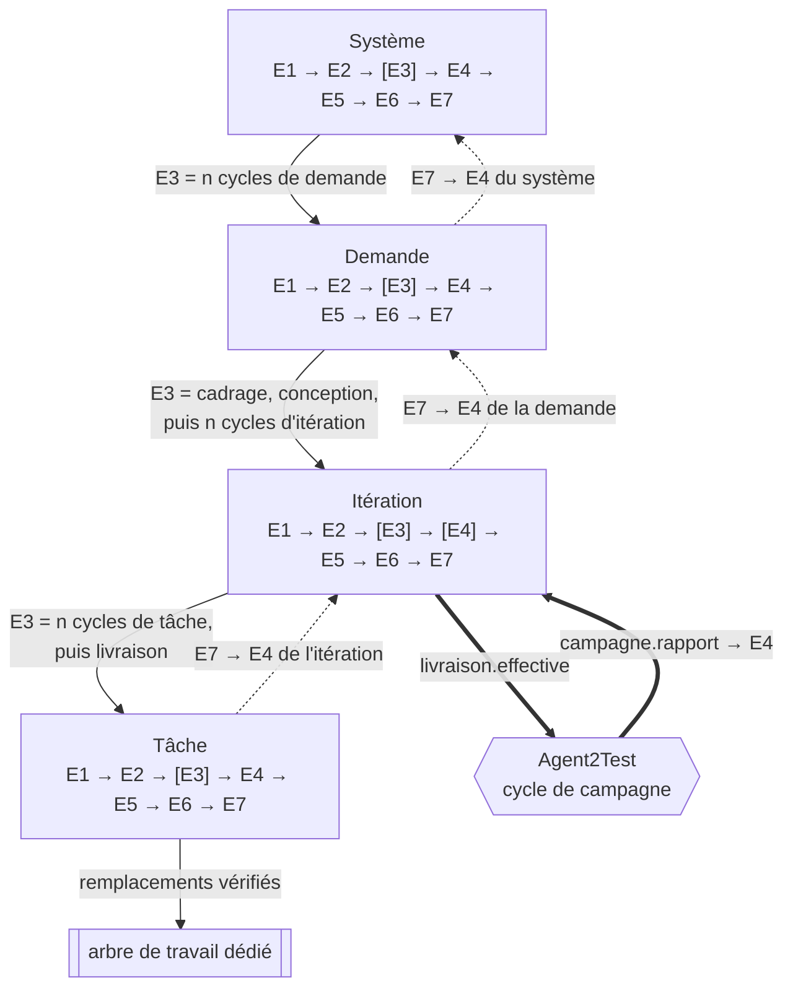
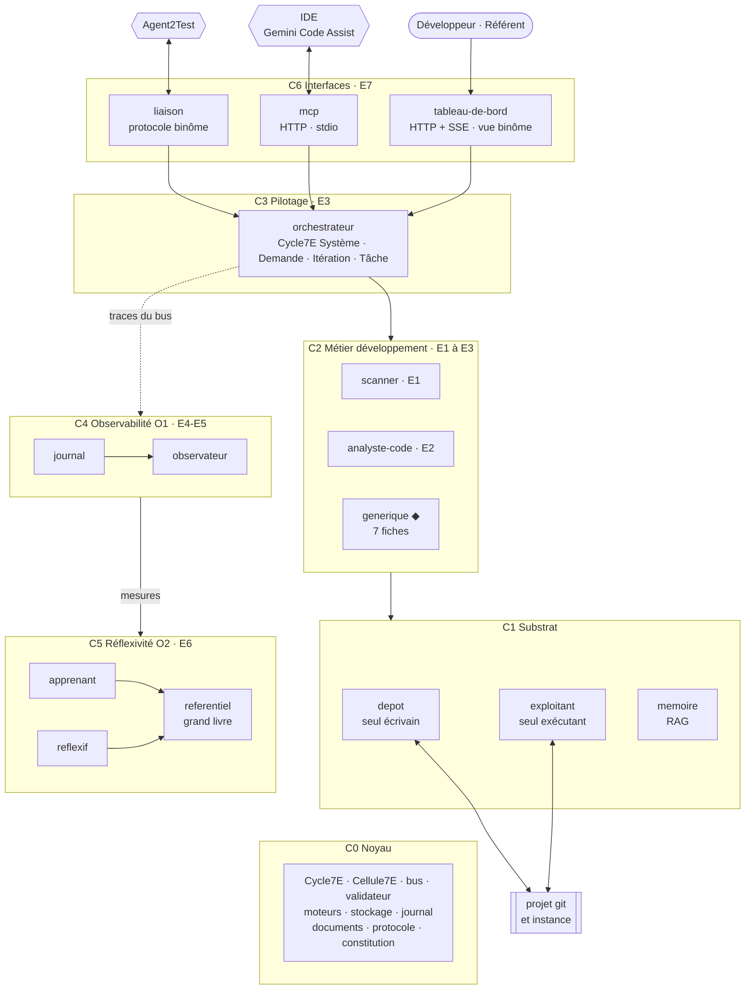
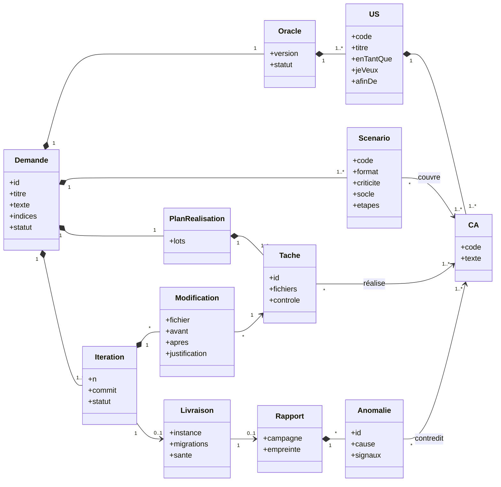
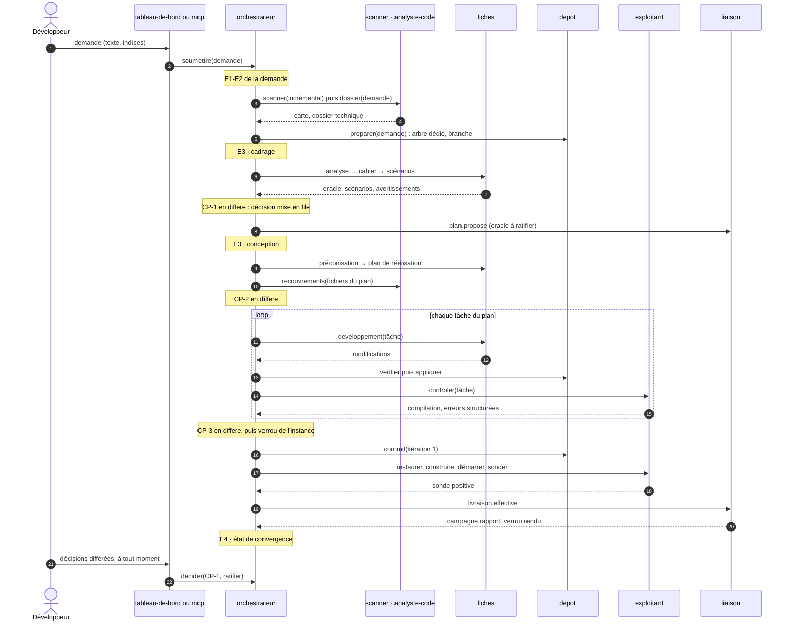
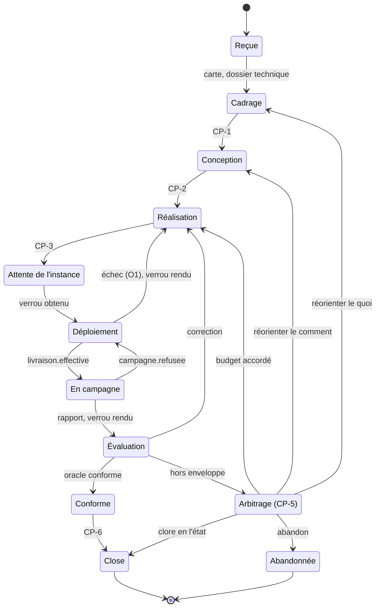
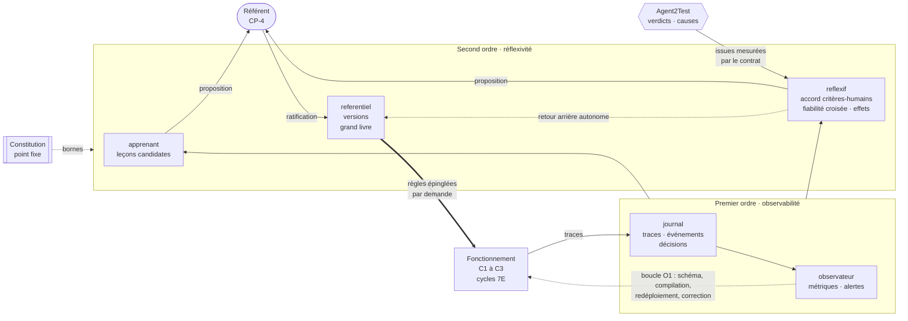
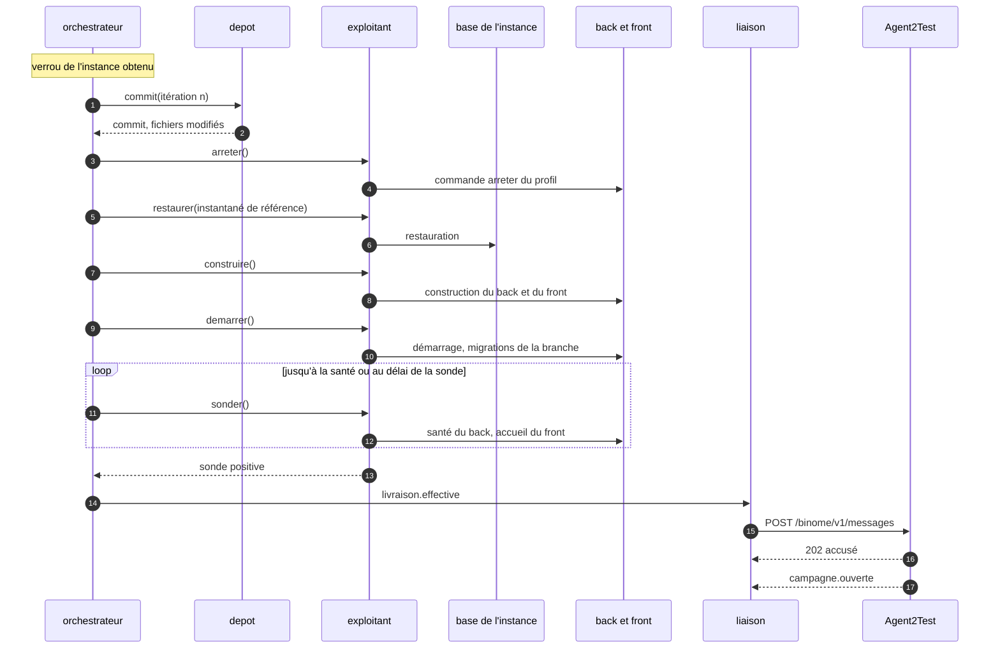

# Agent2Dev — Architecture

> Étape 1 sur 8 · version 0.2.0 du 28 septembre : arbitrages du binôme intégrés, le reste soumis à ratification
> Hypothèses (H), tensions (T) : [`00-cadrage.md`](00-cadrage.md) · Niveau système : [`binome/docs/01-architecture.md`](../../binome/docs/01-architecture.md)

1. Principe directeur
2. Le noyau : fractale 7E
3. Couches, modules et fiches
4. Interfaces
5. Flux et points de contrôle
6. Cybernétique : premier et second ordre
7. Réalisation, vérification et correction
8. Données, mémoire et RAG
9. Sécurité
10. Supervision humaine
11. Déploiement
12. Registre des décisions
13. Filiation avec agents-modif

---

## 1. Principe directeur

**Le moteur conçoit, les agents déterministes exécutent, l'humain ratifie, Agent2Test juge.**

- **Le moteur conçoit.** Le moteur (Gemini par défaut, tout LLM par le port moteur du noyau) ne produit que des données : analyse, oracle proposé, scénarios, préconisations, plan, modifications, diagnostics. Chaque sortie est validée contre un schéma fermé et des contrôles nommés, et porte ses avertissements typés.
- **Les agents déterministes exécutent.** Trois agents agissent, chacun seul dans son domaine : `depot` écrit, dans l'arbre de travail dédié ; `exploitant` exécute, les commandes du profil ratifié ; `liaison` parle, à Agent2Test.
- **Agent2Test juge.** Agent2Dev ne se note pas lui-même : la conformité vient des verdicts d'Agent2Test sur l'oracle ratifié (I5).
- **L'humain ratifie.** Il décide aux points de contrôle, selon leur régime. Il voit la boucle en continu et peut l'arrêter. Entre deux points, les agents avancent seuls, dans l'enveloppe d'autonomie.

---

## 2. Le noyau : fractale 7E

### 2.1 L'axiome

L'axiome et le tableau opératoire des sept phases sont ceux de la spécification commune du binôme : `binome/docs/01-architecture.md` §2.1. Ils ne sont pas répétés ici.

### 2.2 Quatre échelles, une seule classe de cycle

| Phase | Tâche | Itération | Demande | Système |
|---|---|---|---|---|
| E1 | tâche du plan : fichiers, critères, dépendances | entrées : plan ratifié (itération 1), ou anomalies et diagnostic (itération *n*) ; budget restant | demande, indices, profil ratifié, commit de base | fiches, règles, constitutions, profil, contrat |
| E2 | contenu à jour des fichiers, voisinage, leçons épinglées | arbre dédié à jour, instantané de référence, dossier technique ciblé | carte du projet, dossier technique, mémoire, référentiel épinglé, arbre et branche | file des demandes, verrou de l'instance, présence d'Agent2Test, versions actives |
| E3 | modifications proposées, vérifiées, appliquées | cycles de tâche → contrôles locaux → CP-3 → verrou de l'instance → commit → déploiement → livraison | cadrage (CP-1) → conception (CP-2) → cycles d'itération | cycles de demande, en parallèle ; livraisons sérialisées par le verrou de l'instance |
| E4 | contrôle de la tâche : compilation, tests ciblés, garde statique | campagne d'Agent2Test : verdicts par critère (couplage) ; contrôles locaux | matrice critères × itérations, régressions, convergence | métriques de fonctionnement (O1) |
| E5 | ligne de journal, diff de la tâche | rapport d'itération | livrable de demande | tableaux de bord, vue binôme |
| E6 | correction dans le budget (O1) | diagnostic ; correction ou contestation | itérer, arbitrer (CP-5), leçons candidates | réflexivité (O2) : mesures, propositions, retours arrière |
| E7 | résultat remonté à l'itération | résultat remonté à la demande | clôture (CP-6), branche prête, `demande.close`, mémoire | gouvernance humaine, couplage avec Agent2Test |

Le cycle est la classe `Cycle7E` du noyau d'Agent2Dev, conforme à la spécification du binôme (bin §2 et §3.2). L'orchestrateur l'instancie pour les quatre échelles. L'ordonnanceur d'`agents-modif` disparaît : la file des demandes actives et le verrou de l'instance sont l'E2 et l'E3 de l'échelle Système (D3, D20).

La récursion suit a2t/I1 : l'E3 d'une échelle est la suite des cycles de l'échelle inférieure. Le couplage suit bin/I3 : la livraison, fin de l'E3 d'une itération, ouvre une campagne d'Agent2Test, dont le rapport alimente l'E4 de l'itération.

*Diagramme de composants (UML, en flowchart Mermaid) — les échelles et le couplage*



### 2.3 Deuxième axe : les organes

Chaque agent traite chaque message comme un cycle 7E, par la classe `Cellule7E` du noyau :

| E1 | E2 | E3 | E4 | E5 | E6 | E7 |
|---|---|---|---|---|---|---|
| valider l'entrée contre le contrat | charger fiche épinglée, mémoire, règles | agir : moteur, écriture, commande, message | valider la sortie : schéma, contrôles, garde statique | répondre, publier | corriger dans le budget O1 | remettre la trace au bus |

La trace de chaque appel porte le vecteur de ses sept durées. Un agent déterministe laisse vides les phases sans objet ; la forme ne change pas.

### 2.4 Troisième axe : les couches

À l'échelle Système, chaque couche porte une phase dominante (§3). L'observabilité (O1) est l'E4 du Système : elle constate son état. La réflexivité (O2) en est l'E6 : elle le fait évoluer.

### 2.5 Où l'invariant se voit

| Lieu | Forme visible |
|---|---|
| Code | `Cycle7E` et `Cellule7E` du noyau ; toute échelle et tout agent en héritent |
| Données | chaque ligne de journal porte `echelle` et `phase` ; une demande se relit comme un arbre 7E imbriqué |
| Commits | chaque commit porte sa demande, son itération et ses critères |
| IHM | chaque demande s'affiche en roue 7E, dépliable jusqu'à la tâche |
| Gouvernance | toute proposition de changement nomme l'échelle et la phase qu'elle modifie |
| Documents | chaque élément normatif est typé, numéroté et lu par le `referentiel` (binôme §9) |

---

## 3. Couches, modules et fiches

### 3.1 Vue d'ensemble

*Diagramme de composants (UML, en flowchart Mermaid) — couches et modules*



◆ agent cognitif : il appelle le port moteur. Toutes les flèches passent par le bus ; aucun agent n'importe un autre agent. Le premier et le second ordre observent l'ensemble du fonctionnement à travers les traces du bus ; leurs boucles sont détaillées au §6.5.

### 3.2 Modules

| Couche | Module | Responsabilité unique | Fichier possédé | Moteur | Phase |
|---|---|---|---|---|---|
| C0 Noyau | noyau d'Agent2Dev | cycle, cellule, bus, validateur, moteurs, stockage, journal, documents, protocole, constitution ; conforme aux spécifications du binôme (bin §3.2) | — | — | toutes |
| C1 Substrat | `depot` | seul écrivain du projet : arbre dédié, branche, vérification « avant / après », garde statique, application, commit, retour arrière | `depot` | non | E3 |
| | `exploitant` | seul exécutant : commandes du profil ratifié, instantanés et restaurations de base, sondes | `exploitant` | non | E3, E4 |
| | `memoire` | RAG hybride sur le code et sur les demandes passées ; mémoire persistante | `memoire` | non | E2 |
| C2 Métier | `scanner` | carte du projet (§8.5), incrémentale ; proposition du profil ; recouvrements entre demandes actives | `scanner` | non | E1 |
| | `analyste-code` | dossier technique d'une demande : fragments, voisinage, conventions, tests existants ; suspects d'une anomalie | `analyste-code` | non | E2 |
| | `generique` | une classe, sept fiches ; chaque fiche est un agent sur le bus (§3.3) | — | oui | E3, E6 |
| C3 Pilotage | `orchestrateur` | cycles Système, Demande, Itération, Tâche ; file et demandes actives ; verrou de l'instance ; points de contrôle ; régulation de la convergence | `orchestrateur` | non | E3 |
| C4 Observabilité O1 | `journal` | consigner et chaîner ; projeter le livrable | `journal` | non | E5 |
| | `observateur` | mesurer le fonctionnement, alerter | `observateur` | non | E4 |
| C5 Réflexivité O2 | `apprenant` | tirer des leçons candidates des décisions humaines | `apprenant` | option | E6 |
| | `reflexif` | observer critères, observateurs, apprentissage et jugements d'Agent2Test ; proposer ; déclencher les retours arrière | `reflexif` | non | E6 |
| | `referentiel` | versionner fiches et règles, épingler par demande, tenir le grand livre, extraire le modèle de soi, reporter les valeurs ratifiées dans les documents | `referentiel` | non | E6 |
| C6 Interfaces | `tableau-de-bord` | IHM opérateur HTTP + SSE, vue binôme | — | non | E7 |
| | `mcp` | serveur MCP pour l'IDE : pilotage, supervision, mode accompagné | — | non | E7 |
| | `liaison` | membrane avec Agent2Test : protocole binôme, boîtes durables, plan de tests | `liaison` | non | E7 |

Règles de composition :

- **Un propriétaire par fichier.** Un fichier de stockage a un seul propriétaire. Un agent lit les données d'un autre en appelant l'une de ses actions.
- **Une classe, sept fiches.** Les sept fiches sont une seule classe, l'`AgentGenerique` d'`agents-modif` porté sur `Cellule7E`. Ajouter une phase, c'est ajouter une fiche.
- **Modules désactivables.** Chaque module se désactive par configuration. Le palier minimal fait ce que fait `agents-modif`, plus l'écriture dans l'arbre dédié : noyau, `depot`, `scanner`, `generique`, `orchestrateur`, `journal`, `tableau-de-bord`. Les paliers suivants relèvent de la roadmap (étape 4).

Une responsabilité, un seul lieu :

| Responsabilité | Lieu unique |
|---|---|
| écrire dans le projet | `depot` |
| exécuter une commande | `exploitant` |
| parler à Agent2Test | `liaison` |
| lire les sources pour en faire une carte | `scanner` |
| composer le contexte code d'un appel au moteur | `analyste-code` |
| appeler un LLM | port moteur du noyau, par les fiches |
| valider une sortie | `validateur` du noyau |
| dérouler un cycle | `Cycle7E` du noyau |
| décider de la suite d'une boucle | `orchestrateur` |
| écrire le journal | `journal` |
| versionner une règle ou une fiche | `referentiel` |
| écrire dans les documents d'Agent2Dev | `referentiel`, valeurs ratifiées en CP-4 seulement |

### 3.3 Les sept fiches

| Fiche | Agent | Moment | Entrées | Sortie | Contrôles nommés |
|---|---|---|---|---|---|
| `analyse` | `analyste` | cadrage | demande, dossier technique | reformulation, périmètre, fichiers impactés, risques, questions | `fichiersConnus` |
| `cahier` | `redacteur` | cadrage | demande, analyse | règle, hypothèses, décisions, US, critères `CA-n.m` | `criteresUniques`, `numerotationCA` |
| `scenarios` | `scenariste` | cadrage | cahier, analyse, écrans de la carte | scénarios `S-n.k` en étapes ou en Gherkin : couverture, criticité, socle, prérequis | `couvertureComplete`, `referencesConnues`, `formatScenario` |
| `preconisation` | `preconisateur` | conception | analyse, cahier, dossier technique | options, recommandation, points de vigilance | `recommandationConnue` |
| `plan-realisation` | `planificateur` | conception | cahier, préconisation, dossier technique | lots et tâches : fichiers, critères, dépendances, contrôle | `tachesCouvrentCA`, `grapheAcyclique`, `fichiersConnusOuNouveaux`, `dansLeBudget` |
| `developpement` | `developpeur` | tâche | tâche, fichiers à jour, voisinage ; diagnostic en correction | remplacements « avant / après », créations, suppressions | `modificationsNonVides`, `avantNonVide`, `rattacheesAuPlan`, `cheminsAutorises` |
| `diagnostic` | `diagnosticien` | itération, E6 | rapport de campagne, traçabilité, suspects | par anomalie : cause racine présumée, fichiers, stratégie, confiance ; ou contestation argumentée | `anomaliesTraitees`, `contestationFondee` |

Toute sortie de fiche peut porter des avertissements. Leur schéma est défini une seule fois, dans le validateur du noyau : `{ code, gravite, texte, portee }`, avec la gravité `info`, `attention` ou `bloquant`. Les avertissements alimentent les écarts des points de contrôle (§5.2). Les quatre fiches d'`agents-modif` deviennent les versions 1.0.0 d'`analyse`, `cahier`, `preconisation` et `developpement`, débarrassées de toute mention d'un projet.

---

## 4. Interfaces

### 4.1 Bus

API du noyau, héritée d'`agents-modif` :

```js
bus.demander(cible, action, charge, contexte, { delaiMs }) // appel nommé : réponse, trace, délai de garde
bus.publier(type, charge, contexte)                         // événement sans réponse
bus.tracer(fn)                                              // reçoit chaque appel terminé, succès ou échec
bus.abonner(fn)                                             // reçoit chaque événement
```

- **Contexte propagé** : `{ correlation, demande, iteration, tache, echelle, phase, parent, appelant }`. Le champ `parent` construit l'arbre des traces.
- **Contrats déclarés.** Chaque agent déclare son contrat : actions, schémas d'entrée et de sortie, événements émis. Le bus refuse tout appel non déclaré.

### 4.2 Contrats principaux

Le détail des schémas relève de l'étape 3.

| Agent | Actions | Événements émis |
|---|---|---|
| `scanner` | `scanner({ portee })`, `carte(filtre)`, `profil()`, `recouvrements(fichiers)` | `carte.mise_a_jour`, `profil.propose` |
| `analyste-code` | `dossier(demande, portee)`, `impact(fichiers)`, `suspects(anomalie)` | — |
| les sept fiches | `produire(entree, lecons, correction)`, `decrire()` | `validation_echec`, `avertissement` |
| `depot` | `preparer(demande)`, `lire(fichiers)`, `verifier(modifications)`, `appliquer(modifications)`, `commit(iteration)`, `diff(iteration)`, `revenir(commit)` | `arbre.pret`, `commit.enregistre` |
| `exploitant` | `controler(portee)`, `instantane()`, `restaurer(instantane)`, `construire()`, `demarrer()`, `arreter()`, `sonder()` | `instance.demarree`, `instance.arretee`, `sonde.echec` |
| `memoire` | `indexer(documents)`, `rechercher(requete, filtres, k)` | — |
| `liaison` | `envoyer(type, charge, correlation)`, `etatPair()`, `echanges(demande)` | `message.recu`, `pair.indisponible` |
| `orchestrateur` | `soumettre(demande)`, `decider(point, decision)`, `suspendre()`, `reprendre()`, `etat(demande)`, `file()` | `point.ouvert`, `iteration.close`, `arbitrage.ouvert`, `demande.close` |
| `journal` | `consulter(filtre)`, `verifierChaine()` | — |
| `observateur` | `mesures(filtre)` | `alerte` |
| `apprenant` | `lecons(filtre)`, `leconsPour(fiche, moteur)` | `lecon.candidate` |
| `reflexif` | `bilan(filtre)` | `proposition.recalibrage`, `retour.arriere` |
| `referentiel` | `fiche(code, moteur)`, `epingler(demande)`, `appliquer(decision)`, `reporter(regle, valeur)`, `revenir(version)`, `grandLivre(filtre)`, `modeleDeSoi()` | `regle.appliquee`, `document.mis_a_jour`, `constitution.modifiee` |

### 4.3 Port moteur

```js
moteur.completer({ systeme, message, schema, fiche, version }) // → { texte, usage }
```

| Adaptateur | Usage |
|---|---|
| `gemini-cli` (défaut) | mode autonome : Gemini CLI sans tête, authentifié par la licence Gemini Code Assist, qui réutilise les identifiants mis en cache lors d'une première connexion. Appel `gemini -p … --output-format json`, réponse lue dans le champ `response`. Les outils natifs sont désactivés (`tools.core` vide, mode d'approbation `plan`) : le moteur rédige, il n'agit pas. Un sous-processus par appel, avec son seul contexte. |
| `externe` | mode accompagné : Gemini Code Assist dans l'IDE, ou tout agent d'IDE, récupère la rédaction par MCP et la soumet ; la tâche attend |
| `compatible-openai` | tout serveur exposant `/v1/chat/completions` : Ollama, vLLM, LM Studio en local (profil `souverain`), ou toute passerelle autorisée |
| `anthropic` | API Messages ; c'est le moteur actuel d'`agents-modif`, conservé pour la compatibilité multi-LLM |
| `simulation` | déterministe, sans réseau : démonstrations, tests d'Agent2Dev, recette en simulation |

- **Choix du moteur.** Il se fait par configuration, pour toute la tête ou fiche par fiche (H9). Par défaut, `gemini-cli` sert toutes les fiches (bin/D21) ; Agent2Test utilise le même moteur, dans des contextes séparés (bin/D16, bin/I8).
- **Journalisation.** Chaque appel est journalisé avec la fiche et sa version composée, le moteur, l'empreinte SHA-256 du prompt rendu, les identifiants des fragments de mémoire injectés et l'usage.

### 4.4 MCP : IDE et mode accompagné

| Outil | Rôle |
|---|---|
| `a2d_soumettre_demande` | soumet une demande : texte, indices |
| `a2d_tache_suivante` | mode accompagné : prochaine rédaction attendue (rôle, consignes, leçons, schéma, contexte borné), ou point de contrôle à présenter |
| `a2d_soumettre` | soumet une sortie ; renvoie les écarts de validation ou l'acceptation |
| `a2d_decider` | relaie une décision de l'opérateur pour CP-0 à CP-3, CP-5 et CP-6 |
| `a2d_suspendre`, `a2d_reprendre` | arrêt d'urgence et reprise, propagés à Agent2Test |
| `a2d_etat`, `a2d_journal`, `a2d_livrable`, `a2d_binome` | lecture seule |

- **Transports** : HTTP en flux sur `127.0.0.1:4601`, avec jeton porteur (clé `httpUrl` de `~/.gemini/settings.json`), par défaut ; stdio (clé `command`) en repli. C'est le montage d'Agent2Test (a2t/D13).
- **Règles.** `GEMINI.md` interdit à l'agent de l'IDE de décider à la place de l'opérateur. Les décisions CP-4 sont refusées sur le canal MCP : un moteur ne ratifie pas ses propres leçons (I10). L'arrêt d'urgence reste permis, parce qu'il va dans le sens sûr.

### 4.5 HTTP et SSE : tableau de bord

Écoute sur `127.0.0.1:4600`. L'IHM est en HTML et JavaScript natifs, sans cadre, utilisable au clavier et au lecteur d'écran. Elle reprend celle d'`agents-modif`.

| Route | Rôle |
|---|---|
| `GET /api/flux` | événements en direct (SSE) |
| `GET`, `POST /api/demandes` · `GET /api/demandes/:id` · `GET /api/demandes/:id/livrable.md` | file, soumission, état, livrable |
| `GET /api/points` · `POST /api/decisions` | points de contrôle en attente : ceux d'Agent2Dev, et ceux d'Agent2Test en lecture, avec un lien vers son tableau de bord ; décisions sur ceux d'Agent2Dev |
| `GET /api/binome` · `POST /api/binome/suspendre` · `POST /api/binome/reprendre` | vue binôme ; arrêt d'urgence |
| `GET /api/lecons` · `POST /api/lecons/:id/ratifier` · `POST /api/lecons/:id/suspendre` | gouvernance des leçons (CP-4) |
| `GET /api/propositions` · `POST /api/propositions/:id/decider` | gouvernance des recalibrages et des amendements (CP-4) |
| `GET /api/bilan` · `GET /api/journal?demande=…` · `GET /api/modele-de-soi` | mesures ; arbre 7E ; modèle de soi et dérives |

### 4.6 Formats pivots

| Format | Producteur | Consommateurs |
|---|---|---|
| demande | humain, par le tableau de bord, le MCP ou un fichier | `orchestrateur` |
| carte du projet | `scanner` | `analyste-code`, `memoire`, `liaison` (impact) |
| dossier technique | `analyste-code` | fiches |
| analyse, cahier, scénarios | fiches de cadrage | fiches suivantes ; `liaison` (plan de tests) ; livrable |
| préconisation, plan de réalisation | fiches de conception | `orchestrateur` (tâches) ; livrable |
| modifications | `developpeur` | `depot` |
| résultat de contrôle | `exploitant` | `developpeur` (O1) ; `orchestrateur` |
| livraison | `orchestrateur` | `liaison`, vers Agent2Test |
| rapport de campagne | Agent2Test, par la `liaison` | `diagnosticien` ; `orchestrateur` |
| diagnostic | `diagnosticien` | `developpeur` ; `liaison` (contestation) |
| livrable de demande | `orchestrateur` | humain ; `memoire` |

*Diagramme de classes (UML) — le modèle de domaine*



Une tâche est une donnée. Ses identifiants suivent la convention de l'annexe A d'Agent2Test : l'espace est la demande.

```json
{
  "id": "DM-20260927-001/T-3",
  "lot": 2,
  "titre": "Exposer la date d'échéance dans l'API des contrats",
  "fichiers": [
    "back/src/main/java/fr/exemple/contrat/ContratDto.java",
    "back/src/main/java/fr/exemple/contrat/ContratController.java"
  ],
  "nouveauxFichiers": [],
  "criteres": ["DM-20260927-001/CA-1.2"],
  "dependances": ["DM-20260927-001/T-2"],
  "controle": "compiler-back",
  "origine": { "moteur": "compatible-openai:qwen3-coder", "fiche": "plan-realisation@1.0.0+L2", "empreinte": "sha256:77a1c0…" }
}
```

### 4.7 Le livrable de demande

Le livrable est une projection du journal pour une demande. Il est produit en Markdown pour les humains et en JSON pour les outils, depuis la même source.

- **En-tête** : demande, versions épinglées, moteurs, décisions humaines.
- **Cadrage** : analyse ; cahier (oracle, avec son statut de ratification) ; scénarios.
- **Conception** : préconisations, avertissements, plan de réalisation.
- **Itérations** : diff, contrôles locaux, livraison, verdicts d'Agent2Test, diagnostics, contestations.
- **Traçabilité** : chaque critère, avec ses scénarios, ses tâches, ses modifications et ses verdicts par itération.
- **Mesures** du premier ordre ; mentions d'origine (I14) ; empreinte de fin de chaîne.

---

## 5. Flux et points de contrôle

### 5.1 Demande nominale, première itération, en autonomie

*Diagramme de séquence (UML)*



### 5.2 Points de contrôle

| CP | Moment | Qui | Décisions | Régime par défaut | Plancher |
|---|---|---|---|---|---|
| CP-0 Profil | premier usage d'un projet ; changement détecté d'un fichier de construction, de Compose ou de migrations sur la branche de base | développeur | valider · corriger · rejeter | presenter | presenter |
| CP-1 Cadrage | après l'analyse, le cahier et les scénarios | développeur | valider · corriger, commentaire obligatoire · rejeter | differe | differe |
| CP-2 Conception | après les préconisations et le plan de réalisation | développeur | valider · corriger · rejeter | differe | differe |
| CP-3 Livraison | après les tâches et les contrôles locaux, avant le commit et le déploiement | développeur | valider · corriger · rejeter, avec retour au dernier état ratifié | differe | differe |
| CP-4 Gouvernance | proposition de règle : leçon, recalibrage, amendement de document | référent, depuis le tableau de bord seulement | ratifier · amender · refuser | presenter, asynchrone | presenter |
| CP-5 Arbitrage | sortie d'enveloppe, oscillation, contestation maintenue, avertissement bloquant non levé | développeur | accorder un budget pour la demande · réorienter vers CP-1 ou CP-2 · abandonner · clore en l'état | presenter | presenter |
| CP-6 Clôture | oracle conforme sans régression ; en mode solo, contrôles locaux verts | développeur | accepter · rouvrir · abandonner | differe | differe |

Par défaut, chaque point est à son plancher (bin/D20) : seuls CP-0 et CP-5 arrêtent la demande, avec les quatre cas forcés ci-dessous ; CP-4, lui aussi en `presenter`, est asynchrone et ne l'arrête pas. Les régimes sont ceux du binôme (`binome/docs/01-architecture.md` §5.1). Pour un point relevé au régime `ecart`, un objet présente un écart dans les cas suivants :

- **CP-1** : avertissement `attention` ou `bloquant` ; question ouverte dans l'analyse ; critère sans scénario ; scénario non automatisable.
- **CP-2** : avertissement `attention` ou `bloquant` ; fichier hors du périmètre de l'analyse ; option recommandée d'effort « fort » ; migration de schéma prévue ; plan au-delà de la moitié d'un budget ; fichier déjà modifié par une autre demande active (T7).
- **CP-3** : fichier hors du plan ; test existant modifié ; avertissement de la garde statique.
- **CP-6** : critère devenu conforme seulement après une contestation ; régression corrigée pendant la demande.

Quel que soit le régime, quatre cas imposent `presenter` (I8) :

- un avertissement `bloquant` ;
- une modification de la chaîne de construction ou des dépendances ;
- une suppression de fichier ;
- une migration destructive.

Un oracle en attente de ratification (CP-1 en `differe`) laisse la boucle avancer, mais bloque la clôture « conforme » (bin/I2).

### 5.3 Causes d'Agent2Test et suite donnée

| Cause ou statut reçu | Suite dans Agent2Dev |
|---|---|
| `DEFAUT_APPLICATIF` | diagnostic, puis correction à l'itération suivante ; ou contestation, si le diagnostic montre que le code satisfait le critère |
| `DEFAUT_PARCOURS` | aucune correction de code ; attente de `verdict.revise`, après réparation par Agent2Test |
| `SESSION_EXPIREE` | aucune correction ; attente de la connexion humaine (a2t/CP-0) |
| `ENVIRONNEMENT` | redéploiement par l'`exploitant`, dans son budget ; au-delà, CP-5 |
| `INSTABILITE` | aucune correction ; signalée au livrable ; ne compte ni comme échec ni comme progrès |
| `INDETERMINE` | attente de la décision humaine en a2t/CP-3 |
| critère « non vérifié » | ni conforme ni corrigé ; attente d'un verdict |

Une régression, c'est-à-dire l'échec d'un scénario de non-régression ou de socle (paliers P2 et P3), est diagnostiquée en premier.

### 5.4 Cycle de vie d'une demande

*Diagramme d'états (UML)*



- **Suspension.** Tout état peut être suspendu par l'arrêt d'urgence ; il reprend là où il s'était arrêté.
- **Demandes actives.** Plusieurs demandes parcourent ce cycle en même temps, dans la limite du §6.6. Une seule à la fois tient le verrou de l'instance, de « Déploiement » au rapport de campagne ; l'ordre d'attente est celui d'arrivée (bin/D22).
- **Mode solo**, sans Agent2Test : l'état « En campagne » est sauté, et l'évaluation porte sur les contrôles locaux. La demande se clôt alors avec la mention « non testée » (bin/D17).

---

## 6. Cybernétique : premier et second ordre

### 6.1 La distinction

| | Premier ordre — observabilité | Second ordre — réflexivité |
|---|---|---|
| Objet observé | le fonctionnement : appels, tâches, compilations, livraisons, itérations | les règles, les critères d'évaluation, les observateurs, l'apprentissage, et les jugements d'Agent2Test |
| Question | Agent2Dev fait-il ce qu'il doit ? | Ses manières de produire, de juger et d'apprendre sont-elles justes ? |
| Modules | `journal`, `observateur`, vue O1 du tableau de bord | `apprenant`, `reflexif`, `referentiel` |
| Sorties | logs, métriques, traces, alertes, tableaux de bord | mesures d'accord, effets mesurés, fiabilité croisée, propositions, retours arrière, mémoire réflexive |
| Action permise | corriger dans un budget : renvoi au moteur, recompilation, redéploiement, itération de correction | proposer ; revenir seul à un état ratifié ; jamais adopter seul |
| Dépendance | ignore l'existence du second ordre | lit le premier ordre, ne l'écrit jamais |

### 6.2 Premier ordre (O1)

- **Logs** : journal en ajout seul, au format commun du binôme, une ligne par appel, événement, message et décision, avec l'échelle, la phase et le vecteur 7E.
- **Traces** : la corrélation et le parent donnent l'arbre Système › Demande › Itération › Tâche. Un export OpenTelemetry (OTLP) est possible en option.
- **Métriques** :
  - par agent, phase et échelle : volumes, durées p50 et p95, taux d'erreur ;
  - par fiche et par moteur : renvois pour non-conformité, jetons, taille de contexte ;
  - par tâche : tentatives de compilation, premier passage ;
  - par itération : fichiers et lignes modifiés, durées de construction, de démarrage et de sonde ;
  - par demande : itérations, délai de convergence, critères conformes par itération, régressions, attente humaine par point de contrôle ;
  - pour la liaison : messages en boîte d'envoi, délai d'accusé, présence d'Agent2Test.
- **Tableaux de bord** : flux SSE en direct.
- **Alertes** : dérive d'un indicateur au-delà de son seuil.

### 6.3 Second ordre (O2)

| Exigence | Mise en œuvre |
|---|---|
| Observer les modèles et les critères d'évaluation eux-mêmes | Pour chaque contrôle automatique (schémas, contrôles nommés, compilation, tests unitaires, garde statique), mesure de l'accord avec les décisions humaines (CP-1 à CP-3) et avec les verdicts d'Agent2Test, par fiche, version et moteur. Un contrôle local qui laisse passer ce que la campagne rejette est déclaré trop faible. |
| Observer les observateurs | Précision des alertes du premier ordre, qualifiées par l'opérateur. Fiabilité des causes d'Agent2Test, mesurée contre l'arbitrage humain (binôme §6.3). Le `reflexif` est lui-même observé : propositions acceptées, effets mesurés après adoption. |
| Recalibrer les boucles de rétroaction | Propositions bornées sur les budgets, les poids du dossier technique, les délais et les seuils. Chacune porte ses preuves et l'effet attendu. |
| Auto-modification contrôlée des règles | Cycle de vie d'une règle : candidate → ratifiée → active → suspendue ou retirée. Adoption seulement en CP-4 ; retour arrière autonome si la mesure se dégrade. |
| Mémoire réflexive de l'évolution | Grand livre du `referentiel` : chaque version, sa cause, ses preuves, sa ratification, son effet mesuré, ses retours arrière ; chaîné par empreintes. |
| Modèle de soi | Confrontation des hypothèses et des valeurs documentées aux mesures ; dérive entre documents et configuration ; report des valeurs ratifiées dans les documents ; propositions d'amendement pour le reste (binôme §9.6). |

**Garde anti-Goodhart.** Agent2Dev pourrait apprendre à satisfaire ses indicateurs plutôt que la demande. Les dérives prévisibles sont connues :

- modifier un test existant pour le faire passer ;
- contester pour ne pas corriger ;
- livrer une partie et la déclarer effective ;
- affaiblir un critère.

Les invariants I5 et I15 et la constitution du binôme (bin/I2) les ferment. En outre, le `reflexif` compare les contestations aux arbitrages humains et signale un taux anormal.

### 6.4 Niveaux d'apprentissage (Bateson)

| Niveau | Nature | Dans Agent2Dev | Qui décide |
|---|---|---|---|
| 0 | réponse fixe | vérification « avant / après », sonde, commandes du profil | personne |
| I | correction dans un ensemble fixe d'alternatives | renvoi au moteur avec ses écarts, recompilation, redéploiement, itération de correction | le système, dans l'enveloppe |
| II | changement de l'ensemble des alternatives : apprendre à apprendre | leçons injectées dans les fiches ; poids du dossier technique et budgets recalibrés | proposé par le système, ratifié en CP-4, reporté dans les documents par le `referentiel` |
| III | changement du système des ensembles | constitution, points de contrôle et planchers, bornes, spécifications communes | l'humain seul |

### 6.5 Auto-modification asymétrique

- **Le système peut, seul** : suspendre une leçon ou un recalibrage dont l'effet mesuré se dégrade, c'est-à-dire revenir au dernier état ratifié.
- **Le système ne peut pas, seul** : adopter une règle nouvelle, élargir une borne, relever un budget, abaisser un régime, supprimer ou assouplir un point de contrôle.
- **Épinglage** : chaque demande s'exécute avec un instantané du référentiel pris à son E2. Un changement de règle ne touche jamais une demande en cours.
- **Report** : une valeur ratifiée en CP-4 est écrite par le `referentiel` dans le tableau du §6.6, qui reste ainsi le reflet exact des réglages en vigueur (bin/T9).

*Diagramme de composants (UML, en flowchart Mermaid) — les deux boucles*



### 6.6 Ce qui peut changer, ce qui ne change pas

**Modifiable, après CP-4 et dans les bornes de la constitution.** La colonne « Valeur » porte la valeur en vigueur : les défauts ci-dessous, à confirmer au point de contrôle de cette étape, puis les valeurs ratifiées en CP-4, que le `referentiel` y reporte (bin/T9). Les bornes font partie de la constitution ; les valeurs n'en font pas partie.

| Règle | Valeur | Bornes |
|---|---|---|
| consignes et exemples des fiches (leçons) | — | ne contredisent pas la constitution ; indexées par moteur |
| demandes actives simultanées | 3 | [1 ; 5] |
| itérations par demande | 5 | [1 ; 10] |
| stagnation tolérée, en itérations sans progrès | 2 | [1 ; 3] |
| durée d'une demande, hors attentes humaines et attente de l'instance | 4 h | [30 min ; 24 h] |
| fichiers modifiés par itération | 25 | [1 ; 50] |
| lignes modifiées par itération | 800 | [50 ; 3 000] |
| tentatives de compilation par tâche | 3 | [1 ; 5] |
| tentatives pour une sortie non conforme | 2 | [1 ; 3] |
| redéploiements après une cause `ENVIRONNEMENT` | 2 | [0 ; 3] |
| plafond de contexte par appel au moteur | 60 000 caractères | [8 000 ; plafond du moteur] |
| poids du dossier technique : plein texte, graphe, mémoire, récence | 0,4 · 0,3 · 0,2 · 0,1 | chacun dans [0 ; 1] ; somme égale à 1 |
| fragments retenus par recherche | 12 | [1 ; 20] |
| délai d'ouverture d'une campagne après livraison | 10 min | [1 min ; 60 min] |
| délai de la sonde de santé | 5 min | [30 s ; 20 min] |

**Exclu de toute auto-modification.** Le système ne modifie jamais de code : ni celui de son noyau, ni celui des agents. Il ne touche pas non plus :

- aux schémas du journal, du grand livre et du protocole ;
- aux commandes du profil, ratifiées en CP-0 ;
- aux définitions des points de contrôle, à leurs régimes et à leurs planchers ;
- aux politiques de sécurité : exclusions, motifs de secrets, fichiers protégés ;
- aux méta-critères du second ordre : fenêtre de 10 décisions, exposition minimale de 3, marge de 15 points, repris d'Agent2Test (a2t/H18) ;
- au seuil de bascule du stockage, fixé par l'humain (bin §7.2) ;
- à la partie constitutionnelle de ses documents : invariants, points de contrôle et planchers, bornes des règles. Le `referentiel` n'y reporte que les valeurs ratifiées en CP-4.

| # | Invariant |
|---|---|
| I1 | Cycle 7E : sept phases, dans l'ordre, aux échelles Système, Demande, Itération et Tâche ; l'E3 d'une échelle est la suite des cycles de l'échelle inférieure ; le couplage avec Agent2Test suit bin/I3. |
| I2 | Périmètre : Agent2Dev réalise, dans le projet déclaré, les modifications qu'une demande appelle ; il ne rédige pas la demande ; toute action hors de ce projet est refusée. |
| I3 | Écriture confinée : dans le projet, seul `depot` écrit, et seulement dans l'arbre de travail dédié de la demande ; jamais dans l'arbre du développeur, ni dans `.git`, ni hors de la racine ; ni poussée, ni fusion, ni réécriture d'historique, ni suppression de branche. Dans les documents d'Agent2Dev, seul le `referentiel` écrit, et seulement la valeur d'une règle ratifiée en CP-4, sans commit. |
| I4 | Le moteur ne produit que des données validées par schéma ; il n'écrit aucun fichier, n'exécute rien, ne fournit ni commande ni chemin hors de la carte ; toute modification passe par la vérification « avant / après » du `depot`. |
| I5 | Pas de livraison sans preuve : une itération n'est « effective » qu'après commit, construction réussie et sonde positive ; la conformité d'une demande vient des verdicts d'Agent2Test sur l'oracle ratifié, ou de la décision humaine en mode solo, jamais de l'auto-évaluation d'Agent2Dev. |
| I6 | Un verdict d'Agent2Test n'est jamais réécrit ni ignoré ; une contestation est consignée à côté et tranchée par Agent2Test ou par l'humain. |
| I7 | Journal et grand livre en ajout seul, chaînés par empreintes. |
| I8 | Aucun point de contrôle ne peut être supprimé, sauté ou validé par le système ; les régimes ne changent que par configuration humaine et jamais sous leur plancher ; un avertissement bloquant, une modification de la chaîne de construction ou des dépendances, une suppression de fichier ou une migration destructive imposent `presenter`. |
| I9 | Auto-modification asymétrique : retour arrière autonome, adoption ratifiée. |
| I10 | Séparation des pouvoirs : proposer (`apprenant`, `reflexif`), ratifier (humain, hors canal MCP), appliquer (`referentiel`), mesurer (`reflexif`). |
| I11 | Secrets : aucun secret dans le journal, les prompts, les commits ou les messages du binôme ; les fichiers de secrets sont exclus du contexte. |
| I12 | Contexte transmis au moteur minimisé, borné et masqué ; connexions sortantes limitées aux moteurs déclarés. |
| I13 | Actions bornées : seules les commandes du profil ratifié s'exécutent, en vecteurs d'arguments, sans shell, avec délai ; aucune requête SQL libre sur la base de l'instance ; le schéma évolue par les migrations du projet. |
| I14 | Origine : toute production du moteur porte le moteur, la fiche et sa version composée, l'empreinte du prompt et le ratificateur ; les commits portent la demande, l'itération et les critères. |
| I15 | Oracle : les critères ne changent qu'en CP-1 ; un scénario ne change que par une révision qui garde ses critères couverts et ses résultats attendus, ou en CP-1 ; un test existant du projet n'est modifié ou supprimé que si une tâche du plan ratifié le prévoit ; un changeset de migration existant n'est jamais modifié ni supprimé. |

La constitution d'Agent2Dev est extraite de ce document par le `referentiel`, selon la convention documentaire du binôme (§9) : le tableau du §5.2, les invariants du présent §6.6, les noms et les bornes des règles. Les valeurs des règles n'en font pas partie. Son empreinte est inscrite au grand livre à chaque ratification. Si, au démarrage, l'humain a modifié la constitution, Agent2Dev ouvre CP-4 et applique la dernière constitution ratifiée jusqu'à la décision (bin/I7).

### 6.7 Où s'arrête l'observation de l'observation

Agent2Dev ne se juge pas lui-même. Agent2Test, qui lui est extérieur, constate ce qu'il a produit, et l'humain arbitre entre les deux.

Chaque organe du second ordre est lui-même observé : les propositions du `reflexif` et leurs effets sont au grand livre, sous les yeux du référent. La régression s'arrête à la constitution, extraite des documents, et à la gouvernance humaine : c'est le point fixe de la récursion.

Clôture opérationnelle, au sens de Varela et Maturana : Agent2Dev ne change ses règles qu'à partir de ses propres productions (journal, décisions, mesures) et des décisions humaines ratifiées. Les rapports d'Agent2Test le perturbent sans l'instruire (binôme §6.1).

---

## 7. Réalisation, vérification et correction

### 7.1 Le dossier technique

Le contexte code de chaque appel au moteur est composé par l'`analyste-code`, en quatre temps :

1. **Ancrage.** Les indices de la demande (fichiers, classes, écrans) et les termes de la demande et du cahier sont cherchés en plein texte dans les fragments de la carte : classes, méthodes, composants, gabarits, changesets. Les identifiants sont découpés (`camelCase`, `snake_case`).
2. **Expansion par le graphe de la carte.**
   - Côté back : contrôleur, service, dépôt, entité, changeset.
   - Côté front : point d'API, service Angular, composant, route.
   - De part et d'autre : chaque classe et ses tests.
3. **Mémoire.** Les demandes semblables déjà closes sont retrouvées, avec les fichiers qu'elles ont modifiés.
4. **Score et budget.** Un score pondéré (plein texte, graphe, mémoire, récence) classe les candidats. La sélection tient sous le plafond de contexte. Les fichiers à modifier sont transmis entiers, pour l'unicité des blocs « avant » ; le voisinage, par fragments.

**Sortie.** Le dossier technique contient :

- les fichiers et fragments retenus, avec leur raison et leur score ;
- les conventions détectées : nommage, injection, gestion des erreurs, style des tests ;
- les tests existants liés ;
- les fragilités : fichiers sans test, classes très couplées.

Le second ordre en mesure le rappel (part des fichiers modifiés qui figuraient au dossier) et la précision (part du dossier inutilisée). Ces mesures fondent les propositions de recalibrage des poids.

### 7.2 Du plan aux tâches

- **Lots.** Le plan de réalisation se découpe en lots ordonnés. L'ordre par défaut suit les couches : migration, entité et dépôt, service, contrôleur et DTO, service Angular, composant et gabarit, tests unitaires. Le plan peut s'en écarter, en le justifiant.
- **Tâches.** Chaque tâche porte ses fichiers, existants ou nouveaux, les critères qu'elle réalise, ses dépendances et son contrôle : `compiler-back`, `compiler-front`, `tester-cible` ou aucun, avec contrôle en fin de lot.
- **Contrôles de la fiche.** Le graphe des tâches est acyclique ; chaque critère est réalisé par au moins une tâche ; chaque fichier existe dans la carte ou est déclaré nouveau ; le plan tient dans les budgets.

### 7.3 Le cycle de tâche et les contrôles locaux

| Phase | Ce qui se passe |
|---|---|
| E1 | la tâche, ses fichiers et ses critères |
| E2 | contenu à jour des fichiers dans l'arbre dédié ; voisinage tiré du dossier ; leçons épinglées pour la fiche et le moteur |
| E3 | la fiche `developpement` propose remplacements, créations et suppressions ; le `depot` vérifie que chaque bloc « avant » existe une seule fois, puis applique |
| E4 | l'`exploitant` lance le contrôle de la tâche ; les erreurs du compilateur reviennent structurées (fichier, ligne, message) ; la garde statique du `depot` examine le diff |
| E5 | ligne de journal et diff de la tâche |
| E6 | erreurs renvoyées au moteur avec le diff, dans le budget de tentatives ; au-delà, l'itération s'arrête et ouvre CP-5 |
| E7 | résultat remonté à l'itération |

En fin d'itération, les contrôles locaux couvrent la compilation complète du back et du front, puis les tests unitaires déclarés. Ils sont comparés à la ligne de base (H3).

**Garde statique (D19).** Elle signale, avec la gravité `attention` ou `bloquant` :

- les appels système : `Runtime.exec`, `ProcessBuilder`, `child_process` ;
- l'évaluation dynamique : `eval`, `new Function` ;
- un accès réseau vers une origine non déclarée ;
- une écriture de fichier hors des dossiers du projet ;
- une modification de la chaîne de construction ou des dépendances : `pom.xml`, `build.gradle`, `package.json`, `angular.json`, `Dockerfile`, fichiers Compose, CI ;
- une suppression de fichier ;
- une migration destructive : `DROP`, suppression de colonne.

### 7.4 La livraison (option B)

La livraison prend d'abord le verrou de l'instance. Si une autre demande le tient, elle attend, sans que cette attente compte dans sa durée (§6.6). Le verrou est rendu à la réception du rapport de campagne, d'un refus de campagne, ou à l'échec du déploiement (bin/D22).

1. **Commit** sur la branche dédiée, avec ses pieds de page (H7).
2. **Arrêt** de l'instance.
3. **Restauration** de la base à l'instantané de référence : l'état de la base au commit de base. L'`exploitant` le reprend quand ce commit change (bin/AM-8).
4. **Construction** du back et du front.
5. **Démarrage.** Les migrations de la branche s'appliquent, par l'application ou par la commande `migrer` du profil.
6. **Sonde** : santé du back et du front, jusqu'au délai de la sonde.
7. **Notification** : `livraison.effective`, avec les critères visés et les anomalies traitées.

Un échec aux étapes 4, 5 ou 6 déclenche la boucle du premier ordre : retour à la réalisation avec les erreurs, sans rien envoyer à Agent2Test.

*Diagramme de séquence (UML) — la livraison*



### 7.5 Diagnostic, correction, contestation

- **Entrées** de la fiche `diagnostic` :
  - le rapport de campagne ; pour chaque anomalie : critère, scénario, étape, cause, signaux, attendu, observé, étapes de reproduction, erreurs réseau (méthode, URL, statut) et de console ;
  - la traçabilité de l'itération : critère, tâches, modifications ;
  - les suspects de l'`analyste-code` : un point d'API en erreur désigne son contrôleur ; une erreur de console, son composant ; un critère, les tâches qui l'ont réalisé.
- **Sortie**, pour chaque anomalie :
  - soit un diagnostic : cause racine présumée, fichiers, stratégie de correction, confiance ;
  - soit une contestation : l'argument que le code satisfait le critère, avec ses références de code et l'action demandée.
- **Correction.** Les diagnostics deviennent les tâches de l'itération suivante (fiche `developpement`, entrée `diagnostic`). Il n'y a pas de nouvelle conception, sauf si un diagnostic sort du plan ratifié : c'est alors un écart en CP-2.
- **Contestation.** Elle part en `verdict.conteste`. Agent2Dev n'itère pas sur l'anomalie contestée tant qu'Agent2Test n'a pas répondu par `verdict.revise`. Une contestation maintenue ouvre CP-5.

### 7.6 Convergence

L'E6 de la demande décide de la suite, d'après le rapport de l'itération *k* :

| Situation | Décision |
|---|---|
| tous les critères de l'oracle conformes, aucune régression, oracle ratifié | Conforme, puis CP-6 |
| tous conformes, oracle non ratifié (CP-1 en `differe`) | attente de la ratification ; pas de clôture « conforme » (bin/I2) |
| progrès : moins de critères non conformes, ou une anomalie résolue sans régression | nouvelle itération, si les budgets le permettent |
| stagnation : aucun progrès | nouvelle itération tant que la stagnation reste sous son seuil ; sinon CP-5 |
| oscillation : un ensemble d'échecs déjà vu revient | CP-5, immédiatement |
| régression deux itérations de suite | CP-5 |
| budget d'itérations, de durée ou de taille épuisé | CP-5 |
| seules restent des anomalies hors du ressort d'Agent2Dev (§5.3) | attente d'Agent2Test ou de l'humain ; aucune itération |

L'orchestrateur calcule la décision ; les budgets et les seuils sont ceux du §6.6.

### 7.7 Mesures du second ordre propres à la réalisation

- **Premier passage** : part des tâches compilées du premier coup ; part des livraisons acceptées sans refus.
- **Itérations** par demande, et part des demandes conformes sans arbitrage.
- **Dossier technique** : rappel et précision (§7.1).
- **Contestations** retenues par Agent2Test ou par l'humain.
- **Pouvoir prédictif** des contrôles locaux sur les verdicts d'Agent2Test (binôme §6.3).

---

## 8. Données, mémoire et RAG

### 8.1 Stockage

Port de stockage du noyau, selon la politique commune (binôme §7) : un dossier JSON par agent sous `donnees/a2d/`, remplacé par un fichier SQLite quand les données de l'agent dépassent le seuil de 250 Ko. `journal` et `memoire` franchissent ce seuil les premiers.

| Fichier de l'agent | Contenu principal |
|---|---|
| `orchestrateur` | demandes, itérations, tâches, points de contrôle et décisions, budgets consommés |
| `scanner` | cartes par commit, empreintes de fichiers, profil proposé |
| `analyste-code` | dossiers techniques, suspects d'anomalies |
| `depot` | arbres de travail, branches, commits, modifications appliquées |
| `exploitant` | exécutions de commandes (sortie tronquée, code de retour, durée), instantanés, sondes |
| `memoire` | documents, fragments, index plein texte, vecteurs facultatifs |
| `liaison` | boîtes d'envoi et de réception, séquences, état du pair |
| `journal` | lignes chaînées, en ajout seul |
| `observateur` | séries de mesures, alertes |
| `apprenant` | leçons, expositions |
| `reflexif` | mesures d'accord, fiabilité croisée, propositions |
| `referentiel` | versions de fiches et de règles, épinglages, grand livre, empreintes des constitutions |

Sur disque, chaque demande a son dossier `sortie/<demande>/` : `livrable.md`, `resultat.json`, les messages échangés (`echanges/`) et un diff par itération.

### 8.2 Mémoire persistante : quatre natures, quatre propriétaires

| Nature | Contenu | Propriétaire |
|---|---|---|
| Épisodique | demandes passées, itérations, anomalies, décisions | `journal`, avec des résumés indexés par `memoire` |
| Sémantique | carte, dossiers techniques, cahiers, scénarios, glossaire du domaine | `memoire`, indexés depuis `scanner` et les livrables |
| Procédurale | fiches, leçons, règles, budgets | `referentiel` |
| Réflexive | évolution des règles, preuves, effets | `referentiel`, grand livre |

### 8.3 RAG sur le code

- **Recherche.** Plein texte sur des fragments par symbole, identifiants découpés : FTS5 (`unicode61 remove_diacritics 2`, classement `bm25`) une fois `memoire` passée en SQLite, index BM25 en mémoire en dessous du seuil. Similarité vectorielle en option, avec des plongements locaux (Ollama) et un cosinus calculé en JavaScript. Les classements sont fusionnés par rang réciproque, comme dans Agent2Test.
- **Graphe.** La recherche est complétée par le graphe de la carte (§7.1) et par la mémoire des demandes proches.
- **Sans modèle de plongement,** le plein texte et le graphe suffisent.
- **Avant injection** dans une consigne, les fragments sont filtrés par l'épinglage de la demande, bornés et masqués. Leurs identifiants sont journalisés : le prompt reste reproductible.

### 8.4 Conservation

| Donnée | Durée |
|---|---|
| journal, grand livre | toute la vie du système |
| sorties de demande | conservées |
| instantanés de base | jusqu'à la clôture, plus 7 jours (H8) |
| arbre de travail | supprimé à la clôture ; la branche est conservée |
| sorties de commandes | tronquées à 64 Ko par exécution |

### 8.5 Carte du projet et profil d'application

La carte est propre à Agent2Dev (bin/D13). Le `scanner` la tient à jour sur l'arbre de travail de chaque demande active, indexée par empreinte de fichier : un second passage sans fichier modifié ne réanalyse rien.

| Domaine | Contenu de la carte |
|---|---|
| Back | modules de construction ; paquets et classes ; points d'API des contrôleurs (verbe, chemin) ; services, dépôts et entités, avec leurs tables ; DTO ; tests JUnit |
| Front | routes, y compris celles chargées à la demande ; composants et gabarits ; services et leurs appels HTTP, appariés aux points d'API ; clés de traduction ; fichiers de test |
| Migrations | changesets Liquibase ou scripts Flyway : identifiant, auteur, opérations |
| Construction | outil (Maven, Gradle, npm), scripts, versions de Java et de Node déclarées |
| Compose | services, images, ports, volumes |

- **Back** : lecture tolérante des sources Java (annotations, signatures, imports), sans compilateur.
- **Front** : compilateur TypeScript et Angular du projet lui-même, sans dépendance ajoutée. C'est le choix d'Agent2Test (a2t/D15), réalisé ici dans le code d'Agent2Dev.
- **Clés** : fichiers, routes et points d'API s'écrivent dans les clés communes du binôme (bin §8.2), pour que les deux lectures de l'application se rejoignent.
- **Recouvrements** : la carte sait quels fichiers chaque demande active a modifiés. `recouvrements(fichiers)` signale ceux qu'une autre demande a déjà touchés (T7).

**Profil d'application.** Un profil par projet cible, propriété d'Agent2Dev. La carte le propose ; l'humain le ratifie en CP-0 ; aucun agent ne l'écrit ensuite. Agent2Test n'en reçoit que l'instance, par `livraison.effective` (bin §8.3).

| Section | Contenu |
|---|---|
| `projet` | racine, branche de base, exclusions (fichiers de secrets, fichiers protégés) |
| `back`, `front`, `base` | outils, commandes de compilation, de tests, de construction ; outil de migration ; commandes d'instantané et de restauration |
| `instance` | mode (conteneurs ou processus), projet Compose, ports, URL, sondes de santé, démarrage, arrêt |

Les commandes s'écrivent en vecteurs d'arguments, sans shell, avec leur répertoire et leur délai (bin/D14) :

```json
{
  "instance": {
    "mode": "conteneurs",
    "projetCompose": "a2d-instance",
    "ports": { "back": 18080, "front": 14200, "base": 15432 },
    "sante": { "back": "http://localhost:18080/actuator/health", "front": "http://localhost:14200/" },
    "commandes": {
      "demarrer": { "argv": ["docker", "compose", "-p", "a2d-instance", "up", "-d", "--build"], "cwd": ".", "delaiS": 900 },
      "arreter": { "argv": ["docker", "compose", "-p", "a2d-instance", "down"], "cwd": ".", "delaiS": 120 }
    }
  },
  "back": {
    "outil": "maven",
    "commandes": {
      "compiler": { "argv": ["./mvnw", "-q", "-DskipTests", "compile"], "cwd": "back", "delaiS": 600 },
      "tester": { "argv": ["./mvnw", "-q", "test"], "cwd": "back", "delaiS": 1200 }
    }
  }
}
```

---

## 9. Sécurité

| Menace | Contrôle |
|---|---|
| Injection de consignes par le texte de la demande, les commentaires du code ou les rapports d'anomalie, qui citent des textes de l'IHM | le moteur ne produit que des données validées (I4) ; aucune commande ni aucun chemin produit par le moteur n'est exécuté tel quel ; points de contrôle ; avertissements |
| Code écrit par le moteur exécuté à la construction, aux tests ou au démarrage avant relecture (régime `differe`) | `presenter` forcé sur la chaîne de construction et les dépendances (I8) ; garde statique ; instance en conteneurs recommandée (T1) |
| Écriture hors périmètre | `depot` seul écrivain, arbre dédié, chemins confinés ; fichiers protégés : secrets, `.git`, CI (I3) |
| Destruction de données | instantané avant tout démarrage ; migration destructive en `presenter` ; base de l'instance distincte de celle du développeur |
| Fuite de secrets vers le moteur | fichiers de secrets exclus ; valeurs masquées (`password`, `secret`, `token`, clés) ; plafond de contexte (I11, I12) |
| Code du projet envoyé à un moteur hébergé | contexte borné et masqué ; autorisation de la mission (bin/H16) ; profil `souverain` en repli (bin/T7) |
| Commande arbitraire | commandes du profil ratifié seulement, en vecteurs d'arguments, sans shell, avec délai (I13) |
| Historique git altéré | ni poussée, ni force, ni rebase, ni suppression de branche ; commits sur la branche dédiée seulement (I3) |
| Usurpation entre têtes | liaison sur `127.0.0.1` ; jeton porteur partagé (fichier 0600) ; schéma du protocole validé ; version vérifiée |
| Exposition des interfaces | écoute sur `127.0.0.1` ; jeton pour le MCP HTTP ; contrôle de l'en-tête `Origin` |
| Chaîne d'approvisionnement | aucune dépendance d'exécution : modules intégrés de Node seulement ; Gemini CLI, outil externe, à une version épinglée (bin/D18) |

---

## 10. Supervision humaine

### 10.1 Ce que voit le développeur

| Vue | Contenu |
|---|---|
| Demandes | file ; état de chaque demande (§5.4) ; itération en cours ; budgets consommés |
| Point de contrôle | l'objet à trancher et ses preuves, côte à côte : oracle et scénarios ; plan et avertissements ; diff, contrôles locaux et garde statique ; rapport de campagne |
| Vue binôme | `binome/docs/01-architecture.md` §5.5 |
| Journal | arbre 7E d'une demande, de la demande à la tâche |
| Gouvernance | leçons, propositions, grand livre, fiabilité croisée, modèle de soi et dérives entre documents et configuration |
| Observation | indicateurs et alertes du premier ordre |

### 10.2 Ce qu'il peut faire

- Décider aux points de contrôle, CP-4 depuis le tableau de bord seulement.
- Fixer les régimes, dans la configuration humaine.
- Suspendre et reprendre le binôme, depuis l'une ou l'autre tête.
- Rouvrir ou abandonner une demande.
- Consulter la branche et les diffs ; télécharger le livrable.

### 10.3 Ce que le système ne fait jamais sans lui

- Fusionner, pousser, supprimer une branche.
- Écrire dans l'arbre de travail du développeur.
- Adopter une règle, relever un budget, abaisser un régime.
- Modifier un critère d'acceptation.
- Clore « conforme » une demande dont l'oracle n'est pas ratifié.

---

## 11. Déploiement

- **Hôte.** Agent2Dev tourne sur l'hôte, sous WSL2, en processus Node. Il a besoin de git, des chaînes de construction du projet et de Docker. Il n'a pas de profil conteneur : il lui faudrait la socket Docker de l'hôte.
- **Prérequis** :
  - Node 24, 22.13 au minimum ;
  - git, avec `git worktree` ;
  - Docker et Compose v2 ;
  - les chaînes de construction du projet : JDK et Maven ou Gradle, ou leurs enveloppes `mvnw` et `gradlew` ; Node et npm pour le front ;
  - Gemini CLI, connecté une première fois avec la licence Gemini Code Assist : ses identifiants mis en cache servent ensuite au mode sans tête.
- **Instance** : en conteneurs, recommandé (T1), sous le projet Compose `a2d-instance`, ou en processus, selon le profil.
- **Ports** : 4600 (tableau de bord), 4601 (MCP), 4602 (liaison) ; ceux de l'instance viennent du profil (§8.5, binôme §10).
- **Fichiers** :
  - `donnees/a2d/` : un fichier par agent ;
  - `sortie/` : les livrables ;
  - `config/` : moteurs, régimes et seuil de bascule du stockage, écrits par l'humain seul ;
  - `config/profils/<projet>.json` : profil d'application, ratifié en CP-0 ;
  - `donnees/binome/jeton` : jeton de liaison.

---

## 12. Registre des décisions

Les décisions du binôme (bin/D1 à bin/D19) s'appliquent. Celles-ci sont propres à Agent2Dev.

| # | Décision | Justification |
|---|---|---|
| D1 | Une classe cognitive, sept fiches versionnées | Lignée d'`agents-modif` : ajouter une phase revient à ajouter une fiche, sans code nouveau. |
| D2 | Faits calculés, interprétations générées : `scanner` et `analyste-code` sont déterministes, le moteur interprète | Des faits reproductibles fondent des interprétations vérifiables. |
| D3 | Une seule classe `Cycle7E` pour les quatre échelles ; l'ordonnanceur devient l'E2 et l'E3 du Système | Pas de redondance : un orchestrateur, un cycle (écart assumé avec `agents-modif`, comme a2t/D20). |
| D4 | Deux points de contrôle pour les phases cognitives : CP-1 pour le quoi, CP-2 pour le comment | L'autonomie demande moins d'arrêts ; l'oracle se valide d'un tenant (T4). |
| D5 | Arbre de travail dédié (`git worktree`) et branche `a2d/<demande>` ; un commit par itération | Réversibilité (bin/D9) sans jamais toucher l'arbre du développeur. |
| D6 | `depot` seul écrivain, `exploitant` seul exécutant, `liaison` seule interlocutrice d'Agent2Test | Une responsabilité, un seul lieu : chaque risque a un seul point de contrôle. |
| D7 | Instantané de référence, restauré avant chaque livraison | Chaque campagne part d'un état connu (bin/AM-8), et toute migration est réversible. |
| D8 | Travail par tâches du plan, contrôle après chaque tâche ou chaque lot | Boucle du premier ordre courte, contextes bornés, erreurs localisées. |
| D9 | Remplacements « avant / après » vérifiés ; créations et suppressions déclarées ; suppression en `presenter` | Lignée d'`agents-modif` : une modification ambiguë n'est jamais appliquée. |
| D10 | Dossier technique : graphe, plein texte et mémoire ; borné et pondéré | La qualité du code dépend du contexte ; la minimisation, de ses bornes (T2). |
| D11 | Avertissements typés sur toute sortie cognitive ; un avertissement `bloquant` impose `presenter` | Supervision ciblée : l'humain est appelé là où le système doute. |
| D12 | Diagnostic avant correction ; contestation argumentée plutôt que contournement | Garde anti-Goodhart : on corrige la cause, ou l'on conteste le verdict, jamais le test. |
| D13 | Le plan de tests est une projection déterministe, par la `liaison`, du cahier et des scénarios, au format de l'annexe A d'Agent2Test ; la sélection reste à Agent2Test | Pas de redondance avec le stratège d'Agent2Test. |
| D14 | Scénarios en étapes numérotées ou en Gherkin, produits par une seule fiche | Réponse du 27 septembre, sans dédoubler la scénarisation. |
| D15 | Port moteur à cinq adaptateurs ; `gemini-cli` par défaut ; moteur choisi par fiche | Autonomie avec le moteur de la mission (bin/D21) ; multi-LLM ; repli local du profil `souverain` (bin/T7). |
| D16 | Serveur MCP pour l'IDE, en HTTP et stdio ; gouvernance refusée sur ce canal | Même montage qu'Agent2Test (a2t/D12, a2t/D13) ; séparation des pouvoirs (I10). |
| D17 | Premier et second ordres séparés : l'`observant` d'`agents-modif` est scindé en `observateur` et `reflexif` | Distinction stricte demandée, vérifiable par le sens des dépendances (a2t/D9). |
| D18 | Référentiel épinglé par demande | Des règles qui évoluent ne changent jamais une demande en cours. |
| D19 | Garde statique sur les modifications : appels système, réseau, écritures, chaîne de construction, suppressions, migrations destructives | Le code écrit par le moteur s'exécute à la construction : on le signale avant (T1). |
| D20 | Plusieurs demandes actives, trois par défaut ; un verrou sur l'instance, de la livraison au rapport ; recouvrements de fichiers signalés en CP-2 | Pipeline retenu pour le binôme (bin/D22) ; les branches parallèles se fusionnent hors du système, leur recouvrement se voit avant (T7). |
| D21 | Carte du projet et profil d'application propres à Agent2Dev (§8.5), écrits dans les clés communes du binôme | Indépendance des têtes (bin/D13) : aucune bibliothèque partagée, des clés qui se rejoignent. |

---

## 13. Filiation avec agents-modif

| agents-modif | Agent2Dev | Ce qui change |
|---|---|---|
| `bus` | `bus` du noyau | contrats déclarés ; contexte `echelle` et `phase` |
| `Agent` | `Cellule7E` du noyau | chaque message traité comme un cycle 7E |
| `AgentGenerique` et quatre fiches | `generique` et sept fiches versionnées | trois fiches nouvelles : `scenarios`, `plan-realisation`, `diagnostic` ; avertissements typés ; versions composées |
| `depot` : explorer, verifier, appliquer sur une copie | `scanner`, `analyste-code`, `depot` | exploration lexicale remplacée par la carte du projet et le RAG ; application dans l'arbre dédié ; commit |
| — | `exploitant` | option B : construction, migrations, démarrage, sonde, instantanés |
| `orchestrateur` et `ordonnanceur` | `orchestrateur` | un seul `Cycle7E` récursif ; demandes actives et verrou de l'instance ; boucle de convergence ; régimes |
| `observant` | `observateur` (O1) et `reflexif` (O2) | séparation stricte des deux ordres |
| `apprenant` | `apprenant` | leçons indexées par moteur ; ratification en CP-4 seulement |
| — | `referentiel` | versions, épinglage par demande, grand livre, modèle de soi, report des valeurs ratifiées |
| `journal`, JSONL par jour | `journal` | chaîné, au format commun, avec échelle et phase ; JSON, puis SQLite au-delà du seuil |
| `tableau-de-bord` | `tableau-de-bord` | vue binôme, régimes, arrêt d'urgence, gouvernance |
| — | `mcp` | pilotage et mode accompagné depuis l'IDE |
| — | `liaison` | dialogue avec Agent2Test |
| — | `memoire` | RAG hybride sur le code et les demandes |
| moteurs `simulation` et `claude` | port moteur du noyau | adaptateurs `gemini-cli` (défaut), `externe`, `compatible-openai`, `anthropic`, `simulation` |
| `validationAuto` (`AUTO=1`) | régimes de contrôle | `auto` réservé à la simulation |
| `livrable.md`, `resultat.json` | livrable de demande | scénarios, plan, itérations, verdicts ; traçabilité critère → tâches → modifications → verdicts |

Chemin de migration :

1. Le noyau d'Agent2Dev, `agent2dev/noyau/`, reçoit le bus, le validateur, les utilitaires de texte et les moteurs d'`agents-modif`, généralisés et rendus conformes aux spécifications du binôme ; ses tests jouent les vecteurs de conformité de `binome/vecteurs/`.
2. `agent2dev/` reprend l'agent générique, l'`apprenant`, le `depot` et le tableau de bord, et ajoute les autres modules.
3. Les quatre fiches deviennent les versions 1.0.0 de leurs successeurs, sans mention de projet.
4. `agents-modif/` reste intact jusqu'à la recette (étape 8), puis est retiré.
