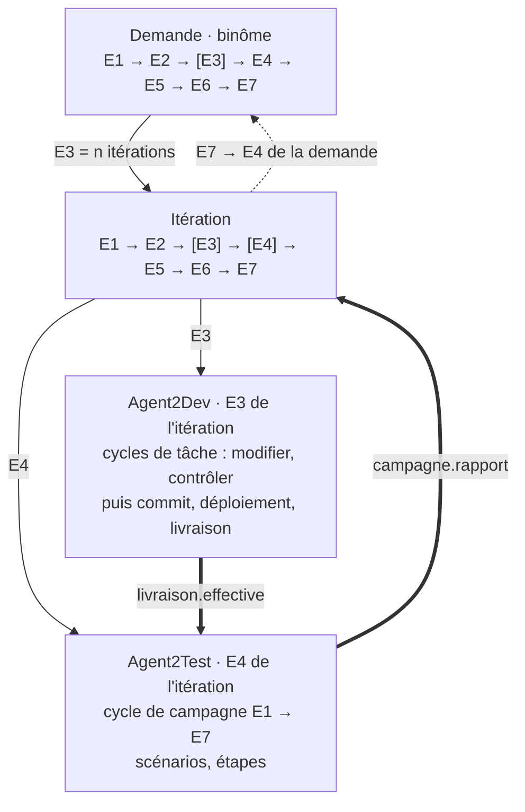
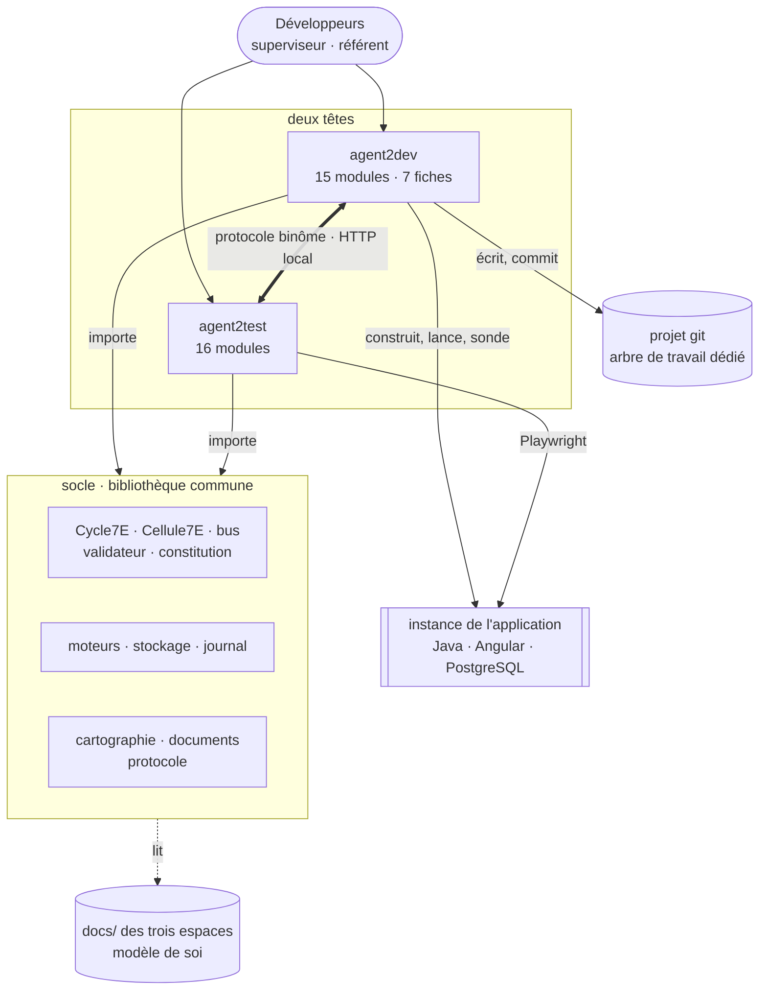
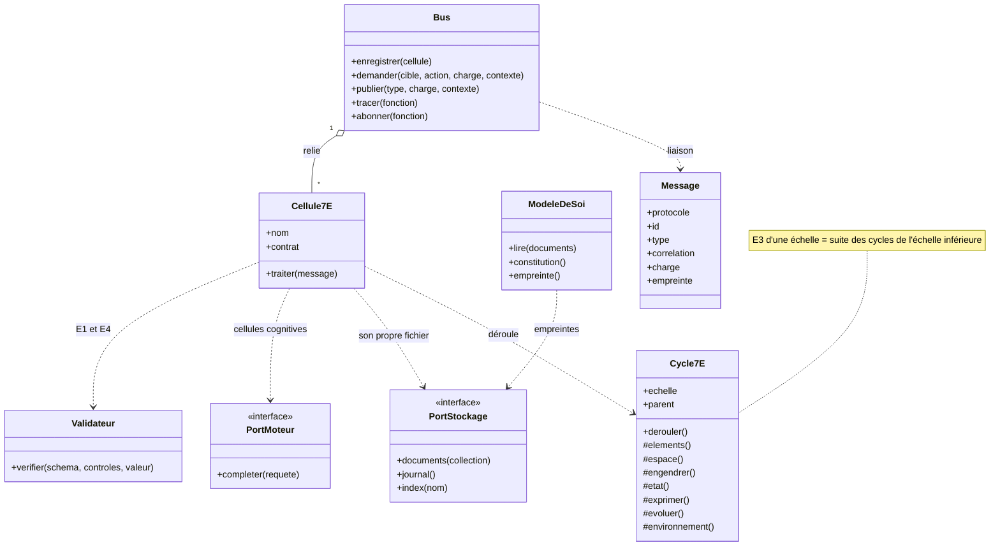
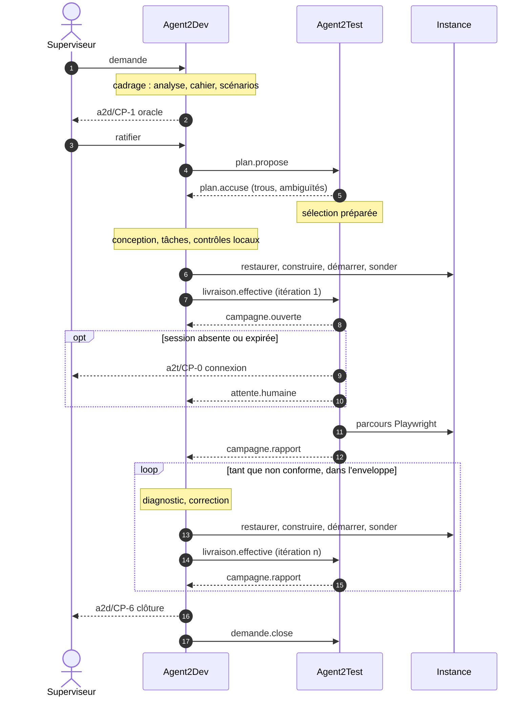
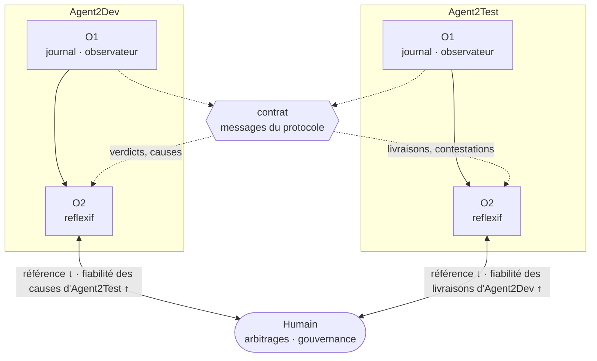
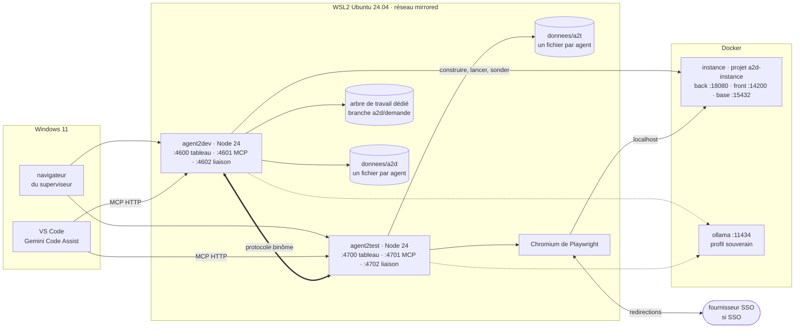

# Binôme Agent2Dev · Agent2Test — Architecture

> Étape 1 sur 8 · proposition soumise à ratification · 27 septembre 2026
> Hypothèses (H), tensions (T) et plan des étapes : [`00-cadrage.md`](00-cadrage.md)
> Tête Dev : [`agent2dev/docs/01-architecture.md`](../../agent2dev/docs/01-architecture.md) · Tête Test : [`agent2test/docs/01-architecture.md`](../../agent2test/docs/01-architecture.md)

1. Principe directeur
2. Le noyau commun : axiome 7E et fractale bicéphale
3. Composants : un socle, deux têtes, un contrat
4. Le contrat d'échange
5. Autonomie et supervision
6. Cybernétique du binôme
7. Stockage interne
8. Cartographie commune et profil d'application
9. La documentation comme modèle de soi
10. Déploiement
11. Registre des décisions
12. Amendements proposés à Agent2Test
13. Filiation

---

## 1. Principe directeur

**Deux têtes, un socle, un contrat, un oracle.**

- **Deux têtes.** Agent2Dev engendre : il modifie le code, le construit et livre une instance en marche. Agent2Test constate : il exerce l'instance et juge chaque critère d'acceptation. Chaque tête est un système complet, fermé sur ses propres règles.
- **Un socle.** Ce qui est commun aux deux têtes n'existe qu'une fois : le cycle 7E, le bus, le validateur, les moteurs, le stockage, le journal, la cartographie du code, la lecture des documents, le protocole.
- **Un contrat.** Les deux têtes ne partagent ni base, ni fichier interne, ni moteur. Elles échangent des messages versionnés, et rien d'autre.
- **Un oracle.** Les critères d'acceptation de la demande, ratifiés par un humain, sont la référence commune. Aucune tête ne les change pour obtenir la conformité : la boucle converge vers eux, jamais l'inverse.

Le binôme est autonome par défaut, dans une enveloppe : budgets, règle de progrès, détection d'oscillation. L'humain voit tout en continu. Il décide à quelques points qui ne se délèguent pas : l'oracle, l'arbitrage, la gouvernance des règles et la clôture. Il peut tout arrêter à tout moment.

---

## 2. Le noyau commun : axiome 7E et fractale bicéphale

### 2.1 L'axiome rendu opératoire

> Les **É**léments dans l'**E**space **E**ngendrent un **É**tat d'**E**xpression **É**volutif de l'**E**nvironnement.

Ce tableau reprend celui d'Agent2Test (`01-architecture.md` §2.1), avec des produits généralisés aux deux têtes : il devient la définition du socle (AM-15).

| Phase | Terme | Opération | Question | Produit |
|---|---|---|---|---|
| E1 | Éléments | Recenser | De quoi dispose-t-on ? | éléments validés, figés pour le cycle |
| E2 | Espace | Situer | Où, et avec quoi, ces éléments agissent-ils ? | contexte : carte, mémoire, règles épinglées, arbre de travail ou session |
| E3 | Engendrent | Produire | Que fait-on advenir ? | produit du cycle : modifications et livraison, sélection et parcours — la récursion descend ici |
| E4 | État | Constater | Qu'est-il advenu, par rapport à l'attendu ? | état mesuré, écart, verdict |
| E5 | Expression | Exprimer | Comment le rendre lisible et opposable ? | ligne de journal, preuve, rapport |
| E6 | Évolutif | Ajuster | Que faut-il changer, et à quel ordre ? | correction immédiate (O1) ou proposition de règle (O2) |
| E7 | Environnement | Coupler | Que rend-on au niveau englobant, que reçoit-on de lui ? | résultat remonté ; perturbation reçue, qui devient l'E1 du cycle suivant |

### 2.2 Deux règles : récursion et couplage

**Récursion**, dans chaque tête (a2t/I1, a2d/I1) : l'E3 d'une échelle *n* est la suite des cycles complets de l'échelle *n − 1* ; l'E7 de chaque cycle de l'échelle *n − 1* alimente l'E4 de l'échelle *n*.

**Couplage**, entre les têtes (I3) :

- La livraison effective, produit de l'E3 d'une itération d'Agent2Dev, entre dans l'environnement d'Agent2Test. Elle y ouvre l'E1 d'une campagne.
- Le rapport, produit de l'E7 de cette campagne, entre dans l'environnement d'Agent2Dev. Il y alimente l'E4 de l'itération.

Aucune tête n'exécute un cycle de l'autre. Chacune lit le message de l'autre à travers sa propre structure : ses schémas, ses règles, ses points de contrôle.

### 2.3 Le binôme, un cycle 7E dont chaque tête est une phase

| Phase | Demande — échelle du binôme | Itération | Portée par |
|---|---|---|---|
| E1 | demande, profil ratifié, oracle ratifié | entrées : plan ratifié, ou anomalies et diagnostic | Agent2Dev ; humain en a2d/CP-1 |
| E2 | carte du projet, dossier technique, arbre dédié, instantané de référence | arbre à jour, contexte ciblé, instantané de référence | Agent2Dev ; Agent2Test pour les relevés d'écran |
| E3 | cadrage, conception, puis *n* itérations | tâches, contrôles locaux, commit, déploiement, livraison | Agent2Dev |
| E4 | convergence : verdicts par critère d'une itération à l'autre | campagne : verdicts par critère, anomalies | Agent2Test ; agrégation par Agent2Dev |
| E5 | livrable de demande, vue binôme | rapports d'itération et de campagne | les deux têtes |
| E6 | itérer, escalader, clore ; leçons et recalibrages | diagnostic, correction ou contestation | Agent2Dev pour la boucle ; chaque tête pour ses règles |
| E7 | clôture, branche prête, mémoire | résultat remonté à la demande | Agent2Dev ; humain en a2d/CP-6 |

À l'échelle de l'itération, Agent2Dev engendre (E3) et Agent2Test constate (E4). Chaque tête est elle-même un système 7E complet, à ses propres échelles. C'est la fractale bicéphale.

*Diagramme de composants (UML, en flowchart Mermaid) — la fractale bicéphale*



---

## 3. Composants : un socle, deux têtes, un contrat

### 3.1 Vue d'ensemble

*Diagramme de composants (UML, en flowchart Mermaid)*



### 3.2 Le socle

Le socle est une bibliothèque, pas un agent. Chaque tête l'importe à une version épinglée (T8).

| Module du socle | Responsabilité | Reprend |
|---|---|---|
| `cycle7e` | classe `Cycle7E` : sept phases, récursion par échelle | `Cycle7E` d'Agent2Test (a2t/D4) ; ordonnanceurs du banc et d'agents-modif (a2t/D20) |
| `cellule` | classe `Cellule7E` : chaque message traité comme un cycle | classe `Agent` d'agents-modif ; `Cellule7E` d'Agent2Test |
| `bus` | appels nommés, événements, traces ; contrat déclaré par agent | bus du banc, d'agents-modif et d'Agent2Test |
| `validateur` | schémas (sous-ensemble de JSON Schema) et contrôles nommés | validateur d'agents-modif |
| `moteurs` | port moteur ; adaptateurs `simulation`, `compatible-openai`, `anthropic`, `gemini-cli`, `externe` | moteurs d'agents-modif et d'Agent2Test |
| `stockage` | port de stockage ; adaptateurs `sqlite` et `json` ; un fichier par agent ; index plein texte (§7) | fichiers d'agents-modif ; PostgreSQL d'Agent2Test (AM-3) |
| `journal` | format de ligne commun, chaînage par empreintes, vérification de la chaîne | JSONL d'agents-modif ; journal d'Agent2Test (a2t/D16) |
| `cartographie` | analyse statique du projet : Java, Angular, migrations, Compose, construction (§8) | exploration lexicale d'agents-modif ; scan statique d'Agent2Test (AM-7) |
| `documents` | lecture des documents selon la convention (§9), modèle de soi, extraction de la constitution | — |
| `protocole` | enveloppe, schémas et versions des messages du binôme (§4) | — |
| `constitution` | vérification de l'empreinte de la constitution au démarrage | a2t/D11 |

*Diagramme de classes (UML) — le noyau du socle*



### 3.3 Les deux têtes

| Tête | Espace | Rôle dans le binôme | Échelles propres | Composition | Documents |
|---|---|---|---|---|---|
| Agent2Dev | `a2d` | propriétaire de la demande et de la boucle ; engendre | Système, Demande, Itération, Tâche | 15 modules, 7 fiches | `agent2dev/docs/` |
| Agent2Test | `a2t` | propriétaire des campagnes ; constate | Système, Campagne, Scénario, Étape | 16 modules après amendements | `agent2test/docs/` |

---

## 4. Le contrat d'échange

### 4.1 Principes

- **Un message est une perturbation, pas une instruction.** La tête réceptrice le valide contre le schéma du contrat, puis le traite selon ses propres règles (§6.1).
- **Enveloppe commune, charge typée.** La charge dépend du `type` ; son schéma est versionné avec le protocole, dans le socle.
- **Idempotence et ordre.** Un message porte un identifiant unique ; un doublon est acquitté sans être retraité. Un numéro de séquence, par émetteur et par demande, fixe l'ordre de traitement.
- **Corrélation obligatoire** : demande, itération et, le cas échéant, campagne (I6).
- **Versions.** Le protocole s'écrit `binome/<majeure>.<mineure>`. Une majeure différente est refusée avec une alerte ; une mineure plus récente est acceptée, et ses champs inconnus sont ignorés.
- **Pas de pièce volumineuse.** Les preuves restent chez Agent2Test. Le rapport en porte les références et les empreintes, consultables par l'API de lecture d'Agent2Test.
- **Tout message est consigné** au journal des deux têtes, avec son empreinte.

### 4.2 Messages

| Message | Sens | Quand | Contenu principal | Effet attendu |
|---|---|---|---|---|
| `plan.propose` | a2d → a2t | après a2d/CP-1, ou dès la production si ce point est en régime `differe` | oracle (US, CA, version, statut de ratification), scénarios (étapes ou Gherkin), couverture, criticité, socle, prérequis, impact présumé (fichiers, points d'API, écrans) | import dans le `plan` d'Agent2Test ; sélection préparée pendant la réalisation |
| `plan.accuse` | a2t → a2d | à l'import | trous de couverture, scénarios orphelins, non automatisables, ambiguïtés par scénario | retour au `scenariste` : boucle de premier ordre entre têtes |
| `livraison.effective` | a2d → a2t | fin de l'E3 d'une itération : commit, construction, migrations, démarrage, sonde positive | branche, commit, fichiers modifiés, critères visés, anomalies traitées, instance (URL, ports, santé), version de l'oracle | ouverture d'une campagne, sans action humaine |
| `campagne.ouverte` | a2t → a2d | E1 de la campagne | identifiant, paliers P1 à P3, points de contrôle en attente | suivi dans la vue binôme |
| `campagne.refusee` | a2t → a2d | sonde négative, plan absent, version incompatible | motif, signaux | Agent2Dev redéploie (O1), ou ouvre a2d/CP-5 |
| `attente.humaine` | a2t ↔ a2d | un point de contrôle `presenter` bloque la boucle | tête, point de contrôle, objet, date d'ouverture | visible dans la vue binôme de l'autre tête |
| `campagne.rapport` | a2t → a2d | E7 de la campagne | verdict par critère ; anomalies (cause, signaux, attendu, observé, étapes de reproduction, erreurs réseau et console, références et empreintes des preuves) ; régressions ; trous ; empreinte de fin de chaîne | E4 de l'itération ; diagnostic |
| `verdict.conteste` | a2d → a2t | le diagnostic conclut que l'application respecte le critère | anomalie, argument, références de code, action demandée : réparer le parcours ou arbitrer | Agent2Test répare (cause `DEFAUT_PARCOURS`) ou ouvre a2t/CP-3 ; le verdict n'est jamais réécrit |
| `verdict.revise` | a2t → a2d | après réparation et rejeu, ou décision en a2t/CP-3 | contestation retenue ou non ; nouveau verdict issu d'une nouvelle exécution | Agent2Dev poursuit, ou ouvre a2d/CP-5 |
| `demande.close` | a2d → a2t | clôture (a2d/CP-6) ou abandon | statut, commit final | archivage des campagnes de la demande |
| `binome.suspendre` · `binome.reprendre` | a2t ↔ a2d | arrêt d'urgence, reprise | auteur, motif | propagation à l'autre tête (I5) |

### 4.3 Transport

- **HTTP local.** Chaque tête expose, sur son port de liaison (§10) :
  - `POST /binome/v1/messages` : dépôt d'un message ; réponse `202` avec l'accusé ;
  - `GET /binome/v1/etat` : santé, version du protocole, demande et campagne en cours, points de contrôle en attente, suspension ;
  - `GET /binome/v1/echanges?demande=…` : historique des messages d'une demande, en lecture seule.
- **Boîtes durables.** L'émetteur inscrit le message dans sa boîte d'envoi avant de l'envoyer, puis réessaie avec un délai croissant, jusqu'à l'accusé. Le récepteur inscrit le message dans sa boîte de réception avant d'accuser. Une tête arrêtée ne perd rien : elle reprend à son redémarrage.
- **Ordre.** Un trou de séquence suspend le traitement de la demande concernée et lève une alerte.
- **Authentification.** Un jeton porteur partagé, généré à l'installation, est lu dans `donnees/binome/jeton` (mode 0600). Les deux têtes n'écoutent que sur `127.0.0.1`.
- **Présence.** Chaque liaison interroge `GET /binome/v1/etat` chez l'autre toutes les 30 secondes. Un pair absent lève l'événement `pair.indisponible` ; les messages restent en boîte d'envoi.
- **MCP** sert aux humains et à l'IDE, pas au dialogue entre têtes.

### 4.4 Séquence nominale

*Diagramme de séquence (UML)*



### 4.5 Exemple de message

```json
{
  "protocole": "binome/1.0",
  "id": "5b0c2f5e-3c1d-4b77-9d2e-6a1f0c9e7a41",
  "type": "livraison.effective",
  "emetteur": "a2d",
  "destinataire": "a2t",
  "horodate": "2026-09-27T20:14:03Z",
  "sequence": 6,
  "correlation": { "demande": "DM-20260927-001", "iteration": 2, "campagne": null },
  "enReponseA": "0e7d4b1a-8f53-4c0e-a9f2-2b7c1d5e6f30",
  "charge": {
    "oracle": { "espace": "DM-20260927-001", "version": 1, "statut": "ratifie" },
    "branche": "a2d/DM-20260927-001",
    "commit": "9f3c2ab",
    "fichiersModifies": [
      "back/src/main/java/fr/exemple/contrat/ContratService.java",
      "front/src/app/contrats/contrat-liste.component.html"
    ],
    "criteresVises": ["DM-20260927-001/CA-1.2"],
    "anomaliesTraitees": ["C-0012/AN-3"],
    "instance": {
      "urlFront": "http://localhost:14200",
      "urlBack": "http://localhost:18080",
      "sante": { "statut": "ok", "sondeLe": "2026-09-27T20:13:58Z" }
    },
    "base": { "instantane": "reference-3e1f0c2", "migrations": ["20260927-01-echeance-contrat"] }
  },
  "empreinte": "sha256:4c1e0d…"
}
```

Les identifiants suivent la convention de l'annexe A d'Agent2Test : l'espace d'un critère est l'identifiant de la demande (`DM-20260927-001/CA-1.2`).

---

## 5. Autonomie et supervision

### 5.1 Régimes de contrôle

Chaque point de contrôle, dans chaque tête, a un régime. Ce vocabulaire commun remplace « présenter tout / présenter l'écart seulement » d'Agent2Test (AM-6).

| Régime | Le système | L'humain | Condition |
|---|---|---|---|
| `presenter` | s'arrête et attend la décision | décide avant la suite | — |
| `ecart` | poursuit si l'objet ne présente aucun écart ; sinon s'arrête, comme `presenter` | décide sur les écarts ; le reste est accepté d'office et consigné | les écarts sont définis par chaque tête (a2d §5.2, a2t §5.2 amendé) |
| `differe` | poursuit ; la décision est mise en file | décide après coup : valider, corriger (nouvelle itération) ou rejeter (retour au dernier état ratifié) | toutes les actions poursuivies doivent être réversibles (D9) |
| `auto` | valide d'office | — | simulation et tests du système seulement |

Règles :

- Le régime de chaque point est fixé par une configuration humaine. Il ne descend jamais sous le plancher inscrit dans la constitution de la tête.
- Un régime plus strict s'applique aussitôt. Un régime plus lâche s'applique à partir de la demande suivante, dont les règles sont épinglées.
- Le système peut proposer un régime plus strict (second ordre). Il ne propose jamais un régime plus lâche.

### 5.2 Points de contrôle des deux têtes

Chaque tête définit ses points de contrôle, leurs planchers et leurs régimes par défaut ; ce document ne les répète pas.

- **Bloquants par nature, plancher `presenter`** : a2d/CP-0 (profil et commandes), a2d/CP-4 (gouvernance), a2d/CP-5 (arbitrage), a2t/CP-0 (session), a2t/CP-4 (gouvernance).
- **Différables, plancher `differe`** : a2d/CP-1 (cadrage et oracle), a2d/CP-2 (conception), a2d/CP-3 (livraison), a2d/CP-6 (clôture), a2t/CP-1 (sélection), a2t/CP-2 (mise en place), a2t/CP-3 (verdicts).
- **Définitions** : Agent2Dev `01-architecture.md` §5.2 ; Agent2Test `01-architecture.md` §5.2, amendé par AM-6.

Si a2d/CP-1 est en régime `differe`, la boucle avance sur un oracle pas encore ratifié ; mais aucune demande n'est close « conforme » tant que l'humain ne l'a pas ratifié (I2).

### 5.3 Enveloppe d'autonomie et escalade

Une boucle de rétroaction autonome a besoin d'une frontière. Celle du binôme tient en trois règles, portées par l'orchestrateur d'Agent2Dev, propriétaire de la boucle. Leurs valeurs et leurs bornes sont dans Agent2Dev `01-architecture.md` §6.6, leur algorithme au §7.6 du même document.

1. **Budgets** : nombre d'itérations, durée hors attentes humaines, taille d'une itération (fichiers, lignes).
2. **Progrès** : chaque itération réduit le nombre de critères non conformes, ou résout une anomalie sans régression. La stagnation est bornée.
3. **Oscillation** : le retour d'un ensemble d'échecs déjà vu, ou une régression répétée, arrête la boucle.

Ouvrent aussi l'arbitrage :

- une contestation maintenue après rejeu ;
- des refus de campagne au-delà du budget de redéploiement ;
- un pair absent au-delà du délai ;
- un avertissement bloquant.

Toute sortie de l'enveloppe ouvre a2d/CP-5. L'humain peut y accorder un budget, pour cette demande seulement. Aucune tête ne relève seule un budget (I4).

### 5.4 Arrêt d'urgence

- Tout humain peut suspendre le binôme depuis l'une ou l'autre tête, par le tableau de bord ou le MCP.
- La tête qui reçoit l'ordre le propage à l'autre (`binome.suspendre`) et le consigne.
- L'arrêt prend effet au plus tard à la fin de l'action en cours : étape Playwright, appel au moteur, commande. Une commande qui dépasse le délai de grâce reçoit un signal d'arrêt.
- L'état est conservé. Seul un humain reprend (`binome.reprendre`).

### 5.5 La vue binôme

Servie par le tableau de bord d'Agent2Dev (D19), alimentée par l'API de lecture d'Agent2Test.

| Élément | Contenu |
|---|---|
| File | demandes en attente, en cours, closes ; instance occupée par quelle demande |
| État d'une demande | position dans le cycle de vie (a2d §5.4), itération en cours, budgets consommés |
| Matrice de convergence | critères de l'oracle × itérations : conforme, non conforme, non vérifié ; régressions signalées |
| Points en attente | les deux têtes, avec leur régime et leur ancienneté ; lien vers l'objet à trancher |
| Échanges | chronologie des messages de la demande, avec leurs empreintes |
| Santé | présence du pair, boîtes d'envoi en attente, alertes du premier ordre |
| Commandes | suspendre, reprendre, ouvrir l'arbitrage |

---

## 6. Cybernétique du binôme

### 6.1 Couplage structurel

Chaque tête est fermée sur son fonctionnement, au sens de Maturana et Varela : elle ne change ses règles qu'à partir de ses propres productions (journal, verdicts, décisions consignées) et des décisions humaines ratifiées. L'autre tête fait partie de son environnement.

Un message de l'autre tête perturbe sans instruire :

- Agent2Dev n'exécute pas un rapport d'anomalies, il le diagnostique ;
- Agent2Test n'exécute pas une contestation, il la réexamine à travers ses causes, ses réparations et son a2t/CP-3.

Les interactions récurrentes produisent des changements de structure congruents chez les deux têtes : c'est un couplage structurel. Leur domaine consensuel est l'oracle, que l'humain fixe et qu'aucune d'elles ne renégocie.

### 6.2 Premier ordre corrélé

- **Journal.** Les deux têtes écrivent au format commun (§7.4). Une ligne porte sa tête, son échelle, sa phase et la corrélation demande · itération · campagne. Un superviseur suit une demande d'une tête à l'autre sans rapprochement manuel.
- **Indicateurs de la boucle.**
  - itérations par demande et délai de convergence ;
  - critères conformes par itération et régressions ;
  - anomalies par cause ;
  - campagnes refusées ;
  - attente humaine par point de contrôle ;
  - messages en boîte d'envoi et délai d'accusé ;
  - présence du pair.
- **Alertes** : dérive d'un indicateur au-delà de son seuil. Chaque tête reste propriétaire de ses indicateurs ; la vue binôme les juxtapose.

### 6.3 Second ordre croisé

Chaque tête observe la fiabilité des jugements de l'autre, et la mesure contre l'arbitrage humain. C'est l'observation des observateurs, portée à l'échelle du binôme.

| Mesure | Mesurée par | Référence | Proposition possible |
|---|---|---|---|
| Fiabilité des causes d'Agent2Test : part des `DEFAUT_APPLICATIF` corrigés sans contestation ; part des contestations retenues par l'humain | `reflexif` d'Agent2Dev | décisions en a2t/CP-3 et a2d/CP-5 | Agent2Test : leçon sur ses règles de cause. Agent2Dev : régime plus strict sur a2t/CP-3 pour la cause concernée, proposé à l'humain |
| Fiabilité des livraisons d'Agent2Dev : part des livraisons suivies d'un refus ou d'un échec `ENVIRONNEMENT` | `reflexif` d'Agent2Test | sondes d'Agent2Test | Agent2Dev : recalibrer sa sonde (URL, délai) |
| Pouvoir prédictif des contrôles locaux : part des itérations aux contrôles verts rejetées pour une anomalie qu'un test unitaire aurait vue | `reflexif` d'Agent2Dev | verdicts d'Agent2Test | Agent2Dev : tâches de tests unitaires dans les plans |
| Révocation des décisions différées : part des décisions `differe` corrigées ou rejetées après coup | `reflexif` de chaque tête | décisions humaines | régime plus strict, jamais plus lâche |
| Stabilité de l'oracle : critères modifiés après a2d/CP-1 ; attendus modifiés par une réparation | `reflexif` de chaque tête | grand livre | alerte de co-dérive ; un attendu modifié par réparation viole AM-11 |

*Diagramme de composants (UML, en flowchart Mermaid) — le second ordre croisé*



Les flux croisés passent par les messages du contrat, jamais par un accès direct (I1).

Niveaux d'apprentissage du binôme, au sens de Bateson :

| Niveau | Dans le binôme | Qui décide |
|---|---|---|
| I | itérations de correction, redéploiements, réessais de messages | le système, dans l'enveloppe |
| II | leçons, recalibrages de budgets et de poids, régimes plus stricts proposés | le système propose ; l'humain ratifie au point de gouvernance de la tête propriétaire de la règle |
| III | constitutions, contrat, planchers des régimes, convention documentaire | l'humain seul, par une version publiée |

### 6.4 Garde contre la co-dérive

Un système qui apprend peut apprendre à satisfaire ses indicateurs plutôt que son but. Deux systèmes couplés peuvent en plus dériver ensemble : chacun s'ajuste à l'autre, sans référence extérieure. Les dérives prévisibles, et leurs parades :

| Dérive | Parade |
|---|---|
| Agent2Dev affaiblit un critère pour le rendre atteignable | les critères ne changent qu'en a2d/CP-1 (I2, a2d/I15) |
| Agent2Test assouplit un attendu en réparant un parcours | une réparation ne change jamais un attendu (AM-11) |
| Agent2Dev modifie un test existant du projet pour le faire passer | tâche du plan ratifié exigée (a2d/I15) |
| Agent2Dev conteste pour ne pas corriger | contestations mesurées contre l'arbitrage humain ; taux anormal signalé |
| Agent2Test classe un échec en instabilité ou en défaut de parcours | garde propre à Agent2Test (a2t §6.3) ; reclassements humains mesurés |
| Agent2Dev livre une partie et la déclare effective | critères visés contrôlés contre l'oracle ; clôture sur l'oracle entier seulement |

### 6.5 Constitution du binôme

Chaque tête a sa constitution (a2t §6.6, a2d §6.6). Celle du binôme ne porte que ce qui tient au couplage :

| # | Invariant |
|---|---|
| I1 | Couplage par contrat seulement : aucune tête n'accède au stockage, aux fichiers internes, au bus ou au moteur de l'autre ; tout passe par les messages du protocole. |
| I2 | Oracle ancré : les critères d'acceptation ne changent que par ratification humaine (a2d/CP-1) ; aucune tête ne modifie critères, scénarios ou attendus pour obtenir la conformité ; les têtes ne négocient pas l'oracle entre elles ; une demande n'est close « conforme » que sur un oracle ratifié, vérifié par Agent2Test sur la version livrée. |
| I3 | Règle de couplage 7E (§2.2) : la livraison, produit de l'E3 d'une itération, ouvre l'E1 d'une campagne ; le rapport, produit de l'E7 de la campagne, alimente l'E4 de l'itération ; chaque cycle, dans chaque tête et à chaque échelle, parcourt E1 → E7. |
| I4 | Enveloppe : toute boucle a des budgets et une règle de progrès ; au-delà, un humain arbitre ; aucune tête ne relève seule un budget. |
| I5 | Arrêt d'urgence : tout humain peut suspendre le binôme depuis l'une ou l'autre tête ; la suspension se propage et prend effet au plus tard à la fin de l'action en cours. |
| I6 | Corrélation : chaque message, ligne de journal et artefact porte la demande, l'itération et, le cas échéant, la campagne ; les deux journaux sont chaînés et en ajout seul. |
| I7 | Documents normatifs : seul un humain les écrit ; le système y propose des amendements ; une tête refuse de démarrer si l'empreinte de sa constitution diffère de celle de sa version publiée. |

**Exclu de toute auto-modification, au niveau du binôme** :

- les schémas et les versions du protocole ;
- la règle de couplage ;
- les planchers des régimes ;
- la présente constitution ;
- la convention documentaire ;
- les commandes du profil d'application ;
- le jeton de liaison.

---

## 7. Stockage interne

### 7.1 Le port

Le port de stockage offre trois familles d'opérations, sur le seul fichier de l'agent appelant :

- **documents** : lire, écrire, lister et supprimer un document dans une collection ;
- **journal** : ajouter une ligne, lire, vérifier la chaîne — en ajout seul ;
- **index** : indexer des fragments de texte, rechercher en plein texte avec un score.

### 7.2 Deux adaptateurs

| | `sqlite` (défaut) | `json` (option) |
|---|---|---|
| Support | module `node:sqlite` intégré à Node, sans dépendance | fichiers JSON et JSONL |
| Emplacement | `donnees/<tete>/<agent>.sqlite` | `donnees/<tete>/<agent>/` |
| Transactions | oui, journalisation WAL | écriture atomique par renommage |
| Ajout seul | déclencheurs qui refusent `UPDATE` et `DELETE` sur le journal | fichier JSONL ouvert en ajout ; chaîne vérifiée à l'ouverture |
| Plein texte | FTS5, `unicode61 remove_diacritics 2`, classement `bm25` | index BM25 en mémoire, reconstruit à l'ouverture |
| Lisibilité | outil SQLite | lecture directe des fichiers |
| Usage conseillé | fonctionnement courant | démonstration, débogage, petits projets |

FTS5, `bm25`, les fonctions JSON et les déclencheurs d'ajout seul ont été vérifiés sur `node:sqlite` : Node 22.22, SQLite 3.51.2. Les vecteurs de plongement, facultatifs, sont stockés comme documents ; la similarité est calculée en JavaScript. Il n'y a pas d'extension native.

### 7.3 Isolation par agent

- **Un fichier par agent propriétaire.** Un agent reçoit, à sa construction, la poignée de son seul fichier. Aucun agent n'ouvre le fichier d'un autre ; il lit ses données en appelant l'une de ses actions sur le bus. C'est la règle d'Agent2Test, « un schéma a un seul propriétaire », portée par le fichier au lieu du rôle PostgreSQL.
- **Deux espaces disjoints.** Les données d'Agent2Dev sont sous `donnees/a2d/`, celles d'Agent2Test sous `donnees/a2t/`. Seul `donnees/binome/` est partagé : il contient le jeton de liaison et rien d'autre.

### 7.4 La ligne de journal commune

```json
{
  "n": 1842,
  "horodate": "2026-09-27T20:14:03.412Z",
  "tete": "a2d",
  "agent": "exploitant",
  "nature": "trace",
  "echelle": "iteration",
  "phase": "E3",
  "correlation": { "demande": "DM-20260927-001", "iteration": 2, "campagne": null, "parent": "c41f7a90" },
  "action": "sonder",
  "statut": "succes",
  "dureeMs": 5210,
  "vecteur7E": [0, 2, 5190, 12, 3, 0, 3],
  "precedent": "sha256:9a0e41…",
  "empreinte": "sha256:1b7dc2…"
}
```

- **Nature** : `trace`, `evenement`, `message`, `decision` ou `regle`.
- **Empreinte** : SHA-256 de l'empreinte précédente et de la ligne sous forme canonique. La vérification de la chaîne nomme la première ligne rompue.

---

## 8. Cartographie commune et profil d'application

### 8.1 Cartographie statique

La cartographie est une bibliothèque du socle, appelée par le `scanner` de chaque tête : Agent2Dev sur son arbre de travail, Agent2Test sur la version livrée. Elle produit une carte au format commun, indexée par empreinte de fichier. Un second passage sans fichier modifié ne réanalyse rien.

| Domaine | Contenu de la carte |
|---|---|
| Back | modules de construction ; paquets et classes ; points d'API des contrôleurs (verbe, chemin) ; services, dépôts et entités, avec leurs tables ; DTO ; tests JUnit |
| Front | routes, y compris celles chargées à la demande ; composants et gabarits ; services et leurs appels HTTP, appariés aux points d'API ; clés de traduction ; fichiers de test |
| Migrations | changesets Liquibase ou scripts Flyway : identifiant, auteur, opérations |
| Construction | outil (Maven, Gradle, npm), scripts, versions de Java et de Node déclarées |
| Compose | services, images, ports, volumes |

- **Back** : lecture tolérante des sources Java (annotations, signatures, imports), sans compilateur.
- **Front** : compilateur TypeScript et Angular du projet lui-même (a2t/D15), sans dépendance ajoutée.

Les relevés dynamiques de l'IHM (instantanés ARIA) restent propres à Agent2Test (AM-7).

### 8.2 Profil d'application

Un profil par projet cible, partagé par les deux têtes. La cartographie le propose ; l'humain le ratifie ; aucune tête ne l'écrit ensuite.

| Section | Propriétaire | Ratifiée en | Contenu |
|---|---|---|---|
| `projet` | Agent2Dev | a2d/CP-0 | racine, branche de base, exclusions (fichiers de secrets, fichiers protégés) |
| `back`, `front`, `base` | Agent2Dev | a2d/CP-0 | outils, commandes de compilation, de tests, de construction ; outil de migration ; commandes d'instantané et de restauration |
| `instance` | Agent2Dev | a2d/CP-0 | mode (conteneurs ou processus), projet Compose, ports, URL, sondes de santé, démarrage, arrêt |
| `test` | Agent2Test | a2t/CP-2 | stratégie de session, origines autorisées, attribut d'identifiant de test, zones à masquer |

Les commandes s'écrivent en vecteurs d'arguments, sans shell, avec leur répertoire et leur délai (D14) :

```json
{
  "instance": {
    "mode": "conteneurs",
    "projetCompose": "a2d-instance",
    "ports": { "back": 18080, "front": 14200, "base": 15432 },
    "sante": { "back": "http://localhost:18080/actuator/health", "front": "http://localhost:14200/" },
    "commandes": {
      "demarrer": { "argv": ["docker", "compose", "-p", "a2d-instance", "up", "-d", "--build"], "cwd": ".", "delaiS": 900 },
      "arreter": { "argv": ["docker", "compose", "-p", "a2d-instance", "down"], "cwd": ".", "delaiS": 120 }
    }
  },
  "back": {
    "outil": "maven",
    "commandes": {
      "compiler": { "argv": ["./mvnw", "-q", "-DskipTests", "compile"], "cwd": "back", "delaiS": 600 },
      "tester": { "argv": ["./mvnw", "-q", "test"], "cwd": "back", "delaiS": 1200 }
    }
  }
}
```

---

## 9. La documentation comme modèle de soi

### 9.1 Pourquoi

Les documents des trois espaces décrivent ce que le système doit être : ses hypothèses, ses décisions, ses invariants, ses points de contrôle, ses règles et leurs bornes. Le système les lit :

- pour s'y conformer ;
- pour confronter ce qu'il observe de lui-même à ce qu'il est censé être ;
- pour proposer des amendements quand la mesure contredit le document.

La documentation devient ainsi le modèle de soi du système, et le formalisme Markdown, UML et Mermaid une partie de son noyau. Les parties normatives ne changent que par une version publiée par un humain (I7, T9).

### 9.2 En-tête

Chaque document commence par un en-tête YAML, comme les plans de tests de l'annexe A d'Agent2Test :

```yaml
---
espace: a2d
document: architecture
version: 0.1.0
statut: proposition
date: 2026-09-27
amont:
  - bin/architecture@0.1.0
  - a2t/architecture@0.1
---
```

- **Clés** : `espace` (`a2d`, `a2t`, `bin`, ou l'identifiant d'une demande pour un plan de tests), `document`, `version`, `statut` (`proposition`, `ratifie`, `remplace`), `date`, `amont`.
- **Document sans en-tête** : l'espace se déduit du dossier (`agent2test/` donne `a2t`). C'est le cas des documents d'Agent2Test en version 0.1, jusqu'à AM-10.

### 9.3 Identifiants

| Genre | Forme | Défini par | Exemple qualifié |
|---|---|---|---|
| hypothèse | `H<n>` | ligne d'un tableau d'hypothèses | `bin/H8` |
| tension | `T<n>` | ligne d'un tableau de tensions | `a2t/T6` |
| décision | `D<n>` | ligne d'un tableau de décisions | `a2d/D5` |
| invariant | `I<n>` | ligne d'un tableau d'invariants | `bin/I2` |
| point de contrôle | `CP-<n>` | ligne d'un tableau de points de contrôle | `a2d/CP-5` |
| amendement | `AM-<n>` | ligne d'un tableau d'amendements | `bin/AM-11` |
| risque | `R<n>` | ligne d'un tableau de risques | `a2t/R3` |
| contrainte | `C<n>` | élément de liste `**C<n>** —` | `a2t/C1` |
| US | `US-<n>` | titre `US-<n> — …` | `a2t/US-8` |
| critère | `CA-<n>.<m>` | élément de liste `- CA-<n>.<m> :` | `a2t/CA-13.5` |
| scénario | `S-<n>.<k>` | titre `S-<n>.<k> — …` | `contrats/S-12.1` |

Règles :

- **Unicité.** Un élément est défini une seule fois, dans un seul document. Ailleurs, on le cite.
- **Références.** Une référence nue désigne l'espace du document courant. Une référence qualifiée s'écrit `espace/identifiant`.
- **Pérennité.** Un identifiant n'est jamais réutilisé. Un élément retiré garde son numéro, avec le statut « retiré » au registre.
- **Vocabulaire.** Les phases `E1` à `E7`, les paliers `P1` à `P3`, les ordres `O1` et `O2`, les couches `C0` à `C6` et les régimes sont un vocabulaire commun. Ce ne sont pas des éléments : une couche ne se confond pas avec une contrainte, qui ne se définit que par la forme `**C<n>** —`.

### 9.4 Tableaux normatifs

Un tableau est lu quand sa ligne d'en-tête est l'une des suivantes :

| Tableau | En-tête | Lu par |
|---|---|---|
| hypothèses | `\| # \| Hypothèse \| Si elle est fausse \|`, ou `\| # \| Hypothèse \| Utilisée par \|` (cahier d'Agent2Test) | `reflexif` : hypothèses confrontées aux mesures |
| tensions | `\| # \| Tension \| Exigences en conflit \| Proposition \| À trancher par \|` | tableau de bord : points ouverts |
| décisions | `\| # \| Décision \| Justification \|` | fiches, en contexte ; tableau de bord |
| invariants | `\| # \| Invariant \|` | `referentiel` : constitution |
| risques | `\| # \| Risque \| Effet \| Parade \| Réf. \|` | `reflexif` : risques confrontés aux incidents |
| règles modifiables | `\| Règle \| Défaut \| Bornes \|`, ou `\| Règle \| Bornes \|` (Agent2Test) | `referentiel`, `reflexif` |
| points de contrôle | `\| CP \| Moment \| Qui \| Décisions \| Régime par défaut \| Plancher \|`, ou la forme d'Agent2Test | `orchestrateur` |
| amendements | `\| # \| Cible \| Changement \| Motif \|` | `referentiel` |
| registre de ratification | `\| Objet \| Où \| Statut \|` | tableau de bord |

### 9.5 Diagrammes

- **Forme** : un diagramme est un bloc Mermaid précédé d'une légende en italique, qui nomme son type UML.
- **Types** : classes (`classDiagram`), séquence (`sequenceDiagram`), états (`stateDiagram-v2`). Composants et déploiement s'écrivent en `flowchart`, faute de type natif.
- **Contrôles** : le type annoncé doit correspondre au bloc, et chaque diagramme doit se rendre sans erreur.

### 9.6 Ce que le système fait des documents

| Usage | Agent | Effet |
|---|---|---|
| Extraire la constitution : invariants, points de contrôle, planchers, règles et bornes | `referentiel` | forme JSON dérivée ; empreinte inscrite au grand livre ; démarrage refusé en cas d'écart (I7) |
| Confronter hypothèses et valeurs par défaut aux mesures | `reflexif` | proposition d'amendement quand la mesure contredit le document |
| Fournir décisions et justifications aux fiches | `referentiel`, vers les fiches | contexte stable, cité par identifiant |
| Détecter la dérive entre documents et configuration | `observateur` | alerte du premier ordre ; proposition du second ordre |
| Proposer un amendement | `apprenant`, `reflexif` | différence de document soumise au point de gouvernance ; jamais écrite par le système |

### 9.7 Contrôle automatique des documents

Chaque publication d'un document passe les contrôles suivants :

- en-tête valide ;
- identifiants uniques ;
- références résolues, dans leur espace ;
- tableaux complets, avec le bon nombre de colonnes ;
- diagrammes rendus, et de type conforme à leur légende ;
- constitution extraite identique à la version publiée.

---

## 10. Déploiement

*Diagramme de déploiement (UML, en flowchart Mermaid) — profil `hote`*



L'instance tourne en conteneurs, ou en processus sur l'hôte, selon son profil (§8.2). Les ports sont ceux du profil par défaut.

| Port | Écoute | Rôle |
|---|---|---|
| 4600 | 127.0.0.1 | tableau de bord d'Agent2Dev et vue binôme |
| 4601 | 127.0.0.1 | MCP d'Agent2Dev, en HTTP |
| 4602 | 127.0.0.1 | liaison d'Agent2Dev |
| 4700 | 127.0.0.1 | tableau de bord d'Agent2Test |
| 4701 | 127.0.0.1 | MCP d'Agent2Test, en HTTP |
| 4702 | 127.0.0.1 | liaison d'Agent2Test |
| 18080 · 14200 · 15432 | localhost | instance : back, front, base |
| 11434 | 127.0.0.1 | Ollama, profil souverain |

| Profil | Contenu | Usage |
|---|---|---|
| `hote` (défaut) | les deux têtes en processus Node sur WSL2 ; l'instance selon son profil | développement |
| `souverain` | profil `hote` et service `ollama` : moteur et plongements locaux | sans moteur externe |
| `conteneur` | profil `hote` et Agent2Test sans tête (image Playwright), session importée ; Agent2Dev reste sur l'hôte, qui porte git, les chaînes de construction et Docker | exécutions répétées |

Les composants sont open source :

| Composant | Licence |
|---|---|
| Node | MIT |
| SQLite | domaine public |
| Playwright | Apache-2.0 |
| Ollama | MIT |
| git | GPL-2.0 |
| Docker Engine | Apache-2.0 |

Seuls les moteurs hébergés font exception, et le port moteur les rend remplaçables.

---

## 11. Registre des décisions

| # | Décision | Justification |
|---|---|---|
| D1 | Deux têtes, un socle commun, un contrat ; aucun troisième processus | Pas de redondance structurelle, et chaque tête reste autonome : elles ne partagent que du code, le socle, et des messages, le contrat. |
| D2 | Agent2Dev est propriétaire de la demande et de la boucle ; Agent2Test sert des campagnes | Un cycle n'a qu'un propriétaire : la demande naît et se clôt du côté du développement. |
| D3 | Règle de couplage 7E : la livraison, produit de l'E3 d'une itération, ouvre l'E1 d'une campagne ; le rapport, produit de l'E7 de la campagne, alimente l'E4 de l'itération | La fractale 7E s'étend au binôme sans qu'une tête pilote l'autre : chacune est l'environnement de l'autre. |
| D4 | Contrat versionné en JSON Schema dans le socle ; enveloppe commune ; messages idempotents ; majeure différente refusée | Le seul couplage entre têtes est explicite, vérifiable et évolutif. |
| D5 | Transport HTTP local, boîtes d'envoi et de réception durables, accusés et reprises ; MCP réservé aux humains et à l'IDE | Une tête arrêtée ne perd rien et reprend seule : c'est une condition de l'autonomie. |
| D6 | Oracle ancré par l'humain : critères changés en a2d/CP-1 seulement ; aucune modification pour obtenir la conformité ; clôture « conforme » sur oracle ratifié | Garde contre la co-dérive (T2) et contre la loi de Goodhart. |
| D7 | Trois régimes de contrôle (`presenter`, `ecart`, `differe`), fixés par configuration humaine pour chaque point, au-dessus de planchers constitutionnels ; `auto` réservé à la simulation | Autonomie par défaut, supervision garantie : c'est la réponse du 27 septembre. |
| D8 | Enveloppe d'autonomie : budgets, règle de progrès, détection d'oscillation ; toute sortie mène à a2d/CP-5 | Une boucle de rétroaction sans enveloppe peut diverger ou osciller ; l'humain reprend la main à la frontière. |
| D9 | Réversibilité : toute action autonome est réversible (branche, arbre de travail dédié, instantané de base) ; fusion, poussée, suppression de branche et arbre du développeur restent hors du système | Le régime `differe` n'est sûr que si l'on peut revenir en arrière. |
| D10 | Stockage interne par port, SQLite par défaut, JSON en option, un fichier par agent propriétaire | Réponse du 27 septembre ; isolation par agent conservée (esprit de la précision 5 d'Agent2Test) ; aucune dépendance. |
| D11 | Journal chaîné au format commun ; corrélation de bout en bout par demande, itération et campagne | Un superviseur suit une demande d'une tête à l'autre sans rapprochement manuel. |
| D12 | La documentation est le modèle de soi : convention commune, constitution extraite des documents, empreinte vérifiée au démarrage | Réponse du 27 septembre : les documents servent au système pour son propre ajustement. Le formalisme Markdown, UML et Mermaid devient opératoire. |
| D13 | Cartographie statique du code dans le socle, commune aux deux têtes ; relevés dynamiques de l'IHM propres à Agent2Test | Une responsabilité, un seul lieu. |
| D14 | Profil d'application unique et partagé, proposé par la cartographie, ratifié par l'humain ; commandes en vecteurs d'arguments, jamais produites par un moteur | L'option B, sans donner la main du shell au moteur. |
| D15 | Réflexivité croisée : chaque tête mesure la fiabilité des jugements de l'autre contre l'arbitrage humain | Observation des observateurs à l'échelle du binôme. |
| D16 | Moteurs distincts recommandés entre les têtes ; leçons indexées par moteur | Réduire les angles morts partagés (T3). |
| D17 | Mode solo : chaque tête fonctionne seule ; Agent2Dev sans Agent2Test clôt « non testée » | Modules découplables : aucune tête n'est indispensable à l'autre. |
| D18 | Node 24 LTS ; socle et Agent2Dev sans dépendance d'exécution ; Agent2Test avec `playwright` seul si AM-3 est ratifié | Surface d'attaque minimale ; `pg` devient inutile avec SQLite. |
| D19 | La vue binôme est servie par le tableau de bord d'Agent2Dev, alimentée par l'API de lecture d'Agent2Test | Le propriétaire de la boucle la montre, sans composant supplémentaire. |

---

## 12. Amendements proposés à Agent2Test

Les documents d'Agent2Test restent en version 0.1 tant que ces amendements ne sont pas ratifiés. Ceux qui sont ratifiés seront appliqués à l'étape 2 (version 0.2).

Dans la colonne « Cible », les éléments visés appartiennent à l'espace d'Agent2Test : ils sont écrits qualifiés (`a2t/H5`), et les sections citées sont celles de ses documents. Dans les autres colonnes, les références nues renvoient au présent document.

| # | Cible | Changement | Motif |
|---|---|---|---|
| AM-1 | a2t : `00-cadrage.md` §3, précision 2 ; a2t/H2 ; a2t/CA-13.1 | En mode binôme, l'instance est lancée par Agent2Dev. Agent2Test ne la démarre toujours pas. Une sonde négative produit `campagne.refusee` vers Agent2Dev, au lieu d'un simple refus. | Option B. |
| AM-2 | a2t : `00-cadrage.md` §3, précision 1 ; a2t/H1 ; `02-cahier-des-charges.md` §4, décision 8, et annexe A | Les scénarios viennent aussi de `plan.propose`. Une annexe A.4 accepte Gherkin : fichiers `.feature` en français, étiquettes `@S-n.k`, `@CA-n.m`, `@criticite-…`, `@socle`. La décision 8 devient : « Gherkin permis comme format, jamais comme étape intermédiaire ». | Réponse du 27 septembre ; T4. |
| AM-3 | a2t : `00-cadrage.md` §3, précision 5 ; a2t/H5 ; a2t/D5, a2t/D6 ; `01-architecture.md` §8.1 ; a2t/US-27 ; a2t/C3 | Stockage interne par le port du socle : SQLite par défaut, un fichier par agent, JSON en option. L'agent `donnees` disparaît. PostgreSQL reste la base de l'application, et l'oracle SQL en lecture seule est inchangé. | Réponse du 27 septembre ; T5. |
| AM-4 | a2t : `01-architecture.md` §3, couche C0, et §13 ; a2t/D3, a2t/D4 ; a2t/T7 | Le noyau C0 d'Agent2Test devient le socle commun (§3.2 du présent document). | Tranche a2t/T7 ; D1. |
| AM-5 | a2t : `01-architecture.md` §3, §4.2 et §5 ; `02-cahier-des-charges.md` §8, nouvelles US | Un nouveau module C6, `liaison`, reçoit `plan.propose`, `livraison.effective`, `verdict.conteste` et `demande.close`. Il émet `plan.accuse`, `campagne.ouverte`, `campagne.refusee`, `attente.humaine`, `campagne.rapport` et `verdict.revise`. Une livraison ouvre une campagne sans action humaine ; les fichiers modifiés et les critères visés alimentent la sélection (§7.1 d'Agent2Test). | Autonomie du binôme. |
| AM-6 | a2t : `01-architecture.md` §5.2 ; a2t/I8 ; a2t/CA-14.3 | Les régimes `presenter`, `ecart` et `differe` remplacent « présenter tout » et « présenter l'écart seulement ». Planchers : a2t/CP-0 et a2t/CP-4 en `presenter` ; a2t/CP-1 à a2t/CP-3 en `differe`. Défauts en mode binôme : a2t/CP-1 et a2t/CP-2 en `ecart` ; a2t/CP-3 en `differe`, sauf la cause `INDETERMINE`, en `presenter`. | T1 ; D7. |
| AM-7 | a2t : `scanner` ; a2t/D15 ; a2t/US-3, a2t/US-4 | La cartographie statique vient de la bibliothèque du socle. Le `scanner` garde les relevés dynamiques (instantanés ARIA). | D13. |
| AM-8 | a2t/H7 ; a2t/R3 | Avant chaque livraison, Agent2Dev restaure la base de l'instance à l'état de référence, puis applique les migrations de la branche. Chaque campagne part d'un état connu. Le préfixe `A2T-<campagne>-` reste. | Reproductibilité ; moins de faux échecs. |
| AM-9 | a2t : `00-cadrage.md` §6 ; `01-architecture.md` §10 ; a2t/H12 ; a2t/T1, volet conformité ; a2t/US-29 ; a2t/C10 | La conformité AI Act est mise de côté. Traçabilité, contrôle humain et marquage d'origine restent. | Réponse du 27 septembre. |
| AM-10 | a2t : les trois documents | Un en-tête de convention documentaire (§9.2 du présent document) et des références qualifiées vers les autres espaces. | D12 : les documents d'Agent2Test entrent dans le modèle de soi. |
| AM-11 | a2t/I5 ; a2t/US-12 | Une réparation de parcours change des cibles, jamais l'`attendu` ni le `critere` d'une étape `verifier`. Un attendu ne change qu'avec le critère dont il découle. | Garde contre la co-dérive (T2). |
| AM-12 | a2t : `reflexif` ; a2t/US-20 | Réflexivité croisée : fiabilité des livraisons d'Agent2Dev, issue des contestations, causes confirmées par l'humain (§6.3 du présent document). | D15. |
| AM-13 | a2t/H8 ; a2t/D19 ; a2t/US-28 ; a2t/CA-28.3, a2t/CA-28.4 | Node 24 LTS, 22.13 au minimum. Une seule dépendance d'exécution, `playwright`, si AM-3 est ratifié. | H9 ; D18. |
| AM-14 | a2t/H6 ; a2t/US-9 ; a2t : `01-architecture.md` §11 | Profil d'application partagé : URL, santé et ports viennent du profil commun (§8.2 du présent document). Le profil d'environnement d'Agent2Test garde ce qui est propre aux tests. | D14. |
| AM-15 | a2t : `01-architecture.md` §2.1 | Le tableau opératoire de l'axiome devient celui du socle (§2.1 du présent document), cité au lieu d'être répété. | Pas de redondance entre documents. |

---

## 13. Filiation

| Système | Date | Apport au binôme |
|---|---|---|
| Banc check-lists | 19 septembre | bus ; agents qui ne se connaissent que par leur nom ; verdict jamais réécrit ; agent de cycle de vie de l'application, repris par l'`exploitant` ; contrats d'écriture nommés |
| agents-modif | 21 septembre | agent générique piloté par des fiches ; vérification « avant / après » ; boucle observant-apprenant ; décision valider-corriger-rejeter |
| Agent2Test | 25 septembre | fractale 7E en code (`Cycle7E`, `Cellule7E`) ; premier et second ordres séparés ; constitution vérifiée par son empreinte ; grand livre ; épinglage ; port moteur ; convention d'entrée (annexe A) |
| Binôme | 27 septembre | socle commun ; contrat ; règle de couplage ; régimes de contrôle ; enveloppe d'autonomie ; réflexivité croisée ; modèle de soi |
