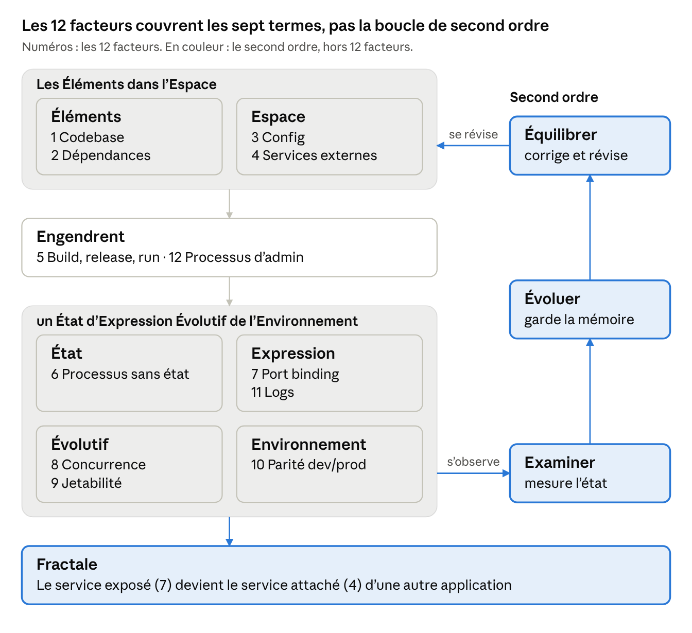

# Modèle exécutif 12 facteurs × 7E

1er octobre 2026 · FRED

> Export du document Claude Docs « Modèle exécutif 12 facteurs × 7E », révision 41, fait le 4 octobre 2026. Le document vivant fait foi : <https://claude.ai/code/artifact/0afadfec-2686-44c8-beb2-11c96474b8d0>.
>
> Dans ce dépôt, le modèle qu'il décrit est [`modele-executif-12f-7e.yaml`](../modele-executif-12f-7e.yaml), la vue d'ensemble détaillée [`vue-ensemble.mmd`](vue-ensemble.mmd) (rendue en [`vue-ensemble.svg`](vue-ensemble.svg)), et son application à un poste en localhost [`profil-localhost-12-facteurs-7e.md`](profil-localhost-12-facteurs-7e.md). Les colonnes Score et Constat des grilles, comme celles de la synthèse, restent vides : elles se remplissent à l'audit.

## Finalité : un méta-projet autotélique

Ce projet est un méta-projet autotélique : il sert de modèle exécutif aux projets qui l'adoptent et s'exécute d'abord sur lui-même. Il est sa propre fin, et le système y est à la fois producteur et produit. La conformité aux 12 facteurs n'est donc pas le but de la grille. Elle est le moyen qui permet à la boucle Examiner → Évoluer → Équilibrer de tourner sur le système lui-même.

Quatre arguments orientent cette boucle :

1. **Aucune consigne ne vient du dehors.** Une boucle tournée vers un but externe (norme, client, échéance) se règle sur l'écart à ce but. Ici, elle fixe ses propres seuils (EX.2) et les révise (EQ.2).
2. **L'invariant la borne.** L'axiome est le point fixe : la boucle révise la structure (code, config, seuils, critères), jamais l'organisation (IN.1). Sans lui, les objectifs dérivent et la récursion ne converge pas.
3. **La viabilité remplace la conformité.** Un cycle réussit quand le système en sort plus capable de s'observer, de se souvenir et de se corriger. Le score exprime cet état, il n'est pas l'objectif.
4. **Autotélique ne veut pas dire autarcique.** Le système se clôt sur ses opérations mais reste couplé à son environnement : il consomme des services (4.1, 4.2) et en expose un que d'autres consomment (FR.1).

Chaque phase reçoit ainsi son orientation, et huit critères des 12 facteurs deviennent ses prérequis directs :

| Phase | Orientation | Critères | Prérequis dans les 12 facteurs |
| --- | --- | --- | --- |
| Examiner | Le système se mesure à ses propres seuils | EX.1, EX.2 | 11.1, 11.2 : le flux émis |
| Évoluer | Le progrès se juge d'un cycle à l'autre, pas contre une norme | EV.1, EV.2 | 1.1, 5.2 : la version déployée, identifiée |
| Équilibrer | La correction vise la structure, puis les critères eux-mêmes | EQ.1, EQ.2 | 5.3, 8.1, 9.2, 9.3 : retour arrière, mise à l'échelle, remplacement sans perte |

Trois règles de lecture en découlent :

- Un écart sur l'un de ces prérequis bloque une phase : il se traite avant tous les autres.
- À effet égal, Équilibrer retient la correction réversible, celle qui laisse le plus de choix au cycle suivant (impératif de von Foerster).
- La grille est un Élément du système : elle se versionne, se révise (EQ.2) et s'applique d'abord au système qui la porte.

## Fractale : la même boucle à chaque rang

Le projet est fractal : le même axiome organise chaque rang, et ce qu'un rang exprime devient Élément ou Espace du rang suivant. Le méta-projet en est le rang racine.

| Rang | Cellule | Ce qu'elle exprime | Ce que cela devient au rang suivant |
| --- | --- | --- | --- |
| Méta | Le méta-projet : l'axiome, le modèle, la boucle | Le modèle versionné, publié aux projets | Élément de chaque projet, épinglé comme une dépendance (2.1) |
| N-1 | Ce que le projet consomme : bibliothèque, service attaché | Artefact versionné, service exposé | Élément (2 Dépendances) ou Espace (4 Services externes) du projet |
| N | Un projet qui exécute le modèle | Son service (7 Port binding) et son journal de cycle | Espace (4) de ce qui le consomme (FR.1), Élément du méta-projet par son journal |
| N+1 | Ce qui consomme le projet | Son propre service exposé | Espace du rang N+2, et ainsi de suite |

Deux conséquences :

- Le modèle s'exécute tel quel à chaque rang : même axiome, mêmes critères, même cycle. Le méta-projet l'exécute le premier, sur lui-même.
- La chaîne se referme au rang méta : le modèle publié redevient Élément de chaque projet, et chaque journal redevient Élément du méta-projet. C'est ce bouclage qui rend le projet autotélique.

## Vue d'ensemble

*12 facteurs sur les 7 termes · boucle de second ordre*

Lecture de haut en bas, comme l'axiome ; à droite, la boucle de second ordre remonte de l'état engendré vers les Éléments et l'Espace.

## Protocole d'exécution

Chaque projet exécute le modèle par cycles de sept phases, et le méta-projet l'exécute d'abord sur lui-même. Le résolveur, programme du méta-projet, porte l'observation ; le pipeline du projet porte l'exécution ; une personne arbitre le reste.

Chaque phase reçoit ce que produit la précédente. Évaluer part du manifeste, du dépôt et du journal.

| Phase | Porteur | Fait | Produit | Garde |
| --- | --- | --- | --- | --- |
| 1 Évaluer | Résolveur | Au rang instance, reçoit la demande (ticket Jira exporté en MHTML) ; vérifie la version épinglée du modèle et le manifeste, identifie la release, détecte la CI | État horodaté | Manifeste invalide ou mauvaise version : le cycle s'arrête |
| 2 Élaborer | Résolveur, puis une personne | Ordonne les écarts du cycle précédent : prérequis de la boucle d'abord, puis le terme le plus faible ; à effet égal, l'action la plus réversible | Plan | Aucune action sur l'organisation ni sur un contrat |
| 3 Exécuter | Pipeline du projet | Produit et déploie une release identifiée, lance les tâches ponctuelles depuis elle | Release déployée | Aucun changement hors release |
| 4 Examiner | Résolveur | Exécute les contrôles des 35 critères, agrège les scores, compare les mesures aux seuils | Scores, constats, mesures | 11.1 ou 11.2 en écart : EX.1 et EX.2 plafonnés à 1 |
| 5 Évoluer | Résolveur | Compare au dernier cycle clos, d'un contrat à l'autre sur les critères communs, rattache chaque baisse à sa release, juge la viabilité ; au rang méta, une baisse remet en question la version du modèle | Tendance, régressions, viabilité | 1.1 ou 5.2 en écart : EV.1 et EV.2 plafonnés à 1 |
| 6 Émettre | Résolveur | Écrit l'entrée de journal du cycle, encore ouverte | Entrée de journal | Entrée conforme au contrat de journal |
| 7 Équilibrer | Résolveur, puis une personne | Applique la rétroaction déclarée, révise les seuils locaux, propose les révisions du modèle, clôt l'entrée | Décisions, propositions | 5.3, 8.1, 9.2 ou 9.3 en écart : tickets seulement, EQ.1 et EQ.2 plafonnés à 1 |

### Du contrôle au score

Dans la spec, chaque critère se résout en contrôles : commande, fichier, motif, config compose, manifeste, journal, scénario, mesure ou déclaration. Le résolveur agrège leurs résultats en un score, règles lues dans l'ordre :

1. Critère déclaré sans objet, ou dont tous les contrôles sont sans objet : pas de score.
2. Tous les contrôles conformes : 2. Le score passe à 3 si le cycle tourne en CI et qu'aucun contrôle n'est une déclaration.
3. Aucun contrôle conforme ou partiel, sans échec heuristique ni erreur : 0.
4. Tous les autres cas : 1.

Six règles complètent l'agrégation :

- **Sans objet automatique** : le contrôle n'a rien à examiner (liste vide, aucun fichier à lire, environnement sans compose pour un contrôle de config).
- **Erreur** : le contrôle n'a pas pu s'exécuter (outil absent, scénario sur un environnement sans compose). Faute de preuve, le critère plafonne à 1.
- **Heuristique** : condition suffisante mais non nécessaire ; son échec demande une confirmation, jamais un 0 à lui seul.
- **Commandes du projet** : chaque commande de test du manifeste tourne dans son propre sous-shell, et une fumée doit échouer sur une release inexistante, sinon elle ne prouve pas le retour arrière (5.3).
- **Fichiers temporaires** : un contrôle n'efface rien ; ce qu'il laisse dans le répertoire temp du cycle est cité au journal par un lien. À l'échéance de son délai, seul le processus lancé est tué.
- **Viabilité** : un cycle est viable si aucun critère EX, EV ou EQ ne baisse ; il progresse si au moins un monte.

### Ce que chaque projet déclare

Le manifeste `7e-instance.yaml`, à la racine du dépôt, est la seule entrée propre au projet. Le modèle dit quoi prouver ; le manifeste dit comment, pour la stack du projet.

| Champ | Contenu | Requis |
| --- | --- | --- |
| `instance`, `modele` | Identité, niveau (méta ou instance), version épinglée du modèle | Toujours |
| `journal` | Répertoire du journal de cycle | Toujours |
| `invariants` | Éléments exemptés d'auto-modification : au moins axiome, cycle et contrats | Toujours |
| `seuils`, `retroaction` | Seuils fixés par le projet, et la correction de chacun : rollback, mise à l'échelle ou ticket | Toujours |
| `environnements` | Fichiers compose, release déployée, date de déploiement, production comprise | Si le projet se déploie |
| `processus`, `expose`, `consomme` | Types de processus, service exposé et son contrat, ce que le projet consomme | Si le projet en a |
| `tests`, `admin`, `bascule`, `release` | Commandes de fumée, de session, de tâches, de retour arrière ; tâches ponctuelles | Selon les critères |
| `observabilite` | Requête sur le flux collecté, alertes actives, tableaux de bord | Pour EX.1 et EX.2 |
| `declarations` | Réponse et lien de preuve pour chaque critère à déclaration | Selon les critères |
| `sans_objet` | Critères sans objet, chacun justifié | Si besoin |

Un champ qu'un contrôle demande et que le manifeste ne déclare pas donne un résultat partiel, avec le constat « champ non déclaré ».

### Journal de cycle

Chaque cycle écrit une entrée sous `journal/<instance>/<numéro>.yaml`, le cycle 0 compris. Émettre l'ouvre, Équilibrer la complète et la clôt ; une fois close, elle n'est plus réécrite.

L'entrée porte la version du modèle et du contrat, la release, l'exécution en CI, le plan, les scores et leurs constats, les mesures, la tendance, les régressions, la viabilité, les décisions, chacune avec son motif, et les propositions au modèle. Seules les entrées closes se comparent, d'un contrat à l'autre sur les critères communs. À côté de l'entrée, un répertoire du cycle garde, sans les versionner, les fichiers temporaires et, au rang instance, le ticket de la demande ; l'entrée les cite par un lien, avec leur taille et leur empreinte.

### Ce que la boucle peut modifier

| Classe | Éléments | Qui les change, et comment |
| --- | --- | --- |
| Organisation | Axiome, ordre du cycle, et cette classe elle-même | Personne, jamais |
| Contrats | Identité du modèle (identifiant, auteur, nature, rôle, compagnon), finalité, échelle, synthèse, manifeste, journal, fractale, amorçage, versions | Une décision hors cycle, en version majeure |
| Structure | Fiche de version du modèle (version, date, statut), critères, contrôles, prérequis, déroulé des phases | Le méta-projet par EQ.2, en version mineure |
| Local | Seuils, rétroaction, code, config | Chaque projet, en Équilibrer |

En cas de recouvrement, la classe la plus stricte l'emporte. C'est la liste explicite qu'exige IN.1 au rang méta.

### Amorçage : le méta-projet, premier projet du modèle

- Au rang méta, la release est une version du modèle et la production est sa publication aux projets, à sa validation finale par une personne : le délai commit → production (10.2) s'arrête là. Le méta-projet n'a pas de ticket : il s'améliore à chaque ticket de ses instances.
- Cycle 0 : le méta-projet écrit son manifeste, exécute le cycle sur son propre dépôt et justifie ses critères sans objet.
- Une version n'est publiée qu'après un cycle clos sur le méta-projet, avec IN.1 au moins à 2.
- Versions : majeure quand un contrat change, mineure pour une révision de structure (EQ.2), qui peut suivre chaque ticket d'une instance, correctif pour une formulation ; toute publication, correctif compris, met à jour la fiche de version. Chaque projet épingle la sienne et n'en change qu'en Évaluer.

## Mode d'emploi

Le modèle évalue chaque projet qui l'exécute, méta-projet compris, sur 35 critères : 27 tirés des 12 facteurs, regroupés par terme de l'axiome 7E, et 8 de second ordre. Dans la spec YAML, chaque critère se résout en contrôles exécutables ; la grille ci-dessous en est la lecture humaine.

| Score | Signification |
| --- | --- |
| 0 Absent | Le critère n'est pas respecté |
| 1 Partiel | Respecté sur une partie du périmètre, ou sans preuve |
| 2 Conforme | Respecté partout, preuve fournie |
| 3 Automatisé | Conforme et vérifié automatiquement, en CI ou en supervision |

Chaque critère reçoit un score et un constat qui cite la preuve observée. Un critère sans objet reste sans score et sort du calcul.

## Éléments

Ce qui compose le système est identifié et déclaré : facteurs 1 Codebase et 2 Dépendances.

| ID | Critère | Preuve attendue | Score | Constat |
| --- | --- | --- | --- | --- |
| 1.1 | Un seul dépôt versionné par application, source de tous les déploiements | Dépôt unique ; commit ou tag déployé connu pour chaque environnement |  |  |
| 1.2 | Le code commun à plusieurs applications est une bibliothèque versionnée, pas une copie | Dépendance déclarée vers la bibliothèque ; aucune duplication de code |  |  |
| 2.1 | Toutes les dépendances sont déclarées et verrouillées | Manifeste et verrouillage des versions dans le dépôt (pom.xml, composer.lock, package-lock.json) |  |  |
| 2.2 | Le build ne dépend d'aucun outil préinstallé sur l'hôte | Build réussi dans un conteneur vierge, à partir du seul dépôt |  |  |

## Espace

La config et les services externes situent les éléments sans modifier le code : facteurs 3 Config et 4 Services externes.

| ID | Critère | Preuve attendue | Score | Constat |
| --- | --- | --- | --- | --- |
| 3.1 | Tout ce qui varie entre déploiements vient de variables d'environnement | Aucune URL, aucun identifiant ni option d'environnement en dur ; .env.example versionné, .env ignoré |  |  |
| 3.2 | Le dépôt pourrait être rendu public sans exposer de secret | Scan de secrets sans alerte, historique Git compris ; aucun secret dans les images |  |  |
| 4.1 | Chaque service externe est désigné par une URL ou un identifiant de config | Base, cache, file de messages, SMTP et API tierces adressés par variables (DATABASE_URL, REDIS_URL) |  |  |
| 4.2 | Remplacer un service local par un service distant ne touche pas au code | Bascule démontrée par simple changement de config |  |  |

## Engendrent

Une seule chaîne engendre tout ce qui s'exécute : facteurs 5 Build, release, run et 12 Processus d'admin.

| ID | Critère | Preuve attendue | Score | Constat |
| --- | --- | --- | --- | --- |
| 5.1 | Build, release et run sont trois étapes séparées | Le pipeline produit un artefact immuable ; aucun build au démarrage du conteneur |  |  |
| 5.2 | Chaque release a un identifiant unique et ne change plus | Images taguées par version ou commit ; pas de tag latest en production |  |  |
| 5.3 | Le retour arrière se fait en redéployant une release antérieure | Rollback testé ; aucun correctif appliqué à chaud sur un environnement |  |  |
| 12.1 | Les tâches ponctuelles s'exécutent depuis la release et la config de l'application | Migrations et scripts lancés via l'image applicative ; scripts versionnés dans le dépôt |  |  |
| 12.2 | Aucune intervention manuelle directe sur la base ou le serveur | Migrations versionnées (Flyway, Django, Laravel) ; journal des exécutions |  |  |

## État

Les processus ne portent aucun état ; l'état vit dans les services attachés : facteur 6 Processus.

| ID | Critère | Preuve attendue | Score | Constat |
| --- | --- | --- | --- | --- |
| 6.1 | Aucun état conservé en mémoire ou sur disque local entre deux requêtes | Sessions dans un store externe ; pas de sessions collantes (sticky sessions) |  |  |
| 6.2 | Toute donnée persistante vit dans un service attaché | Fichiers déposés en stockage objet ou en volume déclaré ; système de fichiers du conteneur jetable |  |  |

## Expression

Le système s'exprime par son service et par son flux d'événements : facteurs 7 Port binding et 11 Logs.

| ID | Critère | Preuve attendue | Score | Constat |
| --- | --- | --- | --- | --- |
| 7.1 | L'application embarque son serveur et expose son service sur un port | Serveur HTTP inclus dans l'image ; aucun serveur d'application injecté à l'exécution |  |  |
| 7.2 | Le port d'écoute vient de la config | Variable de port ; aucun port en dur dans le code |  |  |
| 11.1 | Les logs partent sur stdout et stderr, sans fichier ni rotation gérés par l'application | Configuration de logging ; aucun fichier de log dans le conteneur |  |  |
| 11.2 | Les logs forment un flux d'événements horodatés, un par ligne | Format homogène ; une trace d'erreur reste un seul événement |  |  |

## Évolutif

La structure se multiplie et se remplace pendant que l'organisation se conserve : facteurs 8 Concurrence et 9 Jetabilité.

| ID | Critère | Preuve attendue | Score | Constat |
| --- | --- | --- | --- | --- |
| 8.1 | La montée en charge se fait en ajoutant des processus | Plusieurs instances démarrées en parallèle sans conflit (docker compose up --scale) |  |  |
| 8.2 | Chaque type de charge a son type de processus | Services distincts pour le web, les workers et les tâches planifiées |  |  |
| 9.1 | Un processus démarre en quelques secondes | Temps de démarrage mesuré jusqu'à l'état prêt |  |  |
| 9.2 | Un processus s'arrête proprement sur SIGTERM | Requêtes en cours terminées, tâches remises en file ; délai d'arrêt configuré |  |  |
| 9.3 | Un arrêt brutal ne corrompt rien et ne perd aucune tâche | Test d'arrêt forcé (kill -9) ; tâches idempotentes ou rejouables |  |  |

## Environnement

Le même environnement du poste de dev à la production : facteur 10 Parité dev/prod.

| ID | Critère | Preuve attendue | Score | Constat |
| --- | --- | --- | --- | --- |
| 10.1 | Mêmes services externes et mêmes versions dans tous les environnements | Mêmes images et versions en dev, recette et prod ; pas de substitut léger en dev |  |  |
| 10.2 | Un commit atteint la production en heures, pas en semaines | Délai mesuré entre le commit et la mise en production |  |  |
| 10.3 | Ceux qui écrivent le code participent à son déploiement et à son exploitation | Déploiement déclenché par l'équipe de développement ; accès aux logs de production |  |  |

## Second ordre (hors 12 facteurs)

Ces 8 critères ferment la boucle que les 12 facteurs laissent à la plateforme : le système s'observe et révise ses propres critères.

| ID | Critère | Preuve attendue | Score | Constat |
| --- | --- | --- | --- | --- |
| EX.1 | Le flux émis est collecté, agrégé et consultable | Chaîne d'observabilité en place : collecte, recherche, tableaux de bord |  |  |
| EX.2 | Des indicateurs mesurent l'état du système face à des seuils explicites | Indicateurs et seuils documentés (taux d'erreur, latence, délai de déploiement) ; alertes actives |  |  |
| EV.1 | Le système garde la mémoire de ses cycles | Historique horodaté des releases, incidents et mesures, comparable d'un cycle à l'autre |  |  |
| EV.2 | Chaque régression est rattachée à la release qui l'a introduite | Corrélation entre identifiant de release et indicateurs |  |  |
| EQ.1 | Une mesure hors seuil déclenche une correction définie | Règle de rétroaction documentée et testée : rollback, mise à l'échelle ou ticket |  |  |
| EQ.2 | Les critères eux-mêmes sont révisés à partir de l'historique | Revue périodique des seuils et des règles ; journal des modifications |  |  |
| IN.1 | Ce que la boucle peut modifier est séparé de ce qu'elle ne peut pas modifier | Liste explicite des éléments exemptés d'auto-modification (axiome, contrats d'interface) |  |  |
| FR.1 | Le service exposé (facteur 7) est consommable par une autre application comme service attaché (facteur 4) | Contrat d'interface documenté ; consommation par simple URL de config, sans couplage de code |  |  |

Préfixes : EX Examiner, EV Évoluer, EQ Équilibrer, IN invariant, FR fractale.

## Synthèse

Tout critère noté 0 ou 1 est un écart ; la moyenne par terme, sur 3, montre où ils se concentrent. L'ordre de traitement suit la finalité : d'abord les écarts sur les prérequis de la boucle.

| Terme | Facteurs | Critères | Score moyen sur 3 | Écarts |
| --- | --- | --- | --- | --- |
| Éléments | 1, 2 | 4 |  |  |
| Espace | 3, 4 | 4 |  |  |
| Engendrent | 5, 12 | 5 |  |  |
| État | 6 | 2 |  |  |
| Expression | 7, 11 | 4 |  |  |
| Évolutif | 8, 9 | 5 |  |  |
| Environnement | 10 | 3 |  |  |
| Second ordre | hors 12 facteurs | 8 |  |  |
