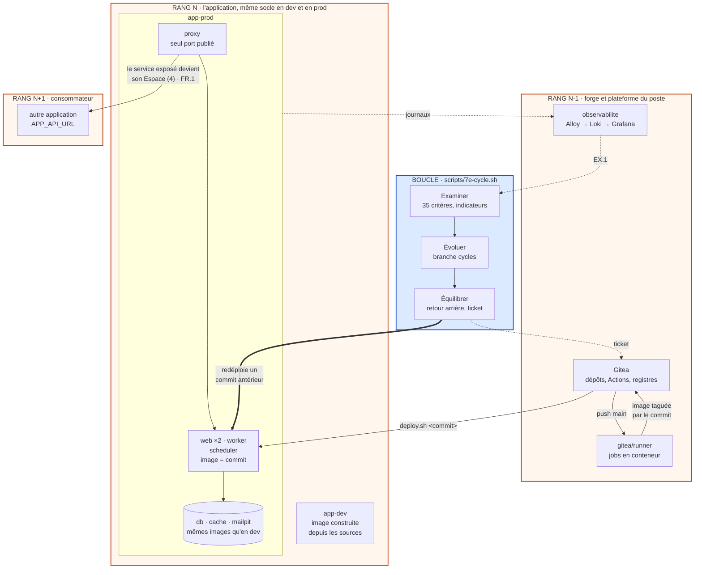

# Profil localhost · Grille 12 facteurs × 7E

> Compagnon de la grille d'audit 12 facteurs × 7E (35 critères), devenue le [modèle exécutif 12 facteurs × 7E](modele-executif-12f-7e.md) ([document vivant](https://claude.ai/code/artifact/0afadfec-2686-44c8-beb2-11c96474b8d0)), et de sa vue d'ensemble [`vue-ensemble.mmd`](vue-ensemble.mmd), rendue en [`vue-ensemble.svg`](vue-ensemble.svg).
>
> Poste cible : Windows 11, WSL2 Ubuntu 24.04, Docker Engine et son plugin Compose, Gitea et son runner.
>
> Versions relevées le 2026-10-01. Validation : fichiers Compose par Compose v5.5.1, proxy par `nginx -t` et un journal JSON réel, collecte par Alloy v1.20.1, scripts par ShellCheck, workflow par actionlint. La logique des scripts est éprouvée contre un faux démon Docker : à confirmer au premier lancement sur le poste.

**En localhost, la grille s'applique sans changer un seul critère : seules les preuves changent.** Trois décisions la rendent applicable :

1. **Deux environnements, mêmes images.** `app-dev` et `app-prod` sont deux projets Compose sur le même socle. La prod locale ne lance que des images publiées, taguées par leur commit.
2. **Une forge locale engendre tout ce qui s'exécute.** Gitea, son runner et son registre construisent, vérifient et publient chaque release. Rien n'est construit ni modifié à la main ailleurs.
3. **La boucle est un outil du dépôt.** `scripts/7e-cycle.sh` enchaîne les sept phases. Sa mémoire est une branche Git, ses seuils et ses règles sont des fichiers versionnés.

Sur les 35 critères, 28 se vérifient à chaque cycle, 4 par épreuve hebdomadaire et 3 restent manuels (1.2, 4.2, 9.3).

## Sommaire

1. [Ce que le localhost change](#1-ce-que-le-localhost-change)
2. [Topologie](#2-topologie)
3. [Socle du poste](#3-socle-du-poste)
4. [Deux environnements, mêmes images](#4-deux-environnements-mêmes-images)
5. [Configuration de référence, terme par terme](#5-configuration-de-référence-terme-par-terme)
6. [Les 35 critères en localhost](#6-les-35-critères-en-localhost)
7. [Équivalences Spring Boot, Django, Laravel](#7-équivalences-spring-boot-django-laravel)
8. [La boucle en localhost](#8-la-boucle-en-localhost)
9. [La fractale en localhost](#9-la-fractale-en-localhost)
10. [Ordre de mise en œuvre](#10-ordre-de-mise-en-œuvre)
11. [Annexes : fichiers de référence](#11-annexes--fichiers-de-référence)

## 1. Ce que le localhost change

Ne changent pas : l'axiome, la projection des 12 facteurs sur les sept termes, les 35 critères et l'échelle de 0 à 3. Changent : la preuve attendue de chaque critère (section 6) et la lecture de deux d'entre eux.

- **10.2** mesure le délai entre le commit et la prod locale. `deploy.sh` horodate chaque déploiement : le délai en découle.
- **10.3** est conforme par construction quand une seule personne code et déploie. La preuve reste la trace : chaque déploiement enregistre son auteur.

**L'argument autotélique.** Dans le cloud, la plateforme fournit la boucle : elle relance, répartit, collecte et alerte. En localhost, personne ne la fournit, et le projet doit produire la boucle qui le régule. Le localhost n'est donc pas une prod au rabais : c'est le lieu où l'autotélie devient opérationnelle.

| Fonction | Fournie par la plateforme, dans le cloud | Produite par le projet, en localhost |
| --- | --- | --- |
| Construire et publier les releases | pipeline managé | Gitea Actions et registre Gitea |
| Router et répartir | répartiteur de charge | `proxy` nginx, seul port publié |
| Relancer un processus tombé | orchestrateur | `restart: unless-stopped`, sondes de santé |
| Mettre à l'échelle | autoscaler | `--scale web=N` |
| Collecter les journaux | service de logs | Alloy, Loki, Grafana |
| Observer, comparer, corriger | supervision et astreinte | `7e-cycle.sh` : Examiner, Évoluer, Équilibrer |

Deux avantages en découlent. Tout est observable sur une seule machine, et chaque correction coûte peu et se défait. La boucle peut donc s'éprouver souvent (section 8).

Deux limites aussi. Une machine seule ne connaît ni vraie panne réseau ni vraie charge, et la prod locale n'est pas la prod. La parité se joue sur les images, pas sur la machine. Ce que le localhost ne peut pas montrer se note « sans objet », jamais « conforme ».

## 2. Topologie



Lecture : trois rangs de la même cellule. Le rang N-1 engendre (la forge) et observe (l'observabilité). Le rang N existe deux fois, en dev et en prod locale, sur le même socle. Le rang N+1 attache le service exposé par sa seule URL. La boucle lit la prod et ses journaux, garde sa mémoire dans Git et corrige en redéployant un commit antérieur.

## 3. Socle du poste

### 3.1 Les fichiers dans WSL, pas sous Windows

- Dépôts dans le système de fichiers Linux de WSL (`~/src/<depot>`), jamais sous `/mnt/c` : les montages y sont lents et la surveillance de fichiers, donc le rechargement à chaud, y fonctionne mal.
- Depuis Windows, les fichiers restent accessibles par `\\wsl$\<distribution>\home\<compte>\src`.
- Un navigateur Windows atteint les ports publiés dans WSL par `localhost` : `http://localhost:8080` pour le dev, `8081` pour la prod locale.

### 3.2 Les ressources de WSL

Docker, MySQL et Loki tournent dans la machine virtuelle de WSL : borner sa mémoire évite qu'elle prenne celle de Windows. Dans `%UserProfile%\.wslconfig`, puis `wsl --shutdown` :

```ini
# Valeurs à adapter à la machine
[wsl2]
memory=8GB
processors=4
```

Docker Engine installé dans WSL a besoin de systemd. Dans `/etc/wsl.conf` :

```ini
[boot]
systemd=true
```

### 3.3 Docker

- Docker Engine dans WSL ou Docker Desktop avec l'intégration WSL : les deux conviennent. Les scripts appellent le plugin `docker compose`, jamais l'ancien `docker-compose`.
- Docker fait la rotation des journaux, pas l'application (11.1). Dans `/etc/docker/daemon.json`, puis `sudo systemctl restart docker` :

  ```json
  { "log-driver": "json-file", "log-opts": { "max-size": "10m", "max-file": "3" } }
  ```

  Avec Docker Desktop, le même JSON se règle dans Settings > Docker Engine. Un conteneur garde l'ancien réglage jusqu'à sa recréation.
- Le registre de Gitea répond en HTTP sur `localhost:3000`. Docker accepte sans TLS les registres en boucle locale (127.0.0.0/8). Une seule connexion suffit : `docker login localhost:3000` avec un jeton Gitea de portée `write:package`.

### 3.4 Git

- `.gitattributes` force LF partout et CRLF pour `.bat` et `.cmd`. Un script enregistré en CRLF casse dans le conteneur (`/bin/sh^M: bad interpreter`).
- `.gitignore` exclut `.env.dev`, `.env.prod` et `.7e/` (état local et mémoire).
- Git 2.42 ou plus pour le worktree orphelin de la mémoire. Ubuntu 24.04 fournit la 2.43.

### 3.5 Outils et horloge

- `sudo apt install jq curl` : jq lit les configurations, la mémoire et les journaux.
- Après une mise en veille, comparer l'heure de WSL (`date -u`) à celle de Windows. Un décalage fausse l'horodatage des journaux (11.2) et la mémoire des cycles (EV.1). Correction : `sudo hwclock -s`.

### 3.6 Mise en place

```bash
cd ~/src/<depot>
scripts/7e-init.sh                      # copies .env, réseau « contrats », mémoire des cycles
# renseigner .env.dev et .env.prod : secrets, ports distincts (8080/8025 et 8081/8026)
docker login localhost:3000
scripts/compose.sh dev up -d --build --wait
docker compose -f ~/src/observabilite/compose.yaml up -d --wait   # rang N-1, une fois par poste
```

## 4. Deux environnements, mêmes images

C'est la décision structurante du profil : la parité (10.1) se joue sur les images, et la prod locale ne voit que des releases.

| | `app-dev` | `app-prod` |
| --- | --- | --- |
| Fichiers Compose | `compose.yaml` + `compose.override.yaml` | `compose.yaml` + `compose.prod.yaml` |
| Image de l'application | construite depuis les sources (cible `dev`) | tirée du registre, tag = commit |
| Code | monté depuis WSL, rechargement à chaud | celui de l'image, rien de monté |
| Config | `.env.dev` | `.env.prod` |
| Ports publiés (127.0.0.1) | 8080 (HTTP), 8025 (Mailpit) | 8081, 8026 |
| Répliques web | 1 | 2 |
| Services attachés | `mysql:8.4.11`, `redis:7.4.11-alpine`, `axllent/mailpit:v1.31.3` | les mêmes, déclarés une seule fois |
| Lancement | `scripts/compose.sh dev up -d --build --wait` | `scripts/deploy.sh <commit>` |

```bash
# dev : construit depuis les sources, sources montées
scripts/compose.sh dev up -d --build --wait
scripts/compose.sh dev logs -f web

# prod locale : uniquement des commits publiés par la CI
git fetch && scripts/deploy.sh <commit>
scripts/rollback.sh                       # retour à la release saine précédente
scripts/admin.sh prod migrate             # tâche ponctuelle tracée
scripts/compose.sh prod ps                # toute autre commande Compose
```

Trois règles :

- La prod locale ne se lance jamais par un `docker compose up` direct. `compose.sh` lui impose le tag de la release en service (`.7e/etat/prod.tag`) ; seul `deploy.sh` le change. Un `APP_TAG` oublié dans `.env.prod` est ignoré.
- Les services attachés sont déclarés une fois, dans `compose.yaml`, à la version de correctif près. `7e-check.sh` compare les identifiants d'image réellement en service dans les deux projets : un `docker pull` à des dates différentes ne passe pas inaperçu.
- L'image de base du Dockerfile s'épingle par digest. Dev et prod partent alors du même octet.

## 5. Configuration de référence, terme par terme

Les fichiers complets sont en annexe (section 11). Chaque terme ci-dessous dit ce qui est en place et pourquoi.

### Éléments : 1 Codebase, 2 Dépendances

- Un dépôt Gitea par application. Son nom nomme les projets Compose : `<depot>-dev`, `<depot>-prod`.
- L'image porte son commit deux fois : dans son tag (SHA complet) et dans le label `org.opencontainers.image.revision`. `docker inspect` dit à tout instant quel commit tourne (1.1).
- Le code commun devient une bibliothèque publiée dans le registre de paquets de Gitea (PyPI, Composer, Maven ou npm) et consommée en version épinglée (1.2). C'est une cellule de rang N-1, avec sa propre grille.
- Les dépendances sont verrouillées (2.1) : `requirements.txt` avec empreintes (`pip-compile --generate-hashes`) ou `uv.lock`, `composer.lock`, `package-lock.json`. Pour Maven, des versions explicites, sans plage ni SNAPSHOT, tenues par les règles de Maven Enforcer.
- Le build multi-étapes part du seul dépôt (2.2). La CI le prouve à chaque commit dans un conteneur de job vierge ; l'épreuve `--exercice` le rejoue sur le poste, sans cache, depuis un clone vierge.

### Espace : 3 Config, 4 Services externes

- `.env.example` est le contrat de config : versionné, commenté, avec les mêmes clés que `.env.dev` et `.env.prod`, qui restent ignorés (3.1).
- `compose.yaml` déclare chaque variable requise sous la forme `${VAR:?}`. Un oubli bloque le lancement au lieu de produire une application mal configurée.
- `--env-file` ne sert qu'à l'interpolation de Compose. Seules les variables listées sous `environment:` entrent dans les conteneurs : la config est explicite et se relit.
- Les secrets ne vivent que dans `.env.dev` et `.env.prod` (3.2). gitleaks parcourt tout l'historique, toutes branches ; Trivy cherche les secrets dans l'image. Plus strict : `secrets:` de Compose et variables `_FILE`, invisibles dans `docker inspect`.
- Les services attachés sont désignés par URL (4.1) : `DATABASE_URL`, `REDIS_URL`, `SMTP_URL`. `DATABASE_URL` vide désigne la base locale `db`. Renseignée, elle bascule vers une autre base sans toucher au code (4.2).
- Dans un conteneur, `localhost` désigne le conteneur lui-même. Le build de dev passe donc par `build.network: host` pour joindre le registre de paquets de Gitea.

### Engendrent : 5 Build, release, run ; 12 Processus d'admin

- Une seule chaîne engendre (5.1). Un push sur `main` déclenche Gitea Actions : construction, tests dans l'image, recherche de secrets, publication de `<registre>/<propriétaire>/<dépôt>:<commit>`. `compose.prod.yaml` n'a aucune clé `build:`.
- Une release ne change plus (5.2). Le registre de Gitea accepterait qu'on écrase un tag : c'est la CI qui refuse de republier un commit déjà présent, en interrogeant l'API des paquets. Aucune image en `latest`.
- Le retour arrière redéploie une release antérieure (5.3). `rollback.sh` choisit la dernière release saine et écarte celles dont on est déjà revenu. `deploy.sh` revient seul à la précédente si la nouvelle n'atteint pas l'état sain (règle R1).
- Les tâches ponctuelles passent par `scripts/admin.sh <env> <commande>` (12.1). Le script lance `compose run --rm web <commande>` sur la release en service, avec sa config, et trace l'acte : commande, release, auteur, code de sortie. Jamais de `docker exec` pour modifier la base (12.2) ; `bin/run migrations-check` compare le schéma aux migrations versionnées.
- Le runner monte le démon Docker de l'hôte dans les jobs (son comportement par défaut). `docker build` et `docker push` y fonctionnent, mais `docker run -v $PWD:…` monterait un chemin de l'hôte, pas celui du job. D'où gitleaks installé dans le job et Trivy qui ne monte que le socket.

### État : 6 Processus sans état

- `read_only: true` et un `tmpfs` sur `/tmp` pour web, worker et scheduler, en dev comme en prod (6.1, 6.2). Toute écriture locale échoue sur-le-champ : c'est la preuve la plus forte, et elle vaut aussi pour 11.1.
- Sessions et caches vivent dans `cache` (Redis), les fichiers dans un service attaché. Le proxy n'a ni `ip_hash` ni `sticky`.
- Seuls `db` et `cache` ont un volume nommé. Un `docker diff` vide prouve que rien n'a été écrit dans un conteneur.

### Expression : 7 Port binding, 11 Logs

- L'application embarque son serveur (7.1) : gunicorn, Tomcat embarqué ou FrankenPHP (section 7). La sonde `bin/run health` interroge le port depuis l'intérieur du conteneur.
- Le port d'écoute vient de `PORT` (7.2). Le seul port publié est celui du proxy, sur `127.0.0.1` : rien n'est exposé au réseau local.
- Les journaux partent en JSON sur stdout et stderr, un événement par ligne, horodaté (11.1, 11.2). Le proxy pose un `X-Request-Id` que l'application peut reprendre dans ses lignes. Son journal d'accès, en JSON, est la source des indicateurs d'Examiner.

### Évolutif : 8 Concurrence, 9 Jetabilité

- Pour monter en charge (8.1), `web` n'a ni `container_name` ni port publié. Le proxy relit le DNS de Docker toutes les 5 secondes et répartit sur les répliques. La prod locale en lance deux.
- Une image, plusieurs commandes (8.2) : `web`, `worker`, `scheduler`. `bin/run` joue le rôle du Procfile. Le scheduler reste unique, jamais mis à l'échelle.
- Au démarrage (9.1), la sonde passe toutes les secondes (`start_interval`, Docker Engine 25 ou plus). L'épreuve mesure le temps jusqu'à l'état sain.
- À l'arrêt (9.2), `init: true` relaie SIGTERM, `stop_grace_period` laisse 30 secondes, et le proxy rejoue une requête sur une autre réplique. Code de sortie : 0 arrêt propre, 143 signal non traité, 137 tué au bout du délai.
- Face à un arrêt brutal (9.3), les tâches sont idempotentes et acquittées après traitement. Redis tourne en AOF : la file survit à un redémarrage.

### Environnement : 10 Parité dev/prod

- 10.1 : socle commun et mêmes images, vérifiés sur les conteneurs en service.
- 10.2 : chaque déploiement est horodaté dans la mémoire ; le délai depuis le commit en découle.
- 10.3 : chaque déploiement enregistre son auteur (`git config user.email`), que la vérification retrouve parmi les auteurs du code.

## 6. Les 35 critères en localhost

`scripts/7e-check.sh dev|prod [--exercice] [ID…]` vérifie les critères et écrit une ligne JSON par critère : `{"id", "statut", "preuve"}`. Les statuts se reportent ainsi dans la grille :

| Statut | Report dans la grille |
| --- | --- |
| `ok` | 3 Automatisé : la vérification est automatique et se répète, à chaque cycle ou à chaque épreuve |
| `ecart` | 0 ou 1, au jugement de l'auditeur, avec la preuve en constat |
| `manuel` | preuve humaine ; le champ `preuve` donne la procédure |
| `calibrage` | seuil pas encore fixé : la mesure est donnée, sans verdict |
| `sans_objet` | hors calcul |

Colonne « Mode » : **cycle** = vérifié à chaque cycle ; **épreuve** = avec `--exercice`, qui agit sur l'environnement et se défait ; **manuel**.

### Éléments

| ID | Preuve en localhost | Vérification | Mode |
| --- | --- | --- | --- |
| 1.1 | Le web de `app-prod` porte le label de révision : un commit du dépôt, égal à la release en service | `docker inspect`, `git cat-file` | cycle |
| 1.2 | Bibliothèque commune publiée dans le registre de paquets Gitea, version épinglée dans le manifeste | revue du manifeste | manuel |
| 2.1 | Chaque manifeste a son verrou versionné ; pom sans plage ni SNAPSHOT | `git ls-files` des manifestes et des verrous | cycle |
| 2.2 | Build sans cache depuis un clone vierge du dépôt | CI à chaque commit ; `docker build --no-cache` sur un clone | épreuve |

### Espace

| ID | Preuve en localhost | Vérification | Mode |
| --- | --- | --- | --- |
| 3.1 | `.env.example` versionné, `.env.dev` et `.env.prod` ignorés, mêmes clés ; `${VAR:?}` bloque toute variable manquante | `git check-ignore`, comparaison des clés | cycle |
| 3.2 | Aucun secret dans l'historique, toutes branches, ni dans l'image | `gitleaks git --log-opts=--all`, `trivy image --scanners secret` ; aussi en CI | cycle |
| 4.1 | `DATABASE_URL`, `REDIS_URL`, `SMTP_URL` dans l'environnement de web ; aucune adresse `db:3306` en dur dans le code | config Compose, `git grep` | cycle |
| 4.2 | Bascule vers une autre instance en changeant une URL dans `.env.<env>`, application saine | procédure donnée par le script | manuel |

### Engendrent

| ID | Preuve en localhost | Vérification | Mode |
| --- | --- | --- | --- |
| 5.1 | Aucune clé `build:` en prod ; aucune installation au démarrage dans `bin/run` | config prod, `bin/run` | cycle |
| 5.2 | Images de la prod toutes épinglées, aucune en `latest` ; tag de l'application = commit de 40 caractères ; la CI refuse d'écraser | `config --images` | cycle |
| 5.3 | Une release antérieure saine existe et son image est sur le poste ; l'épreuve fait l'aller-retour | mémoire, puis `deploy.sh` deux fois | épreuve |
| 12.1 | Tâches lancées par `admin.sh`, tracées avec release, auteur et code de sortie | `evenements.jsonl` | cycle |
| 12.2 | Schéma conforme aux migrations versionnées | `compose run --rm web migrations-check` | cycle |

### État

| ID | Preuve en localhost | Vérification | Mode |
| --- | --- | --- | --- |
| 6.1 | Racine des conteneurs applicatifs en lecture seule ; aucune session collante au proxy | `docker inspect` (ReadonlyRootfs), conf du proxy | cycle |
| 6.2 | Aucun volume sur web, worker, scheduler en prod ; `docker diff` vide | config prod, `docker diff` | cycle |

### Expression

| ID | Preuve en localhost | Vérification | Mode |
| --- | --- | --- | --- |
| 7.1 | Chaque réplique web répond à sa sonde interne | état de santé Docker | cycle |
| 7.2 | `PORT` dans l'environnement, cohérent avec le proxy ; ports publiés sur 127.0.0.1 seulement | config Compose, conf du proxy | cycle |
| 11.1 | Journaux non vides sur stdout et stderr depuis 24 h ; racine en lecture seule | `compose logs` | cycle |
| 11.2 | Les 200 dernières lignes de web et worker sont du JSON horodaté | `compose logs`, jq | cycle |

### Évolutif

| ID | Preuve en localhost | Vérification | Mode |
| --- | --- | --- | --- |
| 8.1 | Ni `container_name` ni port sur web ; l'épreuve ajoute une réplique, sert 20 requêtes sur 20, puis revient | config, `curl` via le proxy | cycle, épreuve |
| 8.2 | Une image, au moins deux commandes distinctes | config Compose | cycle |
| 9.1 | Une réplique redémarrée revient à l'état sain sous `demarrage_s` | `docker start`, sonde | épreuve |
| 9.2 | Arrêt sous trafic : code 0, aucune requête perdue | `docker stop` pendant 20 requêtes | épreuve |
| 9.3 | N tâches, worker tué par SIGKILL, exactement N résultats | procédure propre à l'application | manuel |

### Environnement

| ID | Preuve en localhost | Vérification | Mode |
| --- | --- | --- | --- |
| 10.1 | Mêmes identifiants d'image pour proxy, db, cache et mailpit dans `app-dev` et `app-prod` | `docker inspect` des deux projets | cycle |
| 10.2 | Délai entre le commit et la prod locale sous `delai_commit_prod_h` | mémoire, `git show` | cycle |
| 10.3 | Le dernier déploiement est lancé par un auteur du code | mémoire, `git log` | cycle |

### Second ordre

| ID | Preuve en localhost | Vérification | Mode |
| --- | --- | --- | --- |
| EX.1 | Loki reçoit les journaux du projet depuis une heure | API de Loki | cycle |
| EX.2 | Seuils versionnés et non nuls, évalués à chaque cycle ; sinon calibrage | `7e/seuils.json`, dernier cycle | cycle |
| EV.1 | Au moins deux cycles en mémoire, le dernier de moins de `memoire_max_jours` | branche `cycles` | cycle |
| EV.2 | Chaque cycle porte son commit et le précédent : une régression se rattache à `git log précédent..courant` | dernier cycle | cycle |
| EQ.1 | Règles versionnées ; retour arrière déjà éprouvé ou appliqué | `7e/regles.json`, mémoire | cycle |
| EQ.2 | Seuils ou règles revus depuis moins de `revue_max_jours` | `git log -- 7e/` | cycle |
| IN.1 | `7e/invariant.json` versionné ; chaque chemin protégé sur `main` dans Gitea | API Gitea `branch_protections` | cycle, avec jeton |
| FR.1 | Le consommateur atteint le service par sa seule URL, sur le réseau `contrats` | `docker compose run --rm smoke` | cycle, avec consommateur |

IN.1 et FR.1 deviennent automatiques une fois `GITEA_URL`, `GITEA_REPO`, `GITEA_TOKEN` et `CONSOMMATEUR` renseignés ; sans eux, le script répond `manuel` et dit quoi fournir.

## 7. Équivalences Spring Boot, Django, Laravel

`bin/run` (annexe) est écrit pour Django. Pour les deux autres piles, seules ses lignes changent : le reste du profil est identique.

| Besoin | Spring Boot 4 | Django | Laravel 12 |
| --- | --- | --- | --- |
| Image (2.2) | build `eclipse-temurin:21-jdk` et `./mvnw -B package` ; exécution `eclipse-temurin:21-jre` | `python:3.13-slim`, dépendances avec empreintes | `dunglas/frankenphp:1-php8.4`, `composer install --no-dev` |
| Serveur et port (7.1, 7.2) | Tomcat embarqué, `server.port` = `${PORT}` | gunicorn `--bind 0.0.0.0:${PORT}` | Octane sur FrankenPHP : `octane:start --server=frankenphp` `--host=0.0.0.0 --port=${PORT}` |
| Journaux JSON (11.1, 11.2) | `logging.structured.format.console` = `ecs` ; pas de `logging.file.name` (aucun fichier par défaut) | `LOGGING` vers stdout avec un formateur JSON ; gunicorn de même par `logconfig_dict` | `LOG_CHANNEL=stderr` ; `LOG_STDERR_FORMATTER` = `Monolog\Formatter\JsonFormatter` |
| Arrêt propre (9.2) | actif par défaut ; `spring.lifecycle.timeout-per-shutdown-phase` = `20s` | gunicorn `--graceful-timeout 20` ; Celery finit la tâche en cours sur SIGTERM | FrankenPHP s'arrête proprement sur SIGTERM ; `queue:work` finit la tâche en cours (extension pcntl) |
| Sessions et cache (6.1) | Spring Session Data Redis, `spring.data.redis.url` = `${REDIS_URL}` | `SESSION_ENGINE` en cache, cache Redis intégré (`RedisCache`) | `SESSION_DRIVER=redis`, `CACHE_STORE=redis` |
| Écritures locales (6.2) | le tmpfs `/tmp` suffit à Tomcat | `PYTHONDONTWRITEBYTECODE=1` | `VIEW_COMPILED_PATH=/tmp/views` ; `XDG_CONFIG_HOME` et `XDG_DATA_HOME` de FrankenPHP sous `/tmp` |
| Worker (8.2, 9.3) | même jar, profil `worker`, `spring.main.web-application-type` = `none` | `celery -A config worker`, `task_acks_late` et `task_reject_on_worker_lost` | `php artisan queue:work`, `retry_after` supérieur à la plus longue tâche |
| Scheduler (8.2) | profil `scheduler` portant les `@Scheduled` | `celery -A config beat --schedule /tmp/celerybeat-schedule` | `php artisan schedule:work` |
| Migrations (12.1) | Flyway lancé en tâche ponctuelle, désactivé dans le profil web | `python manage.py migrate` | `php artisan migrate --force` |
| Contrôle des migrations (12.2) | Actuator `/actuator/flyway` : aucune migration en attente | `python manage.py migrate --check` | `php artisan migrate:status` sans ligne `Pending` |
| Sonde de santé (7.1) | Actuator `/actuator/health/readiness` (sondes activées) | vue `/health` | route `/up`, fournie par Laravel |

Pour un front Vue : Vite fige `import.meta.env` au build. Une même image ne servirait alors qu'un environnement, contre 3.1 et 5.1. La config se lit plutôt dans un `config.json` servi au démarrage.

## 8. La boucle en localhost

`scripts/7e-cycle.sh dev|prod [--exercice]` enchaîne les sept phases du cycle 7E sur un environnement. Il sort en 1 si un critère est en écart ou un indicateur hors seuil.

| Phase | Ce que fait le script | Ce qu'il enregistre |
| --- | --- | --- |
| 1 Évaluer | lit la release en service et le dernier cycle de la mémoire | commit, commit précédent |
| 2 Élaborer | charge les seuils et les règles versionnés, fixe la fenêtre d'observation | version de `7e/seuils.json` et de `7e/regles.json`, modification hors commit |
| 3 Exécuter | lance `7e-check.sh` sur les 35 critères ; les épreuves avec `--exercice` | statut et preuve de chaque critère |
| 4 Examiner | calcule sur le journal du proxy le taux de 5xx et la latence p95, face aux seuils | indicateurs, verdicts |
| 5 Évoluer | compare au cycle précédent : critères passés de ok à écart, indicateurs dégradés, commits de l'intervalle | régressions, attribution |
| 6 Émettre | écrit le cycle dans la branche `cycles`, la pousse vers Gitea, affiche le résumé | un fichier JSON par cycle |
| 7 Équilibrer | applique les règles : retour arrière (R2), ticket Gitea (R3, R4), proposition de seuil (R5) | événements, tickets |

### Mémoire des cycles (EV.1, EV.2)

```text
.7e/memoire/          worktree de la branche orpheline « cycles », poussée vers Gitea
├── README.md
├── prod/
│   ├── cycles/20261001T155928Z-f47efeed9197.json   un fichier par cycle, jamais réécrit
│   └── evenements.jsonl                            déploiements, retours arrière, admin, épreuves, tickets
└── dev/
```

Git sert de mémoire parce qu'il horodate, chaîne chaque ajout au précédent par empreinte, se pousse hors du poste et se lit avec les outils habituels (`git log cycles`, jq). La branche `cycles` ne déclenche pas la CI.

Un cycle réel, issu des tests du profil : une release D fait passer le taux de 5xx à 50 % pour un seuil de 5 %. Le cycle rattache la dégradation aux commits de l'intervalle, et la règle R2 revient à la release précédente.

```json
{
  "version": 1,
  "ts": "2026-10-01T15:59:28Z",
  "env": "prod",
  "commit": "f47efeed9197c65ef1ae13b82c994bc6136daee7",
  "commit_precedent": "046b21bff62330df4da89fbfefdfa77a711764a0",
  "nouvelle_release": true,
  "indicateurs": {
    "fenetre_min": 15,
    "requetes": 40,
    "taux_5xx": {
      "mesure": 0.5,
      "seuil": 0.05,
      "verdict": "hors_seuil"
    },
    "latence_p95_ms": {
      "mesure": 10,
      "seuil": 500,
      "verdict": "ok"
    }
  },
  "bilan": {
    "ecart": 1,
    "manuel": 9,
    "ok": 24,
    "sans_objet": 1
  },
  "criteres": [
    {
      "id": "1.1",
      "statut": "ok",
      "preuve": "web exécute f47efeed9197c65ef1ae13b82c994bc6136daee7 : commit du dépôt unique, release en service connue"
    },
    {
      "id": "1.2",
      "statut": "manuel",
      "preuve": "montrer la dépendance déclarée vers la bibliothèque commune (registre de paquets Gitea, version épinglée) et l'absence de copie du code"
    },
    {
      "…": "33 autres critères"
    }
  ],
  "regressions": [],
  "indicateurs_degrades": [
    "taux_5xx"
  ],
  "attribution": [
    "f47efee release D",
    "cc73801 release C (cassée)",
    "6142963 release B"
  ]
}
```

Et les événements correspondants : deux déploiements, un échec suivi du retour automatique (R1), puis un retour arrière manuel qui redéploie la première release.

```text
{"ts":"2026-10-01T15:58:26Z","type":"deploiement","resultat":"ok","commit":"046b21bff62330df4da89fbfefdfa77a711764a0","precedent":"","duree_s":0,"par":"fred@example.test"}
{"ts":"2026-10-01T15:58:27Z","type":"deploiement","resultat":"ok","commit":"6142963b80900e43233ac56ab69ef8003a2880aa","precedent":"046b21bff62330df4da89fbfefdfa77a711764a0","duree_s":0,"par":"fred@example.test"}
{"ts":"2026-10-01T15:58:27Z","type":"deploiement","resultat":"echec","commit":"cc738017fae86952d422d24da0947e2fc81186b0","precedent":"6142963b80900e43233ac56ab69ef8003a2880aa"}
{"ts":"2026-10-01T15:58:27Z","type":"retour_arriere","auto":true,"regle":"R1","commit":"6142963b80900e43233ac56ab69ef8003a2880aa","depuis":"cc738017fae86952d422d24da0947e2fc81186b0"}
{"ts":"2026-10-01T15:58:27Z","type":"deploiement","resultat":"ok","commit":"046b21bff62330df4da89fbfefdfa77a711764a0","precedent":"6142963b80900e43233ac56ab69ef8003a2880aa","duree_s":0,"par":"fred@example.test"}
{"ts":"2026-10-01T15:58:27Z","type":"retour_arriere","auto":false,"commit":"046b21bff62330df4da89fbfefdfa77a711764a0","depuis":"6142963b80900e43233ac56ab69ef8003a2880aa"}
```

### Règles (EQ.1)

| Règle | Si | Alors | Automatique |
| --- | --- | --- | --- |
| R1 | une release n'atteint pas l'état sain au déploiement | retour à la précédente (`deploy.sh`) | oui |
| R2 | un indicateur se dégrade après une nouvelle release | retour arrière (`rollback.sh`) | oui |
| R3 | un indicateur est hors seuil sans nouvelle release | ticket Gitea, une mise à l'échelle se décide à la main | oui |
| R4 | un critère passe de ok à écart | ticket Gitea, avec les commits de l'intervalle | oui |
| R5 | un seuil est en calibrage | mesure enregistrée, valeur proposée à la revue EQ.2 | non |

Principe : à effet égal, la correction réversible, celle qui laisse le plus de choix au cycle suivant. Les tickets ne s'ouvrent pas en double : un ticket du même titre encore ouvert suffit.

### Seuils, calibrage et revue (EX.2, EQ.2)

- Aucune consigne ne vient du dehors : un seuil à `null` est en calibrage. La boucle mesure et enregistre sans verdict.
- Les valeurs initiales lisent les critères eux-mêmes : 9.1 « quelques secondes » donne 10 s, 10.2 « en heures, pas en semaines » donne 24 h.
- La revue EQ.2 est un commit sur `7e/seuils.json` ou `7e/regles.json` qui cite les cycles qui le justifient. Le champ `revue` date la revue même sans changement de valeur. `git log -- 7e/` est le journal des révisions.
- Un cycle lancé avec des seuils modifiés hors commit le signale (`modifies_hors_commit`) : il ne se rattache à aucune version.
- La boucle ne touche jamais l'invariant (IN.1) : `7e/AXIOME.md`, `7e/invariant.json` et `contrats/`. Dans Gitea, la protection de `main` porte les motifs `7e/AXIOME.md;7e/invariant.json;contrats/**`. Les changer suppose de lever la protection : un acte délibéré, hors de la boucle.

### Épreuves (`--exercice`)

Les épreuves agissent sur l'environnement puis se défont : build depuis un clone vierge (2.2), aller-retour de release (5.3), réplique supplémentaire (8.1), arrêt sous trafic et redémarrage (9.1, 9.2). Elles éprouvent les prérequis d'Équilibrer : une boucle qui ne s'éprouve pas ne sait pas si elle peut se corriger. Chaque épreuve laisse un événement dans la mémoire.

### Calendrier

- Après chaque `deploy.sh` : `scripts/7e-cycle.sh prod`.
- Chaque jour : un timer systemd utilisateur (annexe). `Persistent=true` rattrape le cycle manqué quand WSL était arrêté.
- Chaque semaine : `scripts/7e-cycle.sh prod --exercice`.
- Pour les tickets et la vérification d'IN.1 : `GITEA_URL`, `GITEA_REPO` et `GITEA_TOKEN` dans `~/.config/7e/gitea.env`, hors du dépôt.

## 9. La fractale en localhost

Chaque projet du poste est la même cellule : un dépôt, `compose.yaml`, `.env.example`, `7e/` et `scripts/`. Ce qu'un rang exprime devient Élément ou Espace du rang suivant, et la grille s'applique telle quelle à chaque rang.

| Rang | Projets du poste | Ce qu'il exprime | Ce que cela devient au rang suivant |
| --- | --- | --- | --- |
| N-1 | forge (Gitea, gitea/runner), `observabilite`, bibliothèques communes, images de base | images, paquets, journaux consultables | Éléments (1.1, 1.2, 2.1) et Espace (4.1) de l'application |
| N | l'application, en `app-dev` et `app-prod` | service exposé derrière le proxy | Espace (4) du consommateur, par le réseau `contrats` (FR.1) |
| N+1 | consommateur | son propre service | Espace du rang N+2, et ainsi de suite |
| Projet | la grille, `7e/`, la mémoire des cycles | scores, constats, seuils révisés | Éléments de chaque rang au cycle suivant (EQ.2) |

**Répliquer la cellule.** Un dépôt modèle Gitea, `cellule-7e`, porte le squelette : fichiers Compose, `.env.example`, `7e/`, `scripts/`, workflow, `.gitattributes`, `.gitignore`. Un nouveau projet naît par « Utiliser ce modèle ». Les fichiers listés dans `.gitea/template`, ici `.env.example` seul, y reçoivent `$REPO_NAME` et `$REPO_OWNER` : `IMAGE_NAME` et `OWNER` se remplissent à la création.

**La forge passe la grille.** Le rang N-1 est une cellule comme les autres :

- 3.1 : Gitea se configure par variables `GITEA__<section>__<CLÉ>` (image officielle), pas en éditant `app.ini` à la main.
- 5.2 : `gitea/gitea:28.0.0` et `gitea/runner:4.0.1` épinglés, jamais `latest`.
- 6.2 : l'état de Gitea vit dans son volume `/data` et sa base, rien ailleurs.
- 11.1 : journaux sur stdout, recueillis par Alloy comme ceux de l'application.
- 10.1 : `observabilite` épingle Loki 3.7.8, Alloy v1.20.1 et Grafana 13.2.3 ; Promtail, en fin de vie depuis le 2 mars 2026, n'a plus sa place.

**Le bouclage.** La dernière ligne du tableau referme la chaîne : ce que le projet exprime (cycles, constats, seuils révisés) redevient Élément de chaque rang au cycle suivant. C'est ce bouclage qui rend le projet autotélique. En localhost, il tient dans une branche Git et deux fichiers JSON.

## 10. Ordre de mise en œuvre

Les prérequis de la boucle passent d'abord : sans eux, Examiner, Évoluer et Équilibrer n'ont rien sur quoi tourner.

1. **Socle** : WSL, Docker, Git (section 3), puis `scripts/7e-init.sh`.
2. **Deux environnements** : fichiers Compose, `.env.dev`, `.env.prod` (3.1, 10.1).
3. **Journaux JSON sur stdout** (11.1, 11.2) : Examiner devient possible.
4. **Forge** : CI qui tague par commit et publie, `deploy.sh` (1.1, 5.2) : Évoluer devient possible.
5. **Retour arrière, répliques, arrêt propre** (5.3, 8.1, 9.2, 9.3) : Équilibrer devient possible.
6. **Observabilité** (EX.1) et seuils en calibrage (EX.2).
7. **Premier cycle**, puis un par jour ; première épreuve dans la semaine.
8. **Invariant protégé** dans Gitea (IN.1) et consommateur sur le réseau `contrats` (FR.1).
9. **Première revue EQ.2** après quelques cycles : fixer les seuils en calibrage à partir des mesures enregistrées.

## 11. Annexes : fichiers de référence

```text
<depot>/                               rang N, un dépôt par application
├── .gitea/workflows/release.yaml
├── .dockerignore  .gitattributes  .gitignore  .env.example
├── compose.yaml  compose.override.yaml  compose.prod.yaml
├── Dockerfile  bin/run  proxy/default.conf
├── 7e/AXIOME.md  7e/invariant.json  7e/seuils.json  7e/regles.json
├── contrats/                          contrats d'interface exposés (FR.1)
└── scripts/lib.sh  compose.sh  deploy.sh  rollback.sh  admin.sh  7e-init.sh  7e-check.sh  7e-cycle.sh
observabilite/                         rang N-1, son propre dépôt
consommateur/                          rang N+1, son propre dépôt
```

Prérequis des scripts : bash 5, docker avec le plugin compose, git 2.42 ou plus, jq, curl.

### A.1 `compose.yaml`

Socle commun aux deux environnements.

```yaml
# Socle commun aux deux environnements (10.1) : mêmes services, mêmes versions.
# Ne se lance jamais seul : scripts/compose.sh dev|prod ajoute la surcouche.

x-app: &app
  # Une seule image pour web, worker, scheduler et tâches d'admin (8.2, 12.1).
  image: ${REGISTRY:?}/${OWNER:?}/${IMAGE_NAME:?}:${APP_TAG:?tag de release absent, passer par scripts/deploy.sh}
  init: true                     # PID 1 relaie SIGTERM au processus (9.2)
  read_only: true                # aucune écriture locale (6.1, 6.2, 11.1)
  tmpfs:
    - /tmp
  security_opt:
    - no-new-privileges:true
  cap_drop:
    - ALL
  stop_grace_period: 30s         # 9.2 : délai d'arrêt, aligné sur 7e/seuils.json
  environment:
    PORT: ${PORT:?}                                    # 7.2
    DATABASE_URL: ${DATABASE_URL:-mysql://${DB_USER:?}:${DB_PASSWORD:?}@db:3306/${DB_NAME:?}}  # 4.1
    REDIS_URL: ${REDIS_URL:?}                          # 4.1
    SMTP_URL: ${SMTP_URL:?}                            # 4.1
    SECRET_KEY: ${SECRET_KEY:?}                        # 3.2 : jamais dans le dépôt
    LOG_LEVEL: ${LOG_LEVEL:-info}
  depends_on:
    db:
      condition: service_healthy
    cache:
      condition: service_healthy
  restart: unless-stopped

services:
  proxy:
    # Seul port publié de l'application ; répartit sur les répliques de web (8.1).
    image: nginxinc/nginx-unprivileged:1.30.5-alpine
    read_only: true
    tmpfs:
      - /tmp
    cap_drop:
      - ALL
    volumes:
      - ./proxy/default.conf:/etc/nginx/conf.d/default.conf:ro
    ports:
      - "127.0.0.1:${HTTP_PORT:?}:8080"
    depends_on:
      web:
        condition: service_healthy
    restart: unless-stopped

  web:
    <<: *app
    command: ["web"]
    healthcheck:
      test: ["CMD", "/app/bin/run", "health"]
      interval: 10s
      timeout: 3s
      retries: 3
      start_period: 60s
      start_interval: 1s         # sondes rapprochées au démarrage (Docker Engine 25+)

  worker:
    <<: *app
    command: ["worker"]

  scheduler:
    <<: *app
    command: ["scheduler"]       # une seule instance : ne jamais le mettre à l'échelle

  db:
    image: mysql:8.4.11
    environment:
      MYSQL_DATABASE: ${DB_NAME:?}
      MYSQL_USER: ${DB_USER:?}
      MYSQL_PASSWORD: ${DB_PASSWORD:?}
      MYSQL_ROOT_PASSWORD: ${DB_ROOT_PASSWORD:?}
    volumes:
      - db:/var/lib/mysql        # l'état vit dans les services attachés (6.2)
    healthcheck:
      test: ["CMD", "mysqladmin", "ping", "-h", "127.0.0.1", "--silent"]
      interval: 5s
      timeout: 3s
      retries: 30
    restart: unless-stopped

  cache:
    image: redis:7.4.11-alpine
    command: ["redis-server", "--appendonly", "yes"]   # la file de tâches survit à un redémarrage (9.3)
    volumes:
      - cache:/data
    healthcheck:
      test: ["CMD", "redis-cli", "ping"]
      interval: 5s
      timeout: 3s
      retries: 10
    restart: unless-stopped

  mailpit:
    image: axllent/mailpit:v1.31.3
    ports:
      - "127.0.0.1:${MAIL_UI_PORT:?}:8025"
    restart: unless-stopped

volumes:
  db:
  cache:
```

### A.2 `compose.override.yaml`

Surcouche de développement, chargée par `compose.sh dev`.

```yaml
# Développement : le même socle, construit depuis les sources du poste.
# Les sources sont montées pour le rechargement à chaud : dépôt sur l'ext4 de WSL, jamais sous /mnt/c.

x-dev: &dev
  build:
    context: .
    target: dev
    network: host                # le build atteint le registre de paquets Gitea (1.2)
  volumes:
    - ./:/app

services:
  web:
    <<: *dev
    environment:
      WEB_RELOAD: "1"            # lu par bin/run : rechargement à chaud en dev seulement

  worker:
    <<: *dev

  scheduler:
    <<: *dev
```

### A.3 `compose.prod.yaml`

Surcouche de la prod locale, chargée par `compose.sh prod`.

```yaml
# Prod locale : uniquement des images publiées par la CI, aucun build (5.1).
# Lancée par scripts/deploy.sh, qui fixe le tag sur le commit déployé (5.2).

services:
  web:
    deploy:
      replicas: 2                # 8.1 : plusieurs processus web dès la prod locale

  proxy:
    networks:
      default: {}
      contrats:
        aliases:
          - ${IMAGE_NAME:?}-api  # FR.1 : le service exposé, attachable par un autre projet

networks:
  contrats:
    external: true               # créé une fois par scripts/7e-init.sh
```

### A.4 `.env.example`

Contrat de configuration, versionné.

```ini
# Contrat de configuration de l'application (3.1). Versionné.
# Copies réelles : .env.dev et .env.prod, ignorées par Git, jamais poussées (3.2).
# Mêmes clés dans les trois fichiers : scripts/7e-check.sh le vérifie.

# Image de l'application : REGISTRY/OWNER/IMAGE_NAME:APP_TAG (5.2)
REGISTRY=localhost:3000
OWNER=fred
IMAGE_NAME=app
# dev seulement. En prod, le tag vient de scripts/deploy.sh (commit déployé).
APP_TAG=dev

# Ports publiés sur 127.0.0.1, un jeu par environnement (dev 8080/8025, prod 8081/8026)
HTTP_PORT=8080
MAIL_UI_PORT=8025

# Port d'écoute de l'application dans son conteneur (7.2), le même que dans proxy/default.conf
PORT=8000

# Services attachés (4.1). DATABASE_URL vide : la base locale « db » est construite
# à partir des DB_* ; renseignée, elle bascule vers une autre base sans toucher au code (4.2).
DB_NAME=app
DB_USER=app
DB_PASSWORD=a-changer
DB_ROOT_PASSWORD=a-changer
DATABASE_URL=
REDIS_URL=redis://cache:6379/0
SMTP_URL=smtp://mailpit:1025

# Application
SECRET_KEY=a-changer
LOG_LEVEL=info
```

### A.5 `proxy/default.conf`

Proxy : seul port publié, répartition, journal d'accès JSON.

```nginx
# Seul point d'entrée publié de l'application (7.2). Répartit sur les répliques de web (8.1).
# Aucune session collante (6.1) : ni ip_hash ni sticky. web:8000 = PORT de .env.example.

# Journal d'accès en JSON, un événement par ligne (11.2) : source des indicateurs d'Examiner (EX.2).
log_format json escape=json
  '{"ts":"$time_iso8601","req_id":"$request_id","method":"$request_method",'
  '"uri":"$request_uri","status":$status,"rt":$request_time,'
  '"urt":"$upstream_response_time","upstream":"$upstream_addr"}';

server {
  listen 8080;

  # DNS interne de Docker, relu toutes les 5 s : suit l'ajout et le retrait de répliques.
  resolver 127.0.0.11 valid=5s ipv6=off;
  set $web http://web:8000;

  access_log /dev/stdout json;
  error_log /dev/stderr warn;

  location / {
    proxy_pass $web;
    proxy_set_header Host $host;
    proxy_set_header X-Request-Id $request_id;
    proxy_set_header X-Forwarded-For $proxy_add_x_forwarded_for;
    proxy_set_header X-Forwarded-Proto $scheme;
    # Une réplique qui s'arrête (9.2) : la requête repart vers une autre.
    proxy_next_upstream error timeout http_502 http_503;
  }
}
```

### A.6 `Dockerfile`

Gabarit d'image, exemple Django.

```dockerfile
# syntax=docker/dockerfile:1
# Gabarit, exemple Django. La forme vaut pour toutes les piles :
# une image construite depuis le seul dépôt (2.2), identifiée par son commit (1.1, 5.2),
# qui sert web, worker, scheduler et tâches d'admin (8.2, 12.1).
# Épingler l'image de base par digest : dev et prod partent alors du même octet (10.1).
ARG PYTHON_IMAGE=python:3.13-slim

FROM ${PYTHON_IMAGE} AS base
ENV PYTHONDONTWRITEBYTECODE=1 PYTHONUNBUFFERED=1
WORKDIR /app
RUN useradd --system --uid 10001 --no-create-home app

FROM base AS deps
# Versions verrouillées et vérifiées par empreinte (2.1).
COPY requirements.txt .
RUN pip install --no-cache-dir --require-hashes -r requirements.txt

# Cible dev : dépendances de développement en plus ; les sources sont montées par compose.override.yaml.
FROM deps AS dev
COPY requirements-dev.txt .
RUN pip install --no-cache-dir --require-hashes -r requirements-dev.txt
COPY . .
USER app
ENTRYPOINT ["/app/bin/run"]
CMD ["web"]

# Cible prod (dernière étape : celle que construit la CI par défaut).
FROM deps AS prod
COPY . .
RUN SECRET_KEY=build-seulement python manage.py collectstatic --noinput
ARG REVISION=inconnue
LABEL org.opencontainers.image.revision=$REVISION
USER app
ENTRYPOINT ["/app/bin/run"]
CMD ["web"]
```

### A.7 `bin/run`

Types de processus, exemple Django.

```sh
#!/bin/sh
# Types de processus de l'application, à la manière d'un Procfile (8.2).
# Une seule image ; le type est l'argument :
#   web | worker | scheduler | health | migrate | migrations-check | <commande quelconque>
# Exemple Django. Équivalents Spring Boot et Laravel : section « Équivalences » du profil.
set -eu
: "${PORT:?PORT absent de la config (7.2)}"

case "${1:-web}" in
  web)
    # gunicorn : serveur embarqué (7.1), arrêt propre sur SIGTERM (9.2),
    # journaux JSON sur stdout via config/gunicorn.conf.py (11.1, 11.2).
    if [ "${WEB_RELOAD:-0}" = 1 ]; then set -- --reload; else set --; fi
    exec gunicorn config.wsgi --config config/gunicorn.conf.py \
      --bind "0.0.0.0:${PORT}" --graceful-timeout 20 "$@" ;;
  worker)
    # task_acks_late + task_reject_on_worker_lost dans la config Celery (9.3).
    exec celery -A config worker --loglevel "${LOG_LEVEL:-info}" ;;
  scheduler)
    # Fichier d'état de beat en tmpfs : le système de fichiers est en lecture seule (6.2).
    exec celery -A config beat --loglevel "${LOG_LEVEL:-info}" --schedule /tmp/celerybeat-schedule ;;
  health)
    exec python -c "import os, urllib.request; urllib.request.urlopen(f'http://127.0.0.1:{os.environ[\"PORT\"]}/health', timeout=2)" ;;
  migrate)
    exec python manage.py migrate --noinput ;;
  migrations-check)
    exec python manage.py migrate --check ;;
  *)
    exec "$@" ;;
esac
```

### A.8 `.gitea/workflows/release.yaml`

Chaîne de release : construire, vérifier, publier.

```yaml
# Engendrer (5.1, 5.2) : une seule chaîne construit, vérifie et publie chaque release.
# Le déploiement reste un acte local et tracé : scripts/deploy.sh <commit> (10.3).
# Variables du dépôt (Paramètres > Actions > Variables) :
#   REGISTRY=localhost:3000  GITLEAKS_VERSION=8.30.1  TRIVY_IMAGE=aquasec/trivy:0.75.0
#   TEST_COMMAND=<commande de test lancée dans l'image dev>   REGISTRY_USER=<compte du jeton>
# Secret : REGISTRY_TOKEN (jeton Gitea, portée write:package)
name: release

on:
  push:
    branches: [main]             # la branche « cycles » (mémoire) ne déclenche rien

jobs:
  release:
    runs-on: ubuntu-latest       # runner-images : client docker inclus, démon de l'hôte monté
    env:
      REGISTRY: ${{ vars.REGISTRY }}
    steps:
      - uses: actions/checkout@v4
        with:
          fetch-depth: 0         # tout l'historique : le scan de secrets le parcourt (3.2)

      - name: Nommer la release (5.2)
        run: |
          image="$(echo "$REGISTRY/${{ github.repository }}" | tr '[:upper:]' '[:lower:]')"
          echo "IMAGE=$image:${{ github.sha }}" >> "$GITHUB_ENV"

      - name: Refuser d'écraser une release publiée (5.2)
        run: |
          code=$(curl -s -o /dev/null -w '%{http_code}' -H "Authorization: token ${{ secrets.REGISTRY_TOKEN }}" \
            "${{ github.server_url }}/api/v1/packages/${{ github.repository_owner }}/container/${{ github.event.repository.name }}/${{ github.sha }}")
          if [ "$code" = 200 ]; then
            echo "release ${{ github.sha }} déjà publiée : une release ne change plus" >&2
            exit 1
          fi

      - name: Aucun secret dans l'historique (3.2)
        run: |
          v="${{ vars.GITLEAKS_VERSION }}"
          curl -sSfL "https://github.com/gitleaks/gitleaks/releases/download/v$v/gitleaks_${v}_linux_x64.tar.gz" \
            | tar -xz -C /usr/local/bin gitleaks
          gitleaks git --no-banner --redact --log-opts=--all .

      - name: Construire depuis le seul dépôt (2.2, 5.1)
        run: |
          docker build --pull \
            --build-arg REVISION=${{ github.sha }} \
            --label org.opencontainers.image.source=${{ github.server_url }}/${{ github.repository }} \
            -t "$IMAGE" .

      - name: Tester dans l'image
        run: |
          [ -n "${{ vars.TEST_COMMAND }}" ] || { echo "variable TEST_COMMAND absente" >&2; exit 1; }
          docker build --target dev -t "$IMAGE-dev" .
          docker run --rm --entrypoint sh "$IMAGE-dev" -c "${{ vars.TEST_COMMAND }}"
          docker image rm "$IMAGE-dev"

      - name: Aucun secret dans l'image (3.2)
        run: |
          docker run --rm -v /var/run/docker.sock:/var/run/docker.sock "${{ vars.TRIVY_IMAGE }}" \
            image --scanners secret --exit-code 1 --quiet "$IMAGE"

      - name: Publier la release (5.2)
        run: |
          echo "${{ secrets.REGISTRY_TOKEN }}" | docker login "$REGISTRY" -u "${{ vars.REGISTRY_USER }}" --password-stdin
          docker push "$IMAGE"
```

### A.9 `7e/seuils.json`

Seuils de la boucle (EX.2, EQ.2).

```json
{
  "version": 1,
  "revue": "2026-10-01",
  "principe": "Seuils fixés et révisés par la boucle (EX.2, EQ.2). Valeur null : en calibrage, la mesure est enregistrée sans verdict.",
  "seuils": {
    "demarrage_s":         { "valeur": 10,   "critere": "9.1",  "source": "lecture du critère : quelques secondes" },
    "arret_s":             { "valeur": 30,   "critere": "9.2",  "source": "stop_grace_period de compose.yaml" },
    "delai_commit_prod_h": { "valeur": 24,   "critere": "10.2", "source": "lecture du critère : en heures, pas en semaines" },
    "taux_5xx":            { "valeur": null, "critere": "EX.2", "source": "à calibrer sur les premiers cycles" },
    "latence_p95_ms":      { "valeur": null, "critere": "EX.2", "source": "à calibrer sur les premiers cycles" },
    "fenetre_min":         { "valeur": 15,   "critere": "EX.2", "source": "fenêtre d'observation des indicateurs" },
    "memoire_max_jours":   { "valeur": 7,    "critere": "EV.1", "source": "âge maximal du dernier cycle enregistré" },
    "revue_max_jours":     { "valeur": 30,   "critere": "EQ.2", "source": "délai maximal entre deux revues des seuils et des règles" }
  }
}
```

### A.10 `7e/regles.json`

Règles de correction (EQ.1).

```json
{
  "version": 1,
  "principe": "À effet égal, la correction réversible : celle qui laisse le plus de choix au cycle suivant.",
  "regles": [
    { "id": "R1", "si": "release non saine au déploiement",                      "alors": "retour_arriere",       "auto": true,  "criteres": ["5.3", "EQ.1"] },
    { "id": "R2", "si": "indicateur hors seuil après une nouvelle release",      "alors": "retour_arriere",       "auto": true,  "criteres": ["EV.2", "EQ.1"] },
    { "id": "R3", "si": "indicateur hors seuil sans nouvelle release",           "alors": "ticket",               "auto": true,  "criteres": ["EQ.1"] },
    { "id": "R4", "si": "critère passé de ok à écart",                           "alors": "ticket",               "auto": true,  "criteres": ["EQ.1"] },
    { "id": "R5", "si": "seuil en calibrage",                                    "alors": "proposition_de_seuil", "auto": false, "criteres": ["EX.2", "EQ.2"] }
  ]
}
```

### A.11 `7e/invariant.json`

Ce que la boucle ne modifie jamais (IN.1).

```json
{
  "version": 1,
  "principe": "Ce que la boucle ne modifie jamais (IN.1). Protégé dans Gitea : motifs de fichiers protégés de la branche main.",
  "elements": [
    { "chemin": "7e/AXIOME.md",       "raison": "l'axiome générateur, point fixe de la récursion" },
    { "chemin": "7e/invariant.json",  "raison": "la liste elle-même" },
    { "chemin": "contrats/",          "raison": "les contrats d'interface exposés aux autres rangs (FR.1)" }
  ],
  "modifiable_par_la_boucle": ["7e/seuils.json", "7e/regles.json"]
}
```

### A.12 `7e/AXIOME.md`

L'axiome, point fixe versionné.

```markdown
# Axiome 7E

Les Éléments dans l'Espace Engendrent un État d'Expression Évolutif de l'Environnement.

Point fixe du système : la boucle révise la structure (code, config, seuils, règles),
jamais ce fichier (IN.1, voir 7e/invariant.json).
```

### A.13 `scripts/lib.sh`

Fonctions communes.

```bash
# shellcheck shell=bash
# Fonctions communes aux scripts 7E. Sourcé par les scripts, jamais exécuté seul.
set -euo pipefail
shopt -s inherit_errexit            # une erreur dans $(...) interrompt aussi la sous-commande

RACINE="$(cd "$(dirname "${BASH_SOURCE[0]}")/.." && pwd)"
DEPOT="${RACINE##*/}"              # un dépôt par application (1.1) : son nom nomme les projets
ETAT="$RACINE/.7e/etat"            # état local du poste : release en service
MEMOIRE="$RACINE/.7e/memoire"      # mémoire des cycles : worktree de la branche « cycles » (EV.1)
# shellcheck disable=SC2034  # utilisé par les scripts qui sourcent ce fichier
APP_SERVICES=(web worker scheduler)

die()  { printf '7e: %s\n' "$*" >&2; exit 1; }
info() { printf '7e: %s\n' "$*" >&2; }
need() { local c; for c in "$@"; do command -v "$c" >/dev/null 2>&1 || die "commande requise absente : $c"; done; }
horodatage() { date -u +%Y-%m-%dT%H:%M:%SZ; }

env_valide() { [[ "${1:-}" == dev || "${1:-}" == prod ]] || die "environnement attendu : dev ou prod (reçu : ${1:-rien})"; }
projet()     { printf '%s-%s' "$DEPOT" "$1"; }
compose()    { "$RACINE/scripts/compose.sh" "$@"; }

# Image de l'application pour un commit donné, telle que la prod locale la nomme.
image_app() {
  local images
  images="$(DEPLOY_TAG="$1" compose prod config --images)"
  grep -m1 -F ":$1" <<<"$images"
}

etat_lire()   { [[ -s "$ETAT/$1" ]] && cat "$ETAT/$1"; }
etat_ecrire() { mkdir -p "$ETAT"; printf '%s\n' "$2" >"$ETAT/$1"; }

# Valeur d'un seuil de 7e/seuils.json ; vide s'il est en calibrage (null).
seuil() { jq -r --arg k "$1" '.seuils[$k].valeur // empty' "$RACINE/7e/seuils.json"; }

# Identifiants des conteneurs d'un service ; vide si aucun.
conteneurs() { compose "$1" ps -q "$2" 2>/dev/null || true; }

# Révision (commit) de l'image du premier conteneur d'un service ; vide si aucune.
revision() {
  local ids c r
  ids="$(conteneurs "$1" "$2")"
  c="${ids%%$'\n'*}"
  [[ -n "$c" ]] || return 0
  r="$(docker inspect -f '{{index .Config.Labels "org.opencontainers.image.revision"}}' "$c")"
  [[ "$r" == "<no value>" ]] || printf '%s' "$r"
}

memoire_pret() { [[ -e "$MEMOIRE/.git" ]]; }

memoire_valider() {
  memoire_pret || return 0
  git -C "$MEMOIRE" add -A
  git -C "$MEMOIRE" -c user.name="boucle-7e" -c user.email="boucle-7e@localhost" \
    commit -q -m "7e: $1" || return 0
  git -C "$MEMOIRE" push -q origin cycles 2>/dev/null || info "mémoire non poussée vers Gitea (hors ligne ?)"
}

# Ajoute un événement horodaté : déploiement, retour arrière, admin, épreuve, ticket.
memoire_evenement() {
  if ! memoire_pret; then
    info "mémoire non initialisée (scripts/7e-init.sh) : événement non conservé"
    return 0
  fi
  mkdir -p "$MEMOIRE/$1"
  jq -c --arg ts "$(horodatage)" '{ts: $ts} + .' <<<"$2" >>"$MEMOIRE/$1/evenements.jsonl"
  memoire_valider "$1 $(jq -r '.type' <<<"$2")"
}

evenements() {
  if [[ -f "$MEMOIRE/$1/evenements.jsonl" ]]; then cat "$MEMOIRE/$1/evenements.jsonl"; fi
}

# Fichier du dernier cycle enregistré pour un environnement ; vide si aucun.
dernier_cycle() {
  find "$MEMOIRE/$1/cycles" -name '*.json' 2>/dev/null | sort | tail -n 1 || true
}

# Release vers laquelle revenir depuis $1 : la dernière déployée saine, hors releases
# dont on est déjà revenu (rejetées). Vide si aucune.
cible_retour_arriere() {
  evenements prod | jq -rs --arg c "$1" '
    (map(select(.type == "retour_arriere") | .depuis)) as $rejetees
    | map(select(.type == "deploiement" and .resultat == "ok" and .commit != $c
                 and (.commit as $x | any($rejetees[]; . == $x) | not)))
    | (last // {}) | .commit // empty'
}

# Ticket Gitea (règles R3, R4), sans doublon tant qu'un ticket du même titre est ouvert.
# Requiert GITEA_URL, GITEA_REPO (propriétaire/dépôt) et GITEA_TOKEN ; n'échoue jamais.
ticket() {
  local titre="[7E] $1" corps="$2" api ouverts reponse
  if [[ -z "${GITEA_URL:-}" || -z "${GITEA_REPO:-}" || -z "${GITEA_TOKEN:-}" ]]; then
    info "ticket non ouvert (GITEA_URL, GITEA_REPO ou GITEA_TOKEN absent) : $titre"
    return 0
  fi
  api="$GITEA_URL/api/v1/repos/$GITEA_REPO/issues"
  ouverts="$(curl -fsS -H "Authorization: token $GITEA_TOKEN" -G "$api" \
    --data-urlencode state=open --data-urlencode type=issues --data-urlencode "q=$titre" 2>/dev/null || echo '[]')"
  if jq -e --arg t "$titre" 'any(.[]; .title == $t)' <<<"$ouverts" >/dev/null 2>&1; then
    info "ticket déjà ouvert : $titre"
    return 0
  fi
  if reponse="$(curl -fsS -H "Authorization: token $GITEA_TOKEN" -H "Content-Type: application/json" \
       -X POST "$api" -d "$(jq -nc --arg t "$titre" --arg b "$corps" '{title: $t, body: $b}')" 2>/dev/null)"; then
    info "ticket ouvert : #$(jq -r '.number' <<<"$reponse") $titre"
  else
    info "échec de l'ouverture du ticket : $titre"
  fi
}
```

### A.14 `scripts/compose.sh`

Point d'entrée unique vers Compose.

```bash
#!/usr/bin/env bash
# Point d'entrée unique vers Docker Compose : un projet par environnement (10.1).
# usage : scripts/compose.sh dev|prod <arguments de docker compose>
#   dev  : compose.yaml + compose.override.yaml, image construite depuis les sources
#   prod : compose.yaml + compose.prod.yaml, image publiée ; tag lu dans .7e/etat/prod.tag
#          (écrit par deploy.sh) ou imposé par DEPLOY_TAG
set -euo pipefail
# shellcheck source=scripts/lib.sh
. "$(dirname "$0")/lib.sh"

env="${1:-}"
env_valide "$env"
shift
cd "$RACINE"

case "$env" in
  dev)
    fichiers=(-f compose.yaml -f compose.override.yaml) ;;
  prod)
    fichiers=(-f compose.yaml -f compose.prod.yaml)
    # Toujours la release en service, jamais un APP_TAG resté dans .env.prod (5.2).
    APP_TAG="${DEPLOY_TAG:-$(etat_lire prod.tag || true)}"
    export APP_TAG ;;
esac

exec docker compose -p "$(projet "$env")" --env-file ".env.$env" "${fichiers[@]}" "$@"
```

### A.15 `scripts/deploy.sh`

Déploiement d'une release, retour automatique (R1).

```bash
#!/usr/bin/env bash
# Déploie une release publiée dans la prod locale ; si elle n'atteint pas l'état sain,
# revient à la précédente (règle R1 : 5.3, EQ.1). Chaque issue est tracée (EV.1, 10.2).
# usage : scripts/deploy.sh <commit>      (complet ou abrégé, publié par la CI)
set -euo pipefail
# shellcheck source=scripts/lib.sh
. "$(dirname "$0")/lib.sh"
need docker git jq
cd "$RACINE"

[[ $# -eq 1 ]] || die "usage : scripts/deploy.sh <commit>"
sha="$(git rev-parse --verify --quiet "$1^{commit}")" || die "commit inconnu du dépôt : $1 (git fetch ?)"
precedent="$(etat_lire prod.tag || true)"
attente="${DEPLOY_TIMEOUT:-180}"

if [[ "$sha" == "$precedent" ]]; then
  info "release $sha déjà en service"
  exit 0
fi

image="$(image_app "$sha")"
info "récupération de $image"
docker pull -q "$image" >/dev/null || die "release absente du registre : $image (publiée par la CI ?)"

debut=$(date +%s)
if DEPLOY_TAG="$sha" compose prod up -d --wait --wait-timeout "$attente" --remove-orphans; then
  duree=$(( $(date +%s) - debut ))
  etat_ecrire prod.tag "$sha"
  memoire_evenement prod "$(jq -nc --arg c "$sha" --arg p "$precedent" --argjson d "$duree" \
    --arg par "$(git config user.email || echo inconnu)" \
    '{type: "deploiement", resultat: "ok", commit: $c, precedent: $p, duree_s: $d, par: $par}')"
  info "release $sha en service en $duree s"
  exit 0
fi

memoire_evenement prod "$(jq -nc --arg c "$sha" --arg p "$precedent" \
  '{type: "deploiement", resultat: "echec", commit: $c, precedent: $p}')"
if [[ -z "$precedent" ]]; then
  die "release $sha non saine, aucune release précédente vers laquelle revenir"
fi
info "release $sha non saine : retour à $precedent (règle R1)"
DEPLOY_TAG="$precedent" compose prod up -d --wait --wait-timeout "$attente" --remove-orphans
memoire_evenement prod "$(jq -nc --arg c "$precedent" --arg depuis "$sha" \
  '{type: "retour_arriere", auto: true, regle: "R1", commit: $c, depuis: $depuis}')"
die "déploiement de $sha refusé, $precedent reste en service"
```

### A.16 `scripts/rollback.sh`

Retour arrière vers la dernière release saine.

```bash
#!/usr/bin/env bash
# Retour arrière (5.3) : redéploie la dernière release saine qui n'a pas été rejetée.
# La cible vient de la mémoire des cycles (EV.1) ; --vers <commit> l'impose.
# usage : scripts/rollback.sh [--vers <commit>]
set -euo pipefail
# shellcheck source=scripts/lib.sh
. "$(dirname "$0")/lib.sh"
need docker git jq
cd "$RACINE"

courant="$(etat_lire prod.tag || true)"
[[ -n "$courant" ]] || die "aucune release en service"

if [[ "${1:-}" == --vers ]]; then
  cible="$(git rev-parse --verify --quiet "${2:?commit attendu après --vers}^{commit}")" || die "commit inconnu : $2"
else
  memoire_pret || die "mémoire absente : préciser --vers <commit>"
  # Une release dont on est déjà revenu est rejetée : elle n'est pas proposée comme cible.
  cible="$(cible_retour_arriere "$courant")"
  [[ -n "$cible" ]] || die "aucune release antérieure saine en mémoire : préciser --vers <commit>"
fi

info "retour arrière : $courant -> $cible"
"$RACINE/scripts/deploy.sh" "$cible"
memoire_evenement prod "$(jq -nc --arg c "$cible" --arg depuis "$courant" \
  '{type: "retour_arriere", auto: false, commit: $c, depuis: $depuis}')"
```

### A.17 `scripts/admin.sh`

Tâches ponctuelles tracées.

```bash
#!/usr/bin/env bash
# Tâche ponctuelle lancée depuis la release et la config de l'environnement (12.1),
# tracée dans la mémoire avec son auteur et son code de sortie (12.2).
# usage : scripts/admin.sh dev|prod <type ou commande>     ex. : scripts/admin.sh prod migrate
set -euo pipefail
# shellcheck source=scripts/lib.sh
. "$(dirname "$0")/lib.sh"
need docker git jq

env="${1:-}"
env_valide "$env"
shift
[[ $# -gt 0 ]] || die "commande attendue, par exemple : migrate"
cd "$RACINE"

if [[ "$env" == prod ]]; then
  release="$(etat_lire prod.tag || true)"
  [[ -n "$release" ]] || die "aucune release en service : déployer d'abord (scripts/deploy.sh)"
else
  release="dev"
fi

# Sans terminal (timer, CI), pas de pseudo-TTY : sinon « the input device is not a TTY ».
tty=()
[[ -t 0 && -t 1 ]] || tty=(-T)
debut=$(date +%s)
code=0
compose "$env" run --rm "${tty[@]}" web "$@" || code=$?
memoire_evenement "$env" "$(jq -nc --arg cmd "$*" --arg r "$release" --argjson code "$code" \
  --argjson d "$(( $(date +%s) - debut ))" --arg par "$(git config user.email || echo inconnu)" \
  '{type: "admin", commande: $cmd, release: $r, code: $code, duree_s: $d, par: $par}')"
exit "$code"
```

### A.18 `scripts/7e-init.sh`

Préparation du poste et de la mémoire.

```bash
#!/usr/bin/env bash
# Prépare le poste et le dépôt pour la boucle 7E. Idempotent : se relance sans risque.
#  - copies .env.dev et .env.prod depuis le contrat .env.example (3.1)
#  - réseau Docker « contrats » où le rang N expose son service (FR.1)
#  - mémoire des cycles : worktree .7e/memoire sur la branche orpheline « cycles » (EV.1)
set -euo pipefail
# shellcheck source=scripts/lib.sh
. "$(dirname "$0")/lib.sh"
need docker git jq curl
cd "$RACINE"

docker compose version >/dev/null 2>&1 || die "plugin « docker compose » absent"
git worktree list >/dev/null 2>&1 || die "git trop ancien pour les worktrees"

for e in dev prod; do
  if [[ ! -f ".env.$e" ]]; then
    cp .env.example ".env.$e"
    info ".env.$e créé depuis .env.example : à renseigner (ports distincts en dev et en prod)"
  fi
done
for f in .env.dev .env.prod .7e/; do
  git check-ignore -q "$f" || die ".gitignore doit ignorer $f"
done

if ! docker network inspect contrats >/dev/null 2>&1; then
  docker network create contrats >/dev/null
  info "réseau « contrats » créé (FR.1)"
fi

if ! memoire_pret; then
  git fetch -q origin cycles 2>/dev/null || true
  if git show-ref -q --verify refs/heads/cycles || git show-ref -q --verify refs/remotes/origin/cycles; then
    git worktree add -q "$MEMOIRE" cycles
  else
    git worktree add -q --orphan -b cycles "$MEMOIRE"     # git 2.42 ou plus
    printf '%s\n' "# Mémoire des cycles 7E (EV.1)" "" \
      "Branche en ajout seul : un fichier par cycle, une ligne par événement. Ne jamais réécrire." \
      >"$MEMOIRE/README.md"
    memoire_valider "initialisation de la mémoire"
  fi
fi
info "mémoire des cycles : $MEMOIRE (branche cycles)"
registre="$(sed -n 's/^REGISTRY=//p' .env.example)"
info "prêt. Ensuite : docker login $registre (jeton write:package), puis scripts/compose.sh dev up -d --build --wait"
```

### A.19 `scripts/7e-check.sh`

Vérification des 35 critères.

```bash
#!/usr/bin/env bash
# Vérifie en localhost les 35 critères de la grille 12 facteurs × 7E.
# usage : scripts/7e-check.sh dev|prod [--exercice] [ID ...]
#   sans ID     : les 35 critères, dans l'ordre de la grille
#   --exercice  : ajoute les épreuves qui agissent sur l'environnement, toutes réversibles :
#                 2.2 build depuis un clone vierge, 5.3 retour arrière (prod),
#                 8.1 réplique supplémentaire, 9.1 et 9.2 arrêt puis redémarrage d'une réplique
# sortie : une ligne JSON par critère sur stdout : {"id", "statut", "preuve"}
#   ok          vérifié automatiquement : score 3 si la vérification tourne à chaque cycle
#   ecart       à noter 0 ou 1 par l'auditeur
#   manuel      preuve humaine attendue ; « preuve » donne la procédure
#   calibrage   seuil pas encore fixé : la mesure est donnée, sans verdict
#   sans_objet  hors calcul
# code de sortie : 1 si au moins un écart, 0 sinon.
# shellcheck disable=SC2016,SC2317  # programmes jq entre apostrophes ; fonctions c_* appelées par leur nom
set -euo pipefail
# shellcheck source=scripts/lib.sh
. "$(dirname "$0")/lib.sh"
need docker git jq curl

ENV="${1:-}"
env_valide "$ENV"
shift
EXERCICE=false
if [[ "${1:-}" == --exercice ]]; then EXERCICE=true; shift; fi
cd "$RACINE"

GITLEAKS_IMAGE="${GITLEAKS_IMAGE:-zricethezav/gitleaks:v8.30.1}"
TRIVY_IMAGE="${TRIVY_IMAGE:-aquasec/trivy:0.75.0}"
LOKI_URL="${LOKI_URL:-http://127.0.0.1:3100}"
HEALTH_PATH="${HEALTH_PATH:-/health}"
SERVICES_ATTACHES="${SERVICES_ATTACHES:-DATABASE_URL REDIS_URL SMTP_URL}"

TOUS=(1.1 1.2 2.1 2.2 3.1 3.2 4.1 4.2 5.1 5.2 5.3 12.1 12.2 6.1 6.2 7.1 7.2 11.1 11.2
      8.1 8.2 9.1 9.2 9.3 10.1 10.2 10.3 EX.1 EX.2 EV.1 EV.2 EQ.1 EQ.2 IN.1 FR.1)
if [[ $# -gt 0 ]]; then IDS=("$@"); else IDS=("${TOUS[@]}"); fi

TAG_PROD="$(etat_lire prod.tag || true)"
CFG="$(compose "$ENV" config --format json)" || die "configuration $ENV invalide"
CFG_PROD="$(DEPLOY_TAG="${TAG_PROD:-verification}" compose prod config --format json)" || die "configuration prod invalide"
TMPD="$(mktemp -d)"
trap 'rm -rf "$TMPD"' EXIT

# --- outils ------------------------------------------------------------------
res()   { jq -nc --arg id "$1" --arg s "$2" --arg p "$3" '{id: $id, statut: $s, preuve: $p}'; }
liste() { local out="" x; for x in "$@"; do out+="${out:+ ; }$x"; done; printf '%s' "$out"; }
# verdict ID PREUVE_SI_OK [ECART ...] : ok si aucun écart n'est passé
verdict() { local id="$1" ok="$2"; shift 2; if (( $# == 0 )); then res "$id" ok "$ok"; else res "$id" ecart "$(liste "$@")"; fi; }
compter() { grep -c . || true; }
cles()  { grep -oE '^[A-Za-z_][A-Za-z0-9_]*=' "$1" | tr -d '=' | sort -u; }
suivi() { local d="$1" l; shift; for l in "$@"; do git ls-files --error-unmatch "$d/$l" >/dev/null 2>&1 && return 0; done; return 1; }
http_port() { jq -r '.services.proxy.ports[0].published // empty' <<<"$CFG"; }
via_proxy() { curl -s -o /dev/null -m 5 -w '%{http_code}' "http://127.0.0.1:$(http_port)$HEALTH_PATH" || true; }
image_id()  { local c; c="$(conteneurs "$1" "$2" | head -n 1 || true)"; [[ -z "$c" ]] || docker inspect -f '{{.Image}}' "$c"; }
echelle()   { compose "$ENV" up -d --no-deps --scale "web=$1" --wait web >/dev/null 2>&1; }

# --- Éléments : 1 Codebase, 2 Dépendances ---------------------------------------
c_1_1() {
  if [[ "$ENV" == dev ]]; then
    res 1.1 sans_objet "le dev exécute l'arbre de travail ($(git rev-parse --short HEAD)) : critère jugé sur la prod locale"
    return
  fi
  local r e=()
  r="$(revision prod web)"
  if [[ -z "$r" ]]; then res 1.1 ecart "aucun web en service, ou image sans label org.opencontainers.image.revision"; return; fi
  git cat-file -e "$r^{commit}" 2>/dev/null || e+=("web exécute $r, commit inconnu du dépôt")
  [[ "$r" == "$TAG_PROD" ]] || e+=("web exécute $r, l'état local annonce ${TAG_PROD:-rien}")
  verdict 1.1 "web exécute $r : commit du dépôt unique, release en service connue" "${e[@]}"
}

c_1_2() {
  res 1.2 manuel "montrer la dépendance déclarée vers la bibliothèque commune (registre de paquets Gitea, version épinglée) et l'absence de copie du code"
}

c_2_1() {
  local f d e=() n=0
  while IFS= read -r f; do
    [[ -n "$f" ]] || continue
    n=$((n + 1)); d="$(dirname "$f")"
    case "${f##*/}" in
      package.json)   suivi "$d" package-lock.json pnpm-lock.yaml yarn.lock || e+=("$f sans fichier de verrouillage") ;;
      composer.json)  suivi "$d" composer.lock || e+=("$f sans composer.lock") ;;
      pyproject.toml) suivi "$d" uv.lock poetry.lock pdm.lock requirements.txt || e+=("$f sans verrouillage") ;;
      pom.xml)
        if grep -qE '<version>[[:space:]]*[[(]|-SNAPSHOT</version>|<version>(LATEST|RELEASE)</version>' "$f"; then
          e+=("$f : plage de versions ou SNAPSHOT")
        fi ;;
    esac
  done < <(git ls-files -- '*package.json' '*composer.json' '*pyproject.toml' '*pom.xml' | grep -v 'node_modules/' || true)
  if (( n == 0 )); then res 2.1 sans_objet "aucun manifeste de dépendances reconnu"; return; fi
  verdict 2.1 "$n manifeste(s), chacun verrouillé et versionné" "${e[@]}"
}

c_2_2() {
  if ! $EXERCICE; then
    res 2.2 manuel "épreuve longue : relancer avec --exercice (build sans cache depuis un clone vierge) ; la CI la rejoue à chaque commit"
    return
  fi
  local tag="7e-epreuve-2-2:$$"
  git clone -q --no-local "$RACINE" "$TMPD/clone"
  if docker build -q --no-cache --pull -t "$tag" "$TMPD/clone" >/dev/null 2>&1; then
    docker image rm -f "$tag" >/dev/null 2>&1 || true
    res 2.2 ok "épreuve : build réussi sans cache depuis un clone vierge du dépôt"
  else
    res 2.2 ecart "épreuve : le build échoue depuis un clone vierge (dépendance à l'hôte ou fichier non versionné)"
  fi
}

# --- Espace : 3 Config, 4 Services externes -------------------------------------
c_3_1() {
  local f d e=()
  git ls-files --error-unmatch .env.example >/dev/null 2>&1 || e+=(".env.example non versionné")
  for f in .env.dev .env.prod; do
    if git ls-files --error-unmatch "$f" >/dev/null 2>&1; then e+=("$f est versionné"); fi
    git check-ignore -q "$f" || e+=("$f non ignoré par Git")
  done
  if [[ -f ".env.$ENV" ]]; then
    d="$(diff <(cles .env.example) <(cles ".env.$ENV") | grep -E '^[<>]' | tr '\n' ' ' || true)"
    [[ -z "$d" ]] || e+=("clés différentes entre .env.example et .env.$ENV : $d")
  fi
  verdict 3.1 "contrat .env.example versionné, copies ignorées, mêmes clés ; compose refuse toute variable requise absente" "${e[@]}"
}

c_3_2() {
  local e=() img
  if ! docker run --rm -v "$RACINE:/depot:ro" "$GITLEAKS_IMAGE" git --no-banner --redact --log-opts=--all /depot \
       >"$TMPD/gitleaks.log" 2>&1; then
    e+=("gitleaks : $(grep -oE 'leaks found: [0-9]+' "$TMPD/gitleaks.log" || echo 'exécution impossible') (historique, toutes branches)")
  fi
  img="$(jq -r '.services.web.image' <<<"$CFG")"
  if docker image inspect "$img" >/dev/null 2>&1; then
    docker run --rm -v /var/run/docker.sock:/var/run/docker.sock "$TRIVY_IMAGE" \
      image --scanners secret --exit-code 1 --quiet "$img" >/dev/null 2>&1 || e+=("trivy : secret dans l'image $img")
  fi
  verdict 3.2 "aucun secret dans l'historique Git (gitleaks, toutes branches) ni dans l'image $img (trivy)" "${e[@]}"
}

c_4_1() {
  local e=() v dur
  for v in $SERVICES_ATTACHES; do
    jq -e --arg v "$v" '.services.web.environment[$v] // "" | length > 0' <<<"$CFG" >/dev/null || e+=("$v absente de l'environnement de web")
  done
  dur="$(git grep -lE '\b(db|cache|mailpit):[0-9]{2,5}\b' -- . ':!compose*.yaml' ':!.env.example' ':!*.md' ':!7e/' ':!scripts/' 2>/dev/null \
    | head -n 3 | tr '\n' ' ' || true)"
  [[ -z "$dur" ]] || e+=("adresses de services en dur dans : $dur")
  verdict 4.1 "services attachés désignés par URL ($SERVICES_ATTACHES), aucune adresse en dur dans le code" "${e[@]}"
}

c_4_2() {
  res 4.2 manuel "dans .env.$ENV, pointer DATABASE_URL (ou REDIS_URL) vers une autre instance, puis scripts/compose.sh $ENV up -d --wait : même image, même code, application saine"
}

# --- Engendrent : 5 Build, release, run ; 12 Processus d'admin ------------------
c_5_1() {
  local e=() b
  b="$(jq -r '[.services | to_entries[] | select(.value.build != null) | .key] | join(" ")' <<<"$CFG_PROD")"
  [[ -z "$b" ]] || e+=("la prod locale construit au lancement : $b")
  if grep -qE '(npm|pnpm|yarn) (install|ci)|composer install|pip install|mvn |gradle ' bin/run 2>/dev/null; then
    e+=("bin/run installe ou construit au démarrage")
  fi
  verdict 5.1 "prod sans build : images publiées par la CI, rien de construit au démarrage" "${e[@]}"
}

c_5_2() {
  if [[ -z "$TAG_PROD" ]]; then res 5.2 manuel "aucune release déployée : scripts/deploy.sh <commit>"; return; fi
  local e=() images sans_tag latest
  images="$(DEPLOY_TAG="$TAG_PROD" compose prod config --images)"
  sans_tag="$(grep -vE ':[^/:]+$' <<<"$images" | tr '\n' ' ' || true)"
  latest="$(grep -E ':latest$' <<<"$images" | tr '\n' ' ' || true)"
  [[ -z "$sans_tag" ]] || e+=("images sans tag : $sans_tag")
  [[ -z "$latest" ]] || e+=("images en latest : $latest")
  [[ "$TAG_PROD" =~ ^[0-9a-f]{40}$ ]] || e+=("tag de l'application qui n'est pas un commit : $TAG_PROD")
  verdict 5.2 "images de la prod toutes épinglées ; l'application porte le commit $TAG_PROD" "${e[@]}"
}

c_5_3() {
  if [[ "$ENV" != prod ]]; then res 5.3 sans_objet "le retour arrière se juge sur la prod locale"; return; fi
  local cible avant="$TAG_PROD" r=ok
  cible="$(cible_retour_arriere "$TAG_PROD")"
  if [[ -z "$cible" ]]; then res 5.3 ecart "aucune release antérieure saine en mémoire : retour arrière impossible"; return; fi
  if ! $EXERCICE; then
    if docker image inspect "$(image_app "$cible")" >/dev/null 2>&1; then
      res 5.3 manuel "cible de retour arrière prête ($cible, image présente) ; l'éprouver avec --exercice"
    else
      res 5.3 ecart "image de la release $cible absente du poste : retour arrière lent ou impossible hors ligne"
    fi
    return
  fi
  # Épreuve : redéployer la release antérieure, puis revenir à la release en service.
  "$RACINE/scripts/deploy.sh" "$cible" >&2 || r=echec
  [[ "$(revision prod web)" == "$cible" ]] || r=echec
  "$RACINE/scripts/deploy.sh" "$avant" >&2 || r=echec
  [[ "$(revision prod web)" == "$avant" ]] || r=echec
  memoire_evenement prod "$(jq -nc --arg r "$r" --arg c "$cible" '{type: "epreuve", critere: "5.3", resultat: $r, cible: $c}')"
  if [[ "$r" == ok ]]; then res 5.3 ok "épreuve : passage à $cible puis retour à $avant, chacun sain"
  else res 5.3 ecart "épreuve de retour arrière en échec (détail dans la mémoire prod)"; fi
}

c_12_1() {
  local dernier
  dernier="$(evenements "$ENV" | jq -cs '[.[] | select(.type == "admin")] | last // empty')"
  if [[ -z "$dernier" ]]; then
    res 12.1 manuel "aucune tâche d'admin tracée : les lancer par scripts/admin.sh $ENV <commande>"
    return
  fi
  res 12.1 ok "tâches d'admin lancées depuis l'image et la config de $ENV, tracées (dernière : $(jq -r '"\(.commande) sur \(.release)"' <<<"$dernier"))"
}

c_12_2() {
  if ! grep -q 'migrations-check)' bin/run 2>/dev/null; then
    res 12.2 manuel "bin/run ne définit pas migrations-check : contrôler la table des migrations à la main"
    return
  fi
  if compose "$ENV" run --rm -T --no-deps web migrations-check >/dev/null 2>&1; then
    res 12.2 ok "schéma conforme aux migrations versionnées (bin/run migrations-check)"
  else
    res 12.2 ecart "migrations en attente ou contrôle impossible : scripts/admin.sh $ENV migrate"
  fi
}

# --- État : 6 Processus sans état ------------------------------------------------
c_6_1() {
  local e=() s c n=0
  for s in "${APP_SERVICES[@]}"; do
    for c in $(conteneurs "$ENV" "$s"); do
      n=$((n + 1))
      [[ "$(docker inspect -f '{{.HostConfig.ReadonlyRootfs}}' "$c")" == true ]] || e+=("$s : système de fichiers inscriptible")
    done
  done
  (( n > 0 )) || e+=("aucun conteneur applicatif en service")
  if grep -qE '^[[:space:]]*(ip_hash|sticky|hash[[:space:]]+\$cookie)' proxy/default.conf; then e+=("proxy : session collante"); fi
  verdict 6.1 "$n conteneurs applicatifs en lecture seule, aucune session collante au proxy" "${e[@]}"
}

c_6_2() {
  local e=() s c d vols
  vols="$(jq -r '.services | to_entries[] | select(.key == "web" or .key == "worker" or .key == "scheduler")
           | .key as $k | (.value.volumes // [])[] | "\($k):\(.target)"' <<<"$CFG_PROD" | tr '\n' ' ')"
  [[ -z "$vols" ]] || e+=("volumes sur les processus de la prod : $vols")
  for s in "${APP_SERVICES[@]}"; do
    for c in $(conteneurs "$ENV" "$s"); do
      d="$(docker diff "$c" 2>/dev/null | head -n 3 | tr '\n' ' ' || true)"
      [[ -z "$d" ]] || e+=("$s a écrit dans son conteneur : $d")
    done
  done
  verdict 6.2 "aucun volume sur les processus en prod, rien d'écrit dans les conteneurs : l'état vit dans db et cache" "${e[@]}"
}

# --- Expression : 7 Port binding, 11 Logs -----------------------------------------
c_7_1() {
  local e=() c h n=0
  for c in $(conteneurs "$ENV" web); do
    n=$((n + 1))
    h="$(docker inspect -f '{{if .State.Health}}{{.State.Health.Status}}{{else}}sans sonde{{end}}' "$c")"
    [[ "$h" == healthy ]] || e+=("web ${c:0:12} : $h")
  done
  (( n > 0 )) || e+=("aucun conteneur web en service")
  verdict 7.1 "$n processus web servent eux-mêmes leur port (sonde interne saine)" "${e[@]}"
}

c_7_2() {
  local e=() p ouverts
  p="$(jq -r '.services.web.environment.PORT // empty' <<<"$CFG")"
  [[ -n "$p" ]] || e+=("PORT absent de l'environnement de web")
  if [[ -n "$p" ]] && ! grep -q "web:$p" proxy/default.conf; then e+=("proxy/default.conf ne vise pas web:$p"); fi
  if jq -e '(.services.web.ports // []) | length > 0' <<<"$CFG" >/dev/null; then e+=("web publie un port sur l'hôte"); fi
  ouverts="$(jq -r '[.services | to_entries[] | .key as $k | (.value.ports // [])[]
             | select((.host_ip // "") != "127.0.0.1") | "\($k):\(.published)"] | join(" ")' <<<"$CFG")"
  [[ -z "$ouverts" ]] || e+=("ports publiés hors 127.0.0.1 : $ouverts")
  verdict 7.2 "port d'écoute lu dans la config (PORT=$p) ; seuls des ports sur 127.0.0.1 sont publiés" "${e[@]}"
}

c_11_1() {
  local e=() s n
  for s in web worker; do
    [[ -n "$(conteneurs "$ENV" "$s")" ]] || continue
    n="$(compose "$ENV" logs --no-log-prefix --no-color --since 24h "$s" 2>/dev/null | wc -l || true)"
    (( n > 0 )) || e+=("$s : aucun journal sur stdout/stderr depuis 24 h")
  done
  verdict 11.1 "journaux sur stdout/stderr, recueillis par Docker ; racine en lecture seule, aucun fichier de log possible" "${e[@]}"
}

c_11_2() {
  local e=() s lignes total brut sans_ts vus=0
  for s in web worker; do
    lignes="$(compose "$ENV" logs --no-log-prefix --no-color --tail 200 "$s" 2>/dev/null || true)"
    [[ -n "$lignes" ]] || continue
    vus=$((vus + 1))
    total="$(compter <<<"$lignes")"
    brut="$(jq -R 'fromjson? // "brut" | if type == "object" then empty else 1 end' <<<"$lignes" | compter)"
    sans_ts="$(jq -R 'fromjson? | objects | select([has("ts", "timestamp", "@timestamp", "time")] | any | not) | 1' <<<"$lignes" | compter)"
    (( brut == 0 )) || e+=("$s : $brut ligne(s) sur $total hors JSON")
    (( sans_ts == 0 )) || e+=("$s : $sans_ts événements sans horodatage")
  done
  if (( vus == 0 )); then res 11.2 manuel "aucun journal à examiner : lancer l'environnement $ENV"; return; fi
  verdict 11.2 "flux d'événements JSON horodatés, un par ligne (200 dernières lignes de web et worker)" "${e[@]}"
}

# --- Évolutif : 8 Concurrence, 9 Jetabilité ----------------------------------------
c_8_1() {
  local e=() n ok200 r=ok
  if jq -e '.services.web.container_name // empty' <<<"$CFG" >/dev/null; then e+=("web porte un container_name"); fi
  if jq -e '(.services.web.ports // []) | length > 0' <<<"$CFG" >/dev/null; then e+=("web publie un port : conflit dès deux répliques"); fi
  n="$(conteneurs "$ENV" web | compter)"
  if ! $EXERCICE; then
    verdict 8.1 "$n réplique(s) web derrière le proxy, aucun obstacle à en ajouter (épreuve : --exercice)" "${e[@]}"
    return
  fi
  echelle $((n + 1)) || e+=("échec du passage à $((n + 1)) répliques")
  [[ "$(conteneurs "$ENV" web | compter)" == "$((n + 1))" ]] || e+=("$((n + 1)) répliques attendues")
  ok200="$(for _ in $(seq 1 20); do via_proxy; echo; done | grep -c '^200$' || true)"
  (( ok200 == 20 )) || e+=("$((20 - ok200)) requêtes sur 20 en échec via le proxy")
  echelle "$n" || e+=("échec du retour à $n réplique(s)")
  (( ${#e[@]} == 0 )) || r=echec
  memoire_evenement "$ENV" "$(jq -nc --arg r "$r" '{type: "epreuve", critere: "8.1", resultat: $r}')"
  verdict 8.1 "épreuve : $((n + 1)) répliques saines, 20 requêtes sur 20 servies, retour à $n" "${e[@]}"
}

c_8_2() {
  local desc distincts
  desc="$(jq -r '.services as $s | [$s | to_entries[] | select(.value.image == $s.web.image)
          | "\(.key)=\((.value.command // []) | join(" "))"] | join(", ")' <<<"$CFG")"
  distincts="$(jq -r '.services as $s | [$s[] | select(.image == $s.web.image) | (.command // []) | join(" ")] | unique | length' <<<"$CFG")"
  if (( distincts >= 2 )); then res 8.2 ok "une image, $distincts types de processus : $desc"
  else res 8.2 ecart "un seul type de processus pour l'image de l'application : $desc"; fi
}

# Épreuve partagée par 9.1 et 9.2 : arrêter une réplique web pendant que le proxy sert,
# mesurer l'arrêt et son code, puis la redémarrer et mesurer le retour à l'état sain.
epreuve_9() {
  local f="$TMPD/epreuve9.json"
  if [[ -s "$f" ]]; then cat "$f"; return; fi
  local n0 c t0 echecs=0 code arret_ms demarrage_ms
  n0="$(conteneurs "$ENV" web | compter)"
  (( n0 >= 2 )) || echelle 2 || true          # garder le service pendant l'arrêt
  c="$(conteneurs "$ENV" web | head -n 1 || true)"
  [[ -n "$c" ]] || return 1
  t0=$(date +%s%N)
  ( docker stop -t "$(seuil arret_s)" "$c" >/dev/null; date +%s%N >"$TMPD/fin_arret" ) &
  for _ in $(seq 1 20); do
    [[ "$(via_proxy)" == 200 ]] || echecs=$((echecs + 1))
    sleep 0.1
  done
  wait
  arret_ms=$(( ($(cat "$TMPD/fin_arret") - t0) / 1000000 ))
  code="$(docker inspect -f '{{.State.ExitCode}}' "$c")"
  docker start "$c" >/dev/null
  t0=$(date +%s%N)
  until docker exec "$c" /app/bin/run health >/dev/null 2>&1; do
    (( ($(date +%s%N) - t0) < 120000000000 )) || break
    sleep 0.2
  done
  demarrage_ms=$(( ($(date +%s%N) - t0) / 1000000 ))
  (( n0 >= 2 )) || echelle "$n0" || true
  jq -nc --argjson a "$arret_ms" --argjson c "$code" --argjson e "$echecs" --argjson d "$demarrage_ms" \
    '{arret_ms: $a, code: $c, echecs: $e, demarrage_ms: $d}' | tee "$f"
  memoire_evenement "$ENV" "$(jq -c '{type: "epreuve", critere: "9.1-9.2"} + .' "$f")"
}

c_9_1() {
  if ! $EXERCICE; then res 9.1 manuel "mesure par épreuve : relancer avec --exercice"; return; fi
  local m d s
  m="$(epreuve_9)"; d="$(jq -r '.demarrage_ms' <<<"$m")"; s="$(seuil demarrage_s)"
  if [[ -z "$s" ]]; then res 9.1 calibrage "démarrage jusqu'à l'état sain : $d ms"
  elif (( d <= s * 1000 )); then res 9.1 ok "épreuve : démarrage jusqu'à l'état sain en $d ms (seuil $s s)"
  else res 9.1 ecart "épreuve : démarrage en $d ms, au-delà du seuil de $s s"; fi
}

c_9_2() {
  if ! $EXERCICE; then res 9.2 manuel "mesure par épreuve : relancer avec --exercice"; return; fi
  local m code echecs arret
  m="$(epreuve_9)"
  code="$(jq -r '.code' <<<"$m")"; echecs="$(jq -r '.echecs' <<<"$m")"; arret="$(jq -r '.arret_ms' <<<"$m")"
  case "$code" in
    0)
      if (( echecs == 0 )); then res 9.2 ok "épreuve : arrêt propre sur SIGTERM en $arret ms (code 0), aucune requête perdue"
      else res 9.2 ecart "arrêt propre (code 0) mais $echecs requêtes sur 20 perdues pendant l'arrêt"; fi ;;
    143) res 9.2 ecart "tué par SIGTERM sans le traiter (code 143) : le processus ne termine pas son travail en cours" ;;
    137) res 9.2 ecart "tué par SIGKILL au bout de $arret ms : l'arrêt dépasse le délai de grâce" ;;
    *)   res 9.2 ecart "code de sortie inattendu à l'arrêt : $code" ;;
  esac
}

c_9_3() {
  res 9.3 manuel "épreuve : enfiler N tâches idempotentes, docker kill -s KILL sur le worker en plein traitement, scripts/compose.sh $ENV up -d worker, compter exactement N résultats ; prérequis : acquittement tardif (Celery task_acks_late et task_reject_on_worker_lost, Laravel retry_after)"
}

# --- Environnement : 10 Parité dev/prod ---------------------------------------------
c_10_1() {
  local e=() s a b vus=0
  for s in $(jq -r '.services | to_entries[] | select(.value.build == null and (.key | IN("web", "worker", "scheduler") | not)) | .key' <<<"$CFG_PROD"); do
    a="$(image_id dev "$s")"; b="$(image_id prod "$s")"
    [[ -n "$a" && -n "$b" ]] || continue
    vus=$((vus + 1))
    [[ "$a" == "$b" ]] || e+=("$s : images différentes en dev et en prod")
  done
  if (( vus == 0 )); then res 10.1 manuel "lancer dev et prod pour comparer les images des services attachés"; return; fi
  verdict 10.1 "$vus services attachés : mêmes images, octet pour octet, en dev et en prod" "${e[@]}"
}

c_10_2() {
  if [[ -z "$TAG_PROD" ]]; then res 10.2 manuel "aucune release en service"; return; fi
  local ts tc td min s
  ts="$(evenements prod | jq -rs --arg c "$TAG_PROD" '[.[] | select(.type == "deploiement" and .resultat == "ok" and .commit == $c)] | (first // {}) | .ts // empty')"
  if [[ -z "$ts" ]]; then res 10.2 manuel "déploiement de $TAG_PROD absent de la mémoire"; return; fi
  tc="$(git show -s --format=%ct "$TAG_PROD")"; td="$(date -d "$ts" +%s)"
  min=$(( (td - tc) / 60 )); s="$(seuil delai_commit_prod_h)"
  if [[ -z "$s" ]]; then res 10.2 calibrage "du commit à la prod locale : $min min"
  elif (( min <= s * 60 )); then res 10.2 ok "du commit à la prod locale : $min min (seuil $s h)"
  else res 10.2 ecart "du commit à la prod locale : $min min, au-delà de $s h"; fi
}

c_10_3() {
  local par
  par="$(evenements prod | jq -rs '[.[] | select(.type == "deploiement")] | (last // {}) | .par // empty')"
  if [[ -z "$par" ]]; then res 10.3 manuel "aucun déploiement tracé dans la mémoire"; return; fi
  if git log -50 --format=%ae | grep -qxF "$par"; then res 10.3 ok "le dernier déploiement est lancé par un auteur du code ($par)"
  else res 10.3 ecart "dernier déploiement par $par, absent des 50 derniers commits"; fi
}

# --- Second ordre : Examiner, Évoluer, Équilibrer, invariant, fractale ------------------
c_EX_1() {
  local r n
  r="$(curl -fsS -m 5 -G "$LOKI_URL/loki/api/v1/query_range" --data-urlencode "query={projet=\"$(projet "$ENV")\"}" \
       --data-urlencode limit=1 --data-urlencode since=1h 2>/dev/null || true)"
  if [[ -z "$r" ]]; then res EX.1 ecart "Loki injoignable à $LOKI_URL : lancer le projet observabilite"; return; fi
  n="$(jq -r '.data.result | length' <<<"$r")"
  if (( n > 0 )); then res EX.1 ok "journaux de $(projet "$ENV") collectés par Alloy dans Loki, consultables dans Grafana"
  else res EX.1 ecart "Loki ne reçoit aucun journal de $(projet "$ENV") depuis 1 h"; fi
}

c_EX_2() {
  local nuls dernier
  if ! git ls-files --error-unmatch 7e/seuils.json >/dev/null 2>&1; then res EX.2 ecart "7e/seuils.json non versionné"; return; fi
  nuls="$(jq -r '[.seuils | to_entries[] | select(.value.critere == "EX.2" and .value.valeur == null) | .key] | join(", ")' 7e/seuils.json)"
  dernier="$(dernier_cycle "$ENV")"
  if [[ -n "$nuls" ]]; then res EX.2 calibrage "seuils en calibrage : $nuls ; chaque cycle mesure et enregistre sans verdict"
  elif [[ -z "$dernier" ]]; then res EX.2 ecart "seuils fixés, mais aucun cycle ne les a encore évalués"
  else res EX.2 ok "indicateurs évalués face aux seuils versionnés à chaque cycle (dernier : ${dernier##*/})"; fi
}

c_EV_1() {
  local n dernier age s
  if ! memoire_pret; then res EV.1 ecart "mémoire absente : scripts/7e-init.sh"; return; fi
  n="$( { find "$MEMOIRE/$ENV/cycles" -name '*.json' 2>/dev/null || true; } | compter)"
  if (( n < 2 )); then res EV.1 ecart "$n cycle(s) en mémoire : il en faut deux pour comparer"; return; fi
  dernier="$(dernier_cycle "$ENV")"
  age=$(( ($(date +%s) - $(date -d "$(jq -r '.ts' "$dernier")" +%s)) / 86400 ))
  s="$(seuil memoire_max_jours)"
  if [[ -n "$s" ]] && (( age > s )); then res EV.1 ecart "dernier cycle il y a $age jours (seuil $s)"
  else res EV.1 ok "$n cycles horodatés dans la branche cycles, dernier il y a $age jour(s)"; fi
}

c_EV_2() {
  local dernier
  dernier="$(dernier_cycle "$ENV")"
  if [[ -z "$dernier" ]]; then res EV.2 ecart "aucun cycle en mémoire"; return; fi
  if jq -e '(.commit | length > 0) and has("commit_precedent") and has("attribution")' "$dernier" >/dev/null; then
    res EV.2 ok "chaque cycle porte son commit et celui du précédent : une régression se rattache à l'intervalle précédent..courant"
  else
    res EV.2 ecart "le dernier cycle ne permet pas l'attribution (commit ou commit_precedent absent)"
  fi
}

c_EQ_1() {
  local e=() quand
  jq -e '.regles | length > 0' 7e/regles.json >/dev/null 2>&1 || e+=("7e/regles.json absent ou vide")
  quand="$(evenements prod | jq -rs '[.[] | select((.type == "epreuve" and .critere == "5.3" and .resultat == "ok") or .type == "retour_arriere")] | (last // {}) | .ts // empty')"
  [[ -n "$quand" ]] || e+=("retour arrière jamais éprouvé : scripts/7e-check.sh prod --exercice 5.3")
  verdict EQ.1 "règles versionnées (7e/regles.json) appliquées par deploy.sh et 7e-cycle.sh ; retour arrière éprouvé le $quand" "${e[@]}"
}

c_EQ_2() {
  local t age s
  t="$(git log -1 --format=%ct -- 7e/seuils.json 7e/regles.json 2>/dev/null || true)"
  if [[ -z "$t" ]]; then res EQ.2 ecart "seuils et règles jamais versionnés"; return; fi
  age=$(( ($(date +%s) - t) / 86400 )); s="$(seuil revue_max_jours)"
  if [[ -n "$s" ]] && (( age > s )); then res EQ.2 ecart "dernière revue des seuils et des règles il y a $age jours (seuil $s)"
  else res EQ.2 ok "seuils et règles revus il y a $age jour(s) ; journal : git log -- 7e/"; fi
}

c_IN_1() {
  local e=() chemins motifs p
  if ! git ls-files --error-unmatch 7e/invariant.json >/dev/null 2>&1; then res IN.1 ecart "7e/invariant.json non versionné"; return; fi
  chemins="$(jq -r '.elements[].chemin' 7e/invariant.json)"
  for p in $chemins; do [[ -e "$p" ]] || e+=("$p absent du dépôt"); done
  if [[ -z "${GITEA_URL:-}" || -z "${GITEA_REPO:-}" || -z "${GITEA_TOKEN:-}" ]]; then
    res IN.1 manuel "invariant listé ($(jq -r '[.elements[].chemin] | join(", ")' 7e/invariant.json)) ; fixer GITEA_URL, GITEA_REPO et GITEA_TOKEN pour vérifier sa protection dans Gitea"
    return
  fi
  motifs="$(curl -fsS -m 5 -H "Authorization: token $GITEA_TOKEN" "$GITEA_URL/api/v1/repos/$GITEA_REPO/branch_protections" 2>/dev/null \
    | jq -r '[.[] | select((.rule_name // .branch_name) == "main")] | (first // {}) | .protected_file_patterns // empty' 2>/dev/null || true)"
  [[ -n "$motifs" ]] || e+=("aucun motif de fichier protégé sur main dans Gitea")
  for p in $chemins; do
    if [[ -n "$motifs" && "$motifs" != *"$p"* ]]; then e+=("$p non protégé dans Gitea"); fi
  done
  verdict IN.1 "invariant listé et protégé sur main (motifs : $motifs) : la boucle ne peut pas le modifier" "${e[@]}"
}

c_FR_1() {
  local c alias
  if [[ -n "${CONSOMMATEUR:-}" && -f "$CONSOMMATEUR/compose.yaml" ]]; then
    if docker compose -f "$CONSOMMATEUR/compose.yaml" run --rm -T smoke >/dev/null 2>&1; then
      res FR.1 ok "le consommateur ($CONSOMMATEUR) atteint le service exposé par sa seule URL de config"
    else
      res FR.1 ecart "le consommateur ($CONSOMMATEUR) n'atteint pas le service exposé"
    fi
    return
  fi
  c="$(conteneurs prod proxy | head -n 1 || true)"
  alias=""
  [[ -z "$c" ]] || alias="$(docker inspect -f '{{with index .NetworkSettings.Networks "contrats"}}{{join .Aliases " "}}{{end}}' "$c" 2>/dev/null || true)"
  if [[ -n "$alias" ]]; then res FR.1 manuel "service exposé sur le réseau contrats ($alias) ; épreuve : CONSOMMATEUR=<chemin du projet consommateur>"
  else res FR.1 ecart "le proxy de la prod locale n'est pas exposé sur le réseau contrats"; fi
}

# --- exécution ---------------------------------------------------------------------
ecart=0
for id in "${IDS[@]}"; do
  f="c_${id//./_}"
  if ! declare -F "$f" >/dev/null; then res "$id" erreur "critère inconnu"; continue; fi
  # Chaque vérification tourne dans un sous-shell qui s'arrête à la première erreur ;
  # son échec n'interrompt pas les autres.
  set +e
  sortie="$(set -e; "$f")"
  rc=$?
  set -e
  if (( rc != 0 )) || [[ -z "$sortie" ]]; then
    sortie="$(res "$id" erreur "vérification interrompue : relancer scripts/7e-check.sh $ENV $id")"
  fi
  printf '%s\n' "$sortie"
  [[ "$(jq -r '.statut' <<<"$sortie")" != ecart ]] || ecart=1
done
exit "$ecart"
```

### A.20 `scripts/7e-cycle.sh`

Le cycle 7E complet.

```bash
#!/usr/bin/env bash
# Un cycle 7E sur un environnement : les sept phases, de l'état observé à la correction.
# usage : scripts/7e-cycle.sh dev|prod [--exercice]
# Quand : après chaque déploiement, au moins une fois par jour, chaque semaine avec --exercice.
# Code de sortie : 1 si un critère est en écart ou un indicateur hors seuil, 0 sinon.
set -euo pipefail
# shellcheck source=scripts/lib.sh
. "$(dirname "$0")/lib.sh"
need docker git jq curl

env="${1:-}"
env_valide "$env"
shift
exercice=()
if [[ "${1:-}" == --exercice ]]; then exercice=(--exercice); fi
cd "$RACINE"
memoire_pret || die "mémoire absente : lancer scripts/7e-init.sh"
T="$(mktemp -d)"
trap 'rm -rf "$T"' EXIT

# 1. Évaluer : l'état du système et le cycle précédent ------------------------------
if [[ "$env" == prod ]]; then
  commit="$(etat_lire prod.tag || true)"
  [[ -n "$commit" ]] || die "aucune release en service : scripts/deploy.sh <commit>"
else
  commit="$(git rev-parse HEAD)"
fi
precedent="$(dernier_cycle "$env")"
commit_prec=""
if [[ -n "$precedent" ]]; then commit_prec="$(jq -r '.commit' "$precedent")"; fi

# 2. Élaborer : seuils et règles versionnés, fenêtre d'observation ------------------
fenetre="$(seuil fenetre_min)"
fenetre="${fenetre:-15}"
s5xx="$(seuil taux_5xx)"
sp95="$(seuil latence_p95_ms)"
modifies=false
if ! git diff --quiet HEAD -- 7e/; then
  modifies=true
  info "seuils ou règles modifiés hors commit : ce cycle ne sera pas rattaché à une version (EQ.2)"
fi
versions="$(jq -nc --arg s "$(git log -1 --format=%h -- 7e/seuils.json)" \
  --arg r "$(git log -1 --format=%h -- 7e/regles.json)" --argjson m "$modifies" \
  '{seuils: $s, regles: $r, modifies_hors_commit: $m}')"

# 3. Exécuter : vérifier les 35 critères, épreuves comprises avec --exercice --------
info "cycle $env ${commit:0:12} : vérification des critères"
"$RACINE/scripts/7e-check.sh" "$env" "${exercice[@]}" >"$T/criteres.jsonl" || true

# 4. Examiner : indicateurs mesurés sur la fenêtre, face aux seuils (EX.2) ------------
compose "$env" logs --no-log-prefix --no-color --since "${fenetre}m" proxy 2>/dev/null \
  | jq -R -c 'fromjson? | objects | select(has("status"))' >"$T/acces.jsonl" || true
indicateurs="$(jq -s --argjson s5 "${s5xx:-null}" --argjson sp "${sp95:-null}" --argjson f "$fenetre" '
  def verdict($m; $s):
    if $s == null then "calibrage" elif $m == null then "sans_trafic" elif $m <= $s then "ok" else "hors_seuil" end;
  length as $n
  | (map(select(.status >= 500)) | length) as $e
  | (map(.rt) | sort) as $rt
  | (if $n > 0 then $e / $n else null end) as $taux
  | (if $n > 0 then ($rt[(($n * 95 + 99) / 100 | floor) - 1] * 1000 | round) else null end) as $p95
  | {fenetre_min: $f, requetes: $n,
     taux_5xx:       {mesure: $taux, seuil: $s5, verdict: verdict($taux; $s5)},
     latence_p95_ms: {mesure: $p95,  seuil: $sp, verdict: verdict($p95; $sp)}}' "$T/acces.jsonl")"

# 5. Évoluer : comparer au cycle précédent, rattacher les régressions aux commits (EV.2)
nouvelle_release=false
if [[ -n "$commit_prec" && "$commit" != "$commit_prec" ]]; then nouvelle_release=true; fi
: >"$T/prec.jsonl"
ind_prec=null
if [[ -n "$precedent" ]]; then
  jq -c '.criteres[]' "$precedent" >"$T/prec.jsonl"
  ind_prec="$(jq -c '.indicateurs' "$precedent")"
fi
regressions="$(jq -nc --slurpfile cur "$T/criteres.jsonl" --slurpfile prev "$T/prec.jsonl" '
  ($prev | map({key: .id, value: .statut}) | from_entries) as $p
  | [$cur[] | select(.statut == "ecart" and ($p[.id] // "") == "ok") | .id]')"
degrades="$(jq -nc --argjson a "$ind_prec" --argjson b "$indicateurs" '
  [("taux_5xx", "latence_p95_ms") as $k
   | select($b[$k].verdict == "hors_seuil" and ((($a // {})[$k] // {}).verdict // "") != "hors_seuil") | $k]')"
attribution='[]'
if $nouvelle_release; then
  attribution="$(git log -n 20 --format='%h %s' "$commit_prec..$commit" 2>/dev/null | jq -R . | jq -sc . || echo '[]')"
fi

# 6. Émettre : enregistrer le cycle dans la mémoire, publier le résumé ----------------
fichier="$MEMOIRE/$env/cycles/$(date -u +%Y%m%dT%H%M%SZ)-${commit:0:12}.json"
mkdir -p "${fichier%/*}"
jq -n --arg ts "$(horodatage)" --arg env "$env" --arg c "$commit" --arg p "$commit_prec" \
  --argjson nouvelle "$nouvelle_release" --argjson versions "$versions" --argjson ind "$indicateurs" \
  --slurpfile crit "$T/criteres.jsonl" --argjson reg "$regressions" --argjson deg "$degrades" \
  --argjson attr "$attribution" '
  {version: 1, ts: $ts, env: $env, commit: $c, commit_precedent: (if $p == "" then null else $p end),
   nouvelle_release: $nouvelle, versions: $versions, indicateurs: $ind,
   bilan: ($crit | group_by(.statut) | map({key: .[0].statut, value: length}) | from_entries),
   criteres: $crit, regressions: $reg, indicateurs_degrades: $deg, attribution: $attr}' >"$fichier"
memoire_valider "cycle $env ${commit:0:12}"

jq -r '"7e: cycle \(.env) \(.commit[0:12]) : "
  + (.bilan | to_entries | map("\(.value) \(.key)") | join(", "))
  + " ; 5xx \(.indicateurs.taux_5xx.verdict) ; p95 \(.indicateurs.latence_p95_ms.verdict)"
  + (if (.regressions | length) > 0 then " ; régressions : \(.regressions | join(" "))" else "" end)' "$fichier" >&2
jq -r '.criteres[] | select(.statut == "ecart") | "7e:   écart \(.id) : \(.preuve)"' "$fichier" >&2

# 7. Équilibrer : appliquer 7e/regles.json, la correction la plus réversible d'abord --
nb_degrades="$(jq 'length' <<<"$degrades")"
nb_hors="$(jq '[.taux_5xx, .latence_p95_ms] | map(select(.verdict == "hors_seuil")) | length' <<<"$indicateurs")"
nb_ecarts="$(jq '.bilan.ecart // 0' "$fichier")"

if (( nb_degrades > 0 )) && [[ "$env" == prod ]] && $nouvelle_release; then
  info "R2 : $(jq -r 'join(", ")' <<<"$degrades") dégradé(s) depuis la release ${commit:0:12} : retour arrière"
  if ! "$RACINE/scripts/rollback.sh"; then
    ticket "retour arrière impossible après dégradation ($env)" "Cycle : ${fichier##*/}. Indicateurs : $indicateurs"
  fi
elif (( nb_hors > 0 )); then
  ticket "indicateur hors seuil ($env)" "Règle R3. Cycle : ${fichier##*/}. Indicateurs : $indicateurs"
  memoire_evenement "$env" "$(jq -nc --arg c "${fichier##*/}" '{type: "ticket", regle: "R3", cycle: $c}')"
fi

if [[ "$(jq 'length' <<<"$regressions")" -gt 0 ]]; then
  ticket "critères passés de ok à écart ($env) : $(jq -r 'join(" ")' <<<"$regressions")" \
    "Règle R4. Cycle : ${fichier##*/}. Commits depuis le cycle précédent : $(jq -r 'join(" | ")' <<<"$attribution")"
  memoire_evenement "$env" "$(jq -nc --arg c "${fichier##*/}" --argjson r "$regressions" '{type: "ticket", regle: "R4", cycle: $c, criteres: $r}')"
fi

# R5 : un seuil en calibrage reçoit une mesure par cycle ; la revue EQ.2 le fixe
# à partir de cet historique, par un commit sur 7e/seuils.json.
jq -r 'to_entries[] | select(.value | type == "object" and .verdict == "calibrage" and .mesure != null)
       | "7e: R5 : \(.key) mesuré \(.value.mesure) : à fixer à la prochaine revue EQ.2"' <<<"$indicateurs" >&2

(( nb_ecarts == 0 && nb_hors == 0 ))
```

### A.21 `.gitignore`

```text
# Config réelle et secrets : jamais dans le dépôt (3.1, 3.2)
.env
.env.dev
.env.prod
# État local et mémoire des cycles (worktree de la branche « cycles »)
.7e/
```

### A.22 `.dockerignore`

```text
# Ce qui n'entre jamais dans l'image : historique, config réelle, état, outillage d'exploitation
.git
.gitea
.7e
.env
.env.dev
.env.prod
compose*.yaml
scripts
7e
**/node_modules
**/__pycache__
```

### A.23 `.gitattributes`

```text
# Fins de ligne : LF partout (un script en CRLF casse dans le conteneur), CRLF pour CMD.
* text=auto eol=lf
*.bat text eol=crlf
*.cmd text eol=crlf
*.png binary
*.jpg binary
```

### A.24 `observabilite/compose.yaml`

Rang N-1 : observabilité du poste.

```yaml
# Rang N-1 : la plateforme d'observation du poste (EX.1), un projet Compose à part.
# Alloy lit les journaux de tous les conteneurs par l'API Docker, Loki les garde, Grafana les montre.
# Lancement : docker compose -f observabilite/compose.yaml up -d --wait
name: observabilite

services:
  loki:
    image: grafana/loki:3.7.8          # configuration locale fournie par l'image
    ports:
      - "127.0.0.1:3100:3100"
    volumes:
      - loki:/loki
    restart: unless-stopped

  alloy:
    image: grafana/alloy:v1.20.1       # successeur de Promtail (fin de vie le 2 mars 2026)
    command:
      - run
      - --server.http.listen-addr=0.0.0.0:12345
      - --storage.path=/var/lib/alloy/data
      - /etc/alloy/config.alloy
    volumes:
      - ./alloy/config.alloy:/etc/alloy/config.alloy:ro
      - /var/run/docker.sock:/var/run/docker.sock:ro
      - alloy:/var/lib/alloy/data      # positions de lecture : rien n'est relu deux fois
    ports:
      - "127.0.0.1:12345:12345"
    depends_on:
      - loki
    restart: unless-stopped

  grafana:
    image: grafana/grafana:13.2.3
    environment:
      GF_AUTH_ANONYMOUS_ENABLED: "true"   # lecture seule sans compte, sur 127.0.0.1 uniquement
      GF_AUTH_ANONYMOUS_ORG_ROLE: Viewer
    volumes:
      - ./grafana/datasources.yaml:/etc/grafana/provisioning/datasources/datasources.yaml:ro
      - grafana:/var/lib/grafana
    ports:
      - "127.0.0.1:3001:3000"          # 3000 est pris par Gitea
    depends_on:
      - loki
    restart: unless-stopped

volumes:
  loki:
  alloy:
  grafana:
```

### A.25 `observabilite/alloy/config.alloy`

Collecte des journaux de tous les conteneurs.

```hcl
// Collecte les journaux de tous les conteneurs du poste (EX.1),
// étiquetés par projet Compose (app-dev, app-prod...) et par service.

discovery.docker "conteneurs" {
  host = "unix:///var/run/docker.sock"
}

discovery.relabel "conteneurs" {
  targets = []

  rule {
    source_labels = ["__meta_docker_container_label_com_docker_compose_project"]
    target_label  = "projet"
  }

  rule {
    source_labels = ["__meta_docker_container_label_com_docker_compose_service"]
    target_label  = "service"
  }

  rule {
    source_labels = ["__meta_docker_container_name"]
    regex         = "/(.*)"
    target_label  = "conteneur"
  }
}

loki.source.docker "conteneurs" {
  host          = "unix:///var/run/docker.sock"
  targets       = discovery.docker.conteneurs.targets
  relabel_rules = discovery.relabel.conteneurs.rules
  forward_to    = [loki.write.local.receiver]
}

loki.write "local" {
  endpoint {
    url = "http://loki:3100/loki/api/v1/push"
  }
}
```

### A.26 `observabilite/grafana/datasources.yaml`

Source Loki provisionnée dans Grafana.

```yaml
apiVersion: 1
datasources:
  - name: Loki
    type: loki
    access: proxy
    url: http://loki:3100
    isDefault: true
```

### A.27 `consommateur/compose.yaml`

Rang N+1 : épreuve du service exposé (FR.1).

```yaml
# Rang N+1 : une autre application attache le service exposé par le rang N (FR.1).
# Normalement dans son propre dépôt, avec sa propre grille : la même cellule, un rang plus haut.
# Épreuve : docker compose -f consommateur/compose.yaml run --rm smoke
name: consommateur

services:
  smoke:
    image: curlimages/curl:8.22.0
    entrypoint: ["sh", "-c"]
    command: ['curl -fsS --max-time 5 "$${APP_API_URL}$${APP_HEALTH_PATH}"']
    environment:
      APP_API_URL: ${APP_API_URL:-http://app-api:8080}   # son Espace (4) : une URL, rien d'autre
      APP_HEALTH_PATH: ${APP_HEALTH_PATH:-/health}
    networks:
      - contrats

networks:
  contrats:
    external: true
```

### A.28 `~/.config/systemd/user/7e-cycle.service`

```ini
# ~/.config/systemd/user/7e-cycle.service : un cycle 7E sur la prod locale
[Unit]
Description=Cycle 7E de la prod locale

[Service]
Type=oneshot
WorkingDirectory=%h/src/app
EnvironmentFile=-%h/.config/7e/gitea.env
ExecStart=%h/src/app/scripts/7e-cycle.sh prod
```

### A.29 `~/.config/systemd/user/7e-cycle.timer`

```ini
# ~/.config/systemd/user/7e-cycle.timer : chaque jour, rattrapé au démarrage si WSL était arrêté
[Unit]
Description=Cycle 7E quotidien

[Timer]
OnCalendar=daily
Persistent=true

[Install]
WantedBy=timers.target
```

Activation : `systemctl --user daemon-reload && systemctl --user enable --now 7e-cycle.timer`. Pour l'épreuve hebdomadaire, dupliquer la paire en `7e-epreuve` avec `ExecStart=… prod --exercice` et `OnCalendar=weekly`.

### A.30 `~/.config/7e/gitea.env`

```ini
# ~/.config/7e/gitea.env : hors du dépôt, lu par les scripts et le timer
GITEA_URL=http://localhost:3000
GITEA_REPO=fred/app
# jeton Gitea : portées write:issue et read:repository
GITEA_TOKEN=a-renseigner
```

## Sources

Pages et fichiers consultés le 2026-10-01 pour les versions et les options utilisées :

- [Docker Hub](https://hub.docker.com/) : tags de `grafana/loki`, `grafana/alloy`, `grafana/grafana`, `gitea/gitea`, `gitea/runner`, `mysql`, `redis`, `nginxinc/nginx-unprivileged`, `axllent/mailpit`, `zricethezav/gitleaks`, `aquasec/trivy`, `curlimages/curl`, `docker/compose-bin`.
- [Promtail, fin de vie et migration vers Alloy](https://grafana.com/docs/loki/latest/send-data/promtail/) et [loki.source.docker](https://grafana.com/docs/alloy/latest/reference/components/loki/loki.source.docker/).
- [Spring Boot : journalisation structurée](https://docs.spring.io/spring-boot/reference/features/logging.html) et [arrêt propre](https://docs.spring.io/spring-boot/reference/web/graceful-shutdown.html).
- [Configuration du runner Gitea](https://gitea.com/gitea/runner/src/branch/main/internal/pkg/config/config.example.yaml), [son README](https://gitea.com/gitea/runner/src/branch/main/README.md) et [l'image de job par défaut](https://gitea.com/gitea/runner-images/src/branch/main/dockerfiles/ubuntu.dockerfile).
- [API Gitea](https://gitea.com/api/swagger) : paquets, protections de branche, tickets ; [dépôts modèles](https://docs.gitea.com/usage/template-repositories) ; [configuration par variables `GITEA__`](https://github.com/go-gitea/gitea/blob/main/docker/root/etc/s6/gitea/setup).
- [Laravel : config/logging.php](https://github.com/laravel/laravel/blob/12.x/config/logging.php), [bootstrap/app.php](https://github.com/laravel/laravel/blob/12.x/bootstrap/app.php) et [Octane, octane:start](https://github.com/laravel/octane/blob/2.x/src/Commands/StartCommand.php) ; [image FrankenPHP](https://github.com/dunglas/frankenphp/blob/main/Dockerfile).
- [Django : migrate --check](https://github.com/django/django/blob/main/django/core/management/commands/migrate.py).
- [gitleaks : usage](https://github.com/gitleaks/gitleaks/blob/master/README.md) et [image Docker](https://github.com/gitleaks/gitleaks/blob/master/Dockerfile).
- [Celery : réglages par défaut](https://github.com/celery/celery/blob/main/celery/app/defaults.py) (`task_acks_late`, `task_reject_on_worker_lost`).
