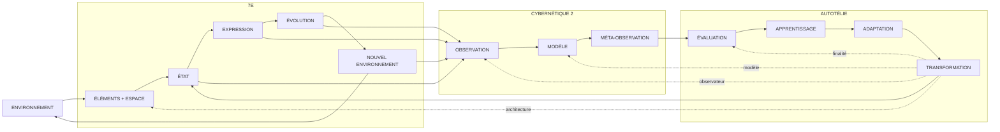

boucle fondamentale:

Les deux diagrammes peuvent finalement être condensés en une métaboucle

```mermaid
flowchart TB

    %% =========================================================
    %% 0. META-SYSTEME
    %% =========================================================

    META["MÉTA-SYSTÈME CYBERNÉTIQUE DE SECOND ORDRE"]

    META --> FINALITE
    META --> OBSERVATEUR
    META --> ENV

    FINALITE["AUTOTÉLIE<br/>
    Finalité interne<br/>
    Maintien • Cohérence • Apprentissage<br/>
    Adaptation • Évolution"]

    %% =========================================================
    %% 1. ENVIRONNEMENT
    %% =========================================================

    ENV["ENVIRONNEMENT<br/>
    Monde externe • Utilisateurs • Systèmes<br/>
    Données • Contraintes • Événements"]

    ENV --> ELEM

    %% =========================================================
    %% 2. 7E
    %% =========================================================

    subgraph CYCLE7E["CYCLE 7E — DYNAMIQUE DU SYSTÈME"]

        ELEM["1 — ÉLÉMENTS<br/>
        Agents • Données • Services<br/>
        Ressources • Connaissances"]

        ESP["2 — ESPACE<br/>
        Contexte • Réseau • Relations<br/>
        Contraintes • Possibilités"]

        ETAT["3 — ÉTAT<br/>
        État interne • État externe<br/>
        État des agents • État des ressources"]

        EXPR["4 — EXPRESSION<br/>
        Actions • Décisions<br/>
        Événements • Comportements"]

        EVOL["5 — ÉVOLUTION<br/>
        Apprentissage • Adaptation<br/>
        Optimisation • Transformation"]

        ENV7["6 — ENVIRONNEMENT<br/>
        Effets produits<br/>
        Interaction avec l'extérieur"]

        EMERG["7 — ÉMERGENCE<br/>
        Nouvel état d'expression<br/>
        évolutif de l'environnement"]

        ELEM --> ESP
        ESP --> ETAT
        ETAT --> EXPR
        EXPR --> EVOL
        EVOL --> ENV7
        ENV7 --> EMERG
        EMERG --> ELEM

    end

    %% =========================================================
    %% 3. OBSERVATION
    %% =========================================================

    subgraph OBSERVATION["OBSERVATION ET RÉFLEXIVITÉ"]

        OBS["OBSERVATION<br/>
        Signaux • Logs • Métriques<br/>
        Événements • Traces"]

        MODELE["MODÈLE DU SYSTÈME"]

        METAOBS["MÉTA-OBSERVATION<br/>
        Observation de l'observation"]

        MODELEOBS["MODÈLE DE L'OBSERVATEUR"]

        OBS --> MODELE
        MODELE --> METAOBS
        METAOBS --> MODELEOBS

    end

    ETAT --> OBS
    EXPR --> OBS
    EVOL --> OBS
    ENV7 --> OBS

    %% =========================================================
    %% 4. CRI
    %% =========================================================

    subgraph CRI["CRI — CYCLE DE RÉGULATION INTELLIGENT"]

        PERCEP["PERCEVOIR"]
        ANALYSE["ANALYSER"]
        MODELISE["MODÉLISER"]
        EVAL["ÉVALUER"]
        DECIDE["DÉCIDER"]
        AGIR["AGIR"]
        MESURE["MESURER"]

        PERCEP --> ANALYSE
        ANALYSE --> MODELISE
        MODELISE --> EVAL
        EVAL --> DECIDE
        DECIDE --> AGIR
        AGIR --> MESURE
        MESURE --> PERCEP

    end

    OBS --> PERCEP

    %% =========================================================
    %% 5. MULTI-AGENTS
    %% =========================================================

    subgraph AGENTIQUE["SYSTÈME MULTI-AGENTS"]

        AP["Agent Perception"]
        AA["Agent Analyse"]
        AM["Agent Modélisation"]
        AE["Agent Évaluation"]
        AD["Agent Décision"]
        AX["Agent Action"]
        AK["Agent Knowledge / Mémoire"]
        AO["Agent Observateur"]
        AMETA["Agent Méta-observateur"]
        ARCH["Agent Architecte"]

        AP --> AA
        AA --> AM
        AM --> AE
        AE --> AD
        AD --> AX
        AX --> AP

        AK --> AM
        AE --> AK

        AO --> AMETA
        AMETA --> AE

        ARCH --> AM
        ARCH --> AX

    end

    PERCEP --> AP
    ANALYSE --> AA
    MODELISE --> AM
    EVAL --> AE
    DECIDE --> AD
    AGIR --> AX

    %% =========================================================
    %% 6. APPRENTISSAGE
    %% =========================================================

    subgraph LEARNING["APPRENTISSAGE"]

        EXPERIENCE["EXPÉRIENCE"]

        KNOW["CONNAISSANCE"]

        PATTERN["PATTERNS"]

        LEARN["APPRENTISSAGE"]

        UPDATE["MISE À JOUR DU MODÈLE"]

        EXPERIENCE --> PATTERN
        PATTERN --> LEARN
        KNOW --> LEARN
        LEARN --> UPDATE
        UPDATE --> KNOW

    end

    MESURE --> EXPERIENCE
    AK --> KNOW
    UPDATE --> MODELE

    %% =========================================================
    %% 7. CYBERNETIQUE SECOND ORDRE
    %% =========================================================

    subgraph CYBER2["CYBERNÉTIQUE DE SECOND ORDRE"]

        O1["Système observé"]

        O2["Observateur"]

        O3["Observation"]

        O4["Modèle"]

        O5["Observation de l'observateur"]

        O6["Modèle de l'observation"]

        O7["Adaptation de l'observateur"]

        O1 --> O2
        O2 --> O3
        O3 --> O4
        O4 --> O5
        O5 --> O6
        O6 --> O7
        O7 --> O2

    end

    OBS --> O2
    METAOBS --> O5
    O7 --> AMETA

    %% =========================================================
    %% 8. RECURSIVITE
    %% =========================================================

    subgraph REC["RÉCURSIVITÉ"]

        R0["Système"]
        R1["Sous-système"]
        R2["Composant"]
        R3["Sous-composant"]
        R4["Instance"]

        R0 --> R1
        R1 --> R2
        R2 --> R3
        R3 --> R4
        R4 --> R0

    end

    ARCH --> R0

    %% =========================================================
    %% 9. FRACTALITE
    %% =========================================================

    subgraph FRACTAL["FRACTALITÉ — INVARIANT 7E"]

        MACRO["MACRO<br/>Organisation"]

        MESO["MESO<br/>Application"]

        MICRO["MICRO<br/>Composant"]

        NANO["NANO<br/>Fonction / Agent"]

        MACRO --> MESO
        MESO --> MICRO
        MICRO --> NANO

        MACRO --> M7["7E"]
        MESO --> S7["7E"]
        MICRO --> C7["7E"]
        NANO --> A7["7E"]

    end

    R0 --> MACRO
    R1 --> MESO
    R2 --> MICRO
    R3 --> NANO

    %% =========================================================
    %% 10. 12 FACTORS
    %% =========================================================

    subgraph FACTORS["12-FACTOR — COUCHE D'EXÉCUTION"]

        F1["1 Codebase"]
        F2["2 Dependencies"]
        F3["3 Config"]
        F4["4 Backing Services"]
        F5["5 Build / Release / Run"]
        F6["6 Processes"]
        F7["7 Port Binding"]
        F8["8 Concurrency"]
        F9["9 Disposability"]
        F10["10 Dev / Prod Parity"]
        F11["11 Logs"]
        F12["12 Admin Processes"]

    end

    AX --> F1
    AX --> F4
    AX --> F6
    AX --> F8

    F11 --> OBS
    F12 --> CRI

    %% =========================================================
    %% 11. AUTO-EVOLUTION
    %% =========================================================

    subgraph AUTO["AUTO-ÉVOLUTION"]

        SELF["AUTO-OBSERVATION"]

        SELF_EVAL["AUTO-ÉVALUATION"]

        SELF_LEARN["AUTO-APPRENTISSAGE"]

        SELF_ADAPT["AUTO-ADAPTATION"]

        SELF_ARCH["AUTO-TRANSFORMATION<br/>Architecturale"]

        SELF --> SELF_EVAL
        SELF_EVAL --> SELF_LEARN
        SELF_LEARN --> SELF_ADAPT
        SELF_ADAPT --> SELF_ARCH
        SELF_ARCH --> SELF

    end

    MODELEOBS --> SELF
    SELF_ARCH --> ARCH

    %% =========================================================
    %% 12. BOUCLE AUTOTELIQUE
    %% =========================================================

    SELF_ARCH --> FINALITE

    FINALITE -. finalité interne .-> META

    %% =========================================================
    %% 13. BOUCLES DE RETROACTION
    %% =========================================================

    EMERG -. rétroaction .-> OBS
    EVAL -. correction .-> ETAT
    LEARN -. connaissance .-> ETAT
    SELF_ADAPT -. adaptation .-> EVOL
    SELF_ARCH -. transformation .-> ELEM
```

Structure temporelle résultante

Le cycle complet peut être lu comme une succession de 24 phases, mais il contient plusieurs boucles imbriquées :
                    ┌──────────────────────────────┐
                    │       ENVIRONNEMENT          │
                    └──────────────┬───────────────┘
                                   │
                                   ▼
                         ┌──────────────────┐
                         │       7E         │
                         │ E → Espace → État│
                         │ → Expression     │
                         │ → Évolution      │
                         │ → Environnement  │
                         └────────┬─────────┘
                                  │
                                  ▼
                         ┌──────────────────┐
                         │   OBSERVATION    │
                         └────────┬─────────┘
                                  │
                                  ▼
                         ┌──────────────────┐
                         │      CRI         │
                         │ Percevoir        │
                         │ Analyser         │
                         │ Modéliser        │
                         │ Évaluer          │
                         │ Décider          │
                         │ Agir             │
                         └────────┬─────────┘
                                  │
                                  ▼
                         ┌──────────────────┐
                         │   APPRENTISSAGE  │
                         └────────┬─────────┘
                                  │
                                  ▼
                    ┌─────────────────────────────┐
                    │ CYBERNÉTIQUE SECOND ORDRE   │
                    │                             │
                    │ Observer                    │
                    │   ↓                         │
                    │ Observer l'observateur      │
                    │   ↓                         │
                    │ Observer le modèle          │
                    │   ↓                         │
                    │ Modifier l'observation      │
                    └──────────────┬──────────────┘
                                   │
                                   ▼
                         ┌──────────────────┐
                         │ AUTO-ÉVALUATION  │
                         └────────┬─────────┘
                                  │
                                  ▼
                         ┌──────────────────┐
                         │ AUTO-APPRENTISS. │
                         └────────┬─────────┘
                                  │
                                  ▼
                         ┌──────────────────┐
                         │ AUTO-ADAPTATION  │
                         └────────┬─────────┘
                                  │
                                  ▼
                         ┌──────────────────┐
                         │ AUTO-ÉVOLUTION   │
                         └────────┬─────────┘
                                  │
                         ┌────────┴────────┐
                         │                 │
                         ▼                 ▼
                    RÉCURSIVITÉ        FRACTALITÉ
                         │                 │
                         └────────┬────────┘
                                  ▼
                         ┌──────────────────┐
                         │ TRANSFORMATION   │
                         │ ARCHITECTURALE   │
                         └────────┬─────────┘
                                  │
                                  ▼
                         ┌──────────────────┐
                         │   12 FACTORS     │
                         │ Build/Run/Deploy │
                         └────────┬─────────┘
                                  │
                                  ▼
                         NOUVEL ÉTAT DU SYSTÈME
                                  │
                                  └───────────────↺

                                  La propriété essentielle est donc une récursion de la boucle elle-même :

$$ C_{n+1}=F(C_n,\;Obs(C_n),\;Obs(Obs(C_n)),\;M_n,\;A_n) $$

où \(C_n\) est le cycle cybernétique au niveau \(n\).

Autrement dit, le système peut évoluer sur trois axes simultanément :

verticalement : récursivité des niveaux ;
horizontalement : cycle 7E et boucle CRI ;
méta-niveau : observation et transformation de ses propres mécanismes.

C'est cette combinaison qui permet de formaliser un système cybernétique de second ordre, récursif, fractal et autotélique plutôt qu'un simple système multi-agents.
