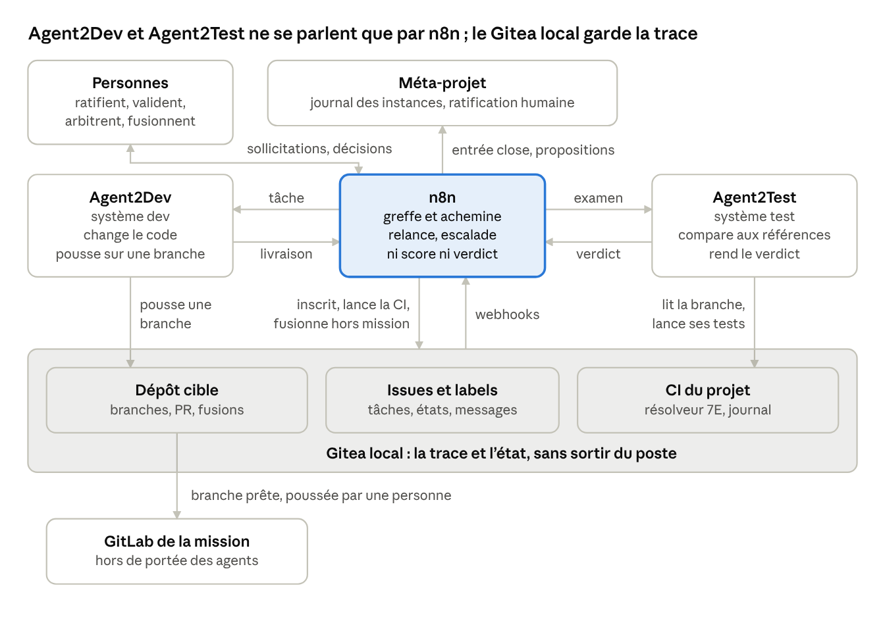
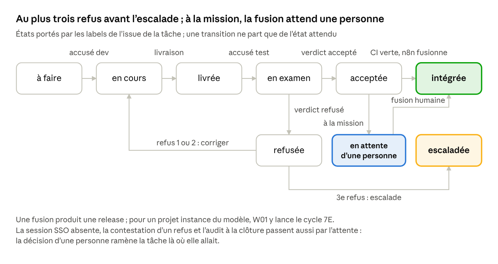

# Binôme cybernétique 7E × 12 facteurs — orchestration n8n

4 octobre 2026 · FRED

> Export du document Claude Docs « Binôme cybernétique 7E × 12 facteurs — orchestration n8n », révision 44, fait le 4 octobre 2026. Le document vivant fait foi : <https://claude.ai/code/artifact/6ebc715b-9431-4106-bac5-108df8374258>.
>
> Statut : spécification ratifiée. Les dix décisions le sont : la 2 le 3 octobre 2026, les neuf autres le 4 octobre 2026, avec le cadrage d'Agent2Dev et d'Agent2Test. Gitea, dont elle dépend, sort du backlog du méta-projet : un Gitea local sur le poste.

## Finalité et périmètre

Le binôme confie le développement et les tests d'un projet à deux systèmes d'agents IA distincts : Agent2Dev développe, Agent2Test teste. n8n porte les tâches, les transferts et les messages entre eux, sans jamais juger à leur place.

- **Le binôme.** Agent2Dev, le système dev, change le code. Agent2Test, le système test, compare le résultat à des références. Chacun compte plusieurs agents et garde ses cycles internes, sa constitution et ses points de contrôle ; vu de n8n, chacun est un seul service avec un seul contrat.
- **Le projet cible.** Tout dépôt du Gitea local qui déclare son contrat avec le binôme (`binome.yaml`). S'il exécute aussi le modèle exécutif 12 facteurs × 7E (son `7e-instance.yaml`), le binôme y conduit le cycle 7E ; sinon, il n'y traite que des demandes. À la mission, le dépôt cible est une copie du projet GitLab. Le binôme peut se prendre lui-même pour cible.
- **Le binôme comme instance.** Son dépôt exécute le modèle au niveau `instance` : contrat, catalogue, workflows et déploiement y sont examinés comme ceux de tout projet. Agent2Dev et Agent2Test ont chacun le leur.

**Ce que fait n8n.** Il reçoit les événements (webhooks Gitea, retours des agents) et valide chaque message contre le contrat. Il l'inscrit dans Gitea, l'achemine vers l'exécutant que déclare le catalogue et attend le résultat dans un délai. Il tient la mécanique de la boucle : machine à états des tâches, compteurs, délais, relances et escalades.

**Ce que n8n ne fait jamais.** Calculer un score, un plan ou une viabilité : c'est le résolveur. Accepter ou refuser une livraison : c'est le système de test. Juger une itération : le diagnostic, la correction et la contestation restent à Agent2Dev. Écrire du code ou des tests, écrire le journal, le modèle ou le manifeste, lancer le résolveur hors de la CI, écrire dans le GitLab de la mission.

**La place des personnes.** Les échanges courants se font entre agents. Les personnes gardent les points où la boucle ne doit pas décider seule ; à chacun, la tâche passe en attente d'une personne.

- **Ratifier** les révisions du modèle (EQ.2 au rang méta), les changements de contrat, les réglages des têtes et les fichiers soumis à ratification.
- **Valider** les critères d'acceptation d'une demande, puis l'oracle avant la clôture, et confirmer à chaque clôture un critère « conforme » tiré au hasard : l'audit par échantillon.
- **Décider** des escalades et arbitrer une contestation d'Agent2Dev.
- **Ouvrir** la session SSO d'Agent2Test : sans elle, aucune campagne ne tourne.
- **Fusionner**, à la mission : une personne fusionne et pousse la branche prête vers GitLab ; n8n ne fusionne que pour les projets personnels.

## Agent2Dev et Agent2Test

Les deux têtes du binôme sont Agent2Dev et Agent2Test, cadrés pour la mission EDF (étape 1) et ratifiés le 4 octobre 2026 ; leurs documents de l'étape 1 portent cette ratification en version 0.3.0. n8n porte leur couplage ; chaque tête reste un système 7E complet, à ses propres échelles.

| Sujet | Agent2Dev et Agent2Test | n8n |
| --- | --- | --- |
| Boucle | Agent2Dev diagnostique, corrige ou conteste ; Agent2Test rend les verdicts par critère | compteurs, délais, relances, escalades |
| File et instance | Agent2Dev construit et lance l'unique instance de l'application ; une campagne à la fois | file des demandes et verrou de l'instance, repris du rang Système d'Agent2Dev |
| Règles | constitutions, points de contrôle et leurs régimes, budgets internes | limites entre les têtes, dans le catalogue |
| Moteur | Gemini CLI sans interface, sous licence Code Assist, contextes séparés ; seul un contexte borné et masqué sort du poste | aucun appel au moteur |
| Messages | contrat d'échange du cadrage EDF, à l'intérieur de chaque tête | enveloppe `binome-7e/1` pour tout échange entre les têtes |
| Dépôts | `FredGarcia/Agent2Dev` pour Agent2Dev ; Agent2Test a le sien | dépôt du binôme : contrat, catalogue, workflows, simulation |

Les hypothèses H16 et H17 du cadrage EDF sont confirmées : la licence couvre Gemini CLI, la mission autorise l'envoi d'extraits masqués, et le quota permet environ cent appels par demande. Gemini CLI fixe le modèle demandé, sauf pour ses sous-agents ([sélection du modèle](https://geminicli.com/docs/cli/model/)), et peut basculer sur un modèle de repli après une erreur de quota ([repli](https://geminicli.com/docs/cli/model-routing/)). Chaque tête consigne donc, appel par appel, le modèle réellement utilisé, que détaille la sortie JSON du [mode sans interface](https://geminicli.com/docs/cli/headless/).

## Architecture

n8n tient le milieu du binôme : Agent2Dev et Agent2Test ne s'adressent jamais directement, et le Gitea local garde la trace de chaque échange.



*architecture du binôme · 9 composants, 11 flux*

Tâches, livraisons, examens et verdicts passent par n8n, qui les inscrit dans Gitea ; les questions entre agents suivent le même chemin. Pour un projet instance du modèle, la CI exécute le résolveur et pousse le journal, que n8n reçoit par webhook. Tout tourne sur le poste : n8n, Postgres et Gitea en compose, Agent2Dev et Agent2Test à côté. À la mission, une personne pousse la branche prête vers le GitLab du projet ; aucun agent n'y écrit.

| Composant | Terme de l'axiome | Pourquoi |
| --- | --- | --- |
| Code et prompts d'Agent2Dev et d'Agent2Test | Éléments (1, 2) | versionnés chacun dans son dépôt ; nom du modèle Gemini épinglé |
| Agent2Dev et Agent2Test en exécution | État, Évolutif (6, 8, 9) | processus sans état et jetables ; à la mission, un processus par tête |
| n8n, Postgres, moteur Gemini (Gemini CLI) | Espace (3, 4) | services attachés, désignés par la config |
| Issues, labels et webhooks du Gitea local | Espace (4) | le milieu partagé où vivent les tâches et leurs états ; rien ne sort du poste |
| Dépôt du projet cible, dans le Gitea local | Éléments (1) | le code que dev change et que test lit ; à la mission, une copie du projet GitLab |
| CI du projet | Engendrent (5, 12) | la chaîne unique qui produit les releases ; pour un projet instance du modèle, elle lance le résolveur |
| Résolveur 7E | Éléments (2) | une dépendance épinglée, publiée par le méta-projet |
| Journal de cycle | Expression | ce que le projet exprime de son cycle ; il devient Élément du méta-projet |
| GitLab de la mission | Environnement | reçoit la branche prête, poussée par une personne ; aucun agent n'y écrit |

## Contrat des messages

Tout échange passe par une seule enveloppe, `binome-7e/1`, que n8n valide avant de l'inscrire et de la transmettre. Un message invalide n'est jamais transmis : il devient une `erreur` de cause `contrat`.

| Champ | Contenu | Règle |
| --- | --- | --- |
| `contrat` | `binome-7e/1` | une version majeure nouvelle est un contrat changé, décidé hors cycle |
| `id` | identifiant unique (UUID) | clé d'idempotence : un même `id` n'est traité qu'une fois |
| `type` | voir le tableau suivant |  |
| `de`, `vers` | `orchestrateur`, `dev`, `test`, `resolveur`, `meta`, `humain` | un agent n'écrit qu'en son propre nom |
| `phase` | une des 7 phases du cycle | celle où l'échange a lieu |
| `correlation` | `projet`, `cycle` ou `demande`, `tache`, `iteration` | relie le message à sa tâche et à son cycle, ou à sa demande |
| `release` | SHA court ou tag | toujours identifiée |
| `objet` | identifiants de critères (`5.3`, `EX.1`) | ce que l'échange vise |
| `charge` | contenu propre au type | des références, jamais de fichiers joints |
| `preuves` | liens : journal, CI, PR, rapport | tout constat renvoie à une preuve consultable |
| `reponse_a` | `id` du message auquel il répond | obligatoire sauf pour `tache`, `rapport`, `escalade` et `sollicitation` |
| `emis_le`, `echeance` | horodatages UTC | n8n fixe `echeance` d'après le catalogue |

| Type | De → vers | Charge | Phases |
| --- | --- | --- | --- |
| `tache` | orchestrateur → dev ou test | nature (cadrer, implémenter, corriger, examiner…), consigne, critère, raison, constat, périmètre, branche | Élaborer, Exécuter, Examiner, Équilibrer |
| `accuse` | dev ou test → orchestrateur | prise en charge, durée estimée | toutes |
| `livraison` | dev → test | branche, commits, tâches couvertes, ce qui a changé | Exécuter |
| `verdict` | test → dev | `acceptee` ou `refusee`, échecs avec reproduction, critères en écart | Examiner |
| `contestation` | dev → orchestrateur | verdict contesté, motif, preuves | Examiner |
| `question`, `reponse` | dev ↔ test | texte, sujet : spécification ou reproduction | Exécuter, Examiner |
| `proposition` | test → orchestrateur | critère, nature, motif, pour la commande `proposer` du résolveur | Équilibrer |
| `rapport` | orchestrateur → dev et test | synthèse du cycle : moyennes par terme, phases bloquées, viabilité | Émettre |
| `sollicitation` | orchestrateur → humain | point attendu (ratifier, valider, arbitrer, ouvrir la session SSO, fusionner, auditer), liens | toutes |
| `decision` | humain → orchestrateur | point, réponse, motif | toutes |
| `erreur` | tous → orchestrateur | cause (contrat, délai, outil absent, exécution), détail | toutes |
| `escalade` | orchestrateur → humain | motif, historique en liens | toutes |

- Un message ne se modifie jamais : une correction est un nouveau message qui répond au premier.
- Une `livraison` dit ce qui a changé, jamais pourquoi ce serait correct. Un `verdict` donne des preuves et des reproductions, jamais de correctif (voir Gardes).
- Le schéma JSON du contrat est versionné dans le dépôt du binôme (`binome/contrat/message.schema.json`). n8n, Agent2Dev et Agent2Test le valident, et chacun épingle sa version.
- Les messages du cadrage EDF entrent dans cette enveloppe : la livraison effective d'Agent2Dev devient une `livraison`, le rapport de campagne d'Agent2Test un `verdict`, ses anomalies et leurs reproductions vont dans ses échecs. La ligne de journal et la convention documentaire communes aux deux têtes restent normatives à l'intérieur de chacune.

```json
{
  "contrat": "binome-7e/1",
  "id": "5f0c2a8e-1d4b-4c7a-9a51-2b7e6c3d9f10",
  "type": "verdict",
  "de": "test",
  "vers": "dev",
  "phase": "examiner",
  "correlation": { "projet": "fred/projet-cible", "cycle": "projet-cible-0004", "tache": "T-0004-02", "iteration": 2 },
  "release": "a1b2c3d4e5f6",
  "objet": ["8.1"],
  "reponse_a": "c41e9b07-6a2f-4e3d-8b15-0f9d7a6c2e48",
  "charge": {
    "statut": "refusee",
    "echecs": [
      { "test": "acceptation/montee-en-charge", "constat": "le second processus web ne démarre pas", "reproduction": "docker compose up -d --scale web=2" }
    ]
  },
  "preuves": [{ "nature": "ci", "url": "https://gitea.local/fred/projet-cible/actions/runs/412" }],
  "emis_le": "2026-10-03T10:12:00Z",
  "echeance": null
}
```

## Carte des workflows par phase

Chaque phase garde son porteur et sa garde ; n8n n'ajoute aucune phase et n'en saute aucune. Il ne fait que les passages de relais, un workflow par passage.

| Phase · workflow | Déclencheur | Exécutant | Échanges | Garde |
| --- | --- | --- | --- | --- |
| 1 Évaluer · W01 `cycle-declencher` | release prête (tag publié ou fusion sur la branche principale), ou planification | résolveur, en CI | orchestrateur → CI : lancement du cycle (`workflow_dispatch`) | un seul cycle par release ; aucun cycle tant qu'une entrée est ouverte |
| 2 Élaborer · W02 `journal-recevoir` | entrée de journal poussée (`journal/**`) | résolveur, puis système dev | orchestrateur → dev : une `tache` par ligne du plan, dans l'ordre du plan | aucune tâche ne vise l'organisation ni un contrat (IN.1) |
| 3 Exécuter · W03 `tache-dev` | `tache` prise en charge par dev | système dev, puis pipeline du projet | dev → test : `livraison` ; orchestrateur : contrôle du périmètre, ouverture de la PR | une seule chaîne : dev pousse sur une branche, jamais sur la branche principale |
| 4 Examiner · W04 `examen-test`, W05 `integrer` | PR ouverte par W03 | système test : tests d'acceptation, résolveur `examiner` sur la PR, CI | test → dev : `verdict` ; si accepté et CI verte : fusion par n8n pour un projet personnel, `sollicitation` de fusion à la mission | le verdict n'appartient qu'au système test ; aucune fusion sans verdict accepté ni CI verte ; à la mission, aucune fusion sans une personne |
| 5 Évoluer · W02 | entrée du cycle suivant | résolveur | orchestrateur → dev : une `tache` « corriger » par régression, liée à la PR qui a produit la release (EV.2) | seules les régressions écrites au journal ouvrent une tâche |
| 6 Émettre · W02 | même entrée | résolveur | orchestrateur → dev et test : `rapport` | l'entrée reste la seule source ; le rapport la résume et la cite |
| 7 Équilibrer · W06 `equilibrer` | entrée ouverte reçue | résolveur, puis système test | décisions appliquées (ticket → tâche, rollback → déploiement de la release précédente) ; test → orchestrateur : `proposition` ; orchestrateur → CI : `proposer`, puis `clore` | seules les décisions du journal s'appliquent ; Équilibrer bloquée ne donne que des tickets ; l'entrée est close à l'échéance, propositions ou non |
| Bouclage · W07 `meta-remonter` | entrée close | orchestrateur | orchestrateur → méta : PR de l'entrée dans `journal/<instance>/`, une issue de ratification par proposition | une entrée close n'est jamais réécrite ; la ratification (EQ.2) reste humaine |

Deux examens se suivent. L'examen de livraison, sur la PR, sert de porte et n'écrit rien au journal. Le cycle 7E, sur la release fusionnée, écrit l'entrée qui fait foi.

Un projet sans `7e-instance.yaml` n'a pas de cycle 7E : seuls W03, W04 et W05 s'y déroulent, avec les workflows transverses, et la porte de livraison s'en tient aux tests d'acceptation. Une demande y entre par une issue « à faire » ; Agent2Dev rédige les US et leurs critères d'acceptation numérotés (tâche `cadrer`), une personne les valide, puis le plan donne les tâches.

Cinq workflows servent toutes les phases :

- **W00** **`greffe`** : valide chaque message contre le schéma, l'inscrit dans Gitea, écarte les doublons par `id`.
- **W08** **`questions`** : relaie les questions entre dev et test, dans la limite du catalogue.
- **W09** **`reconcilier`** : planifié ; repère les tâches arrêtées, les échéances passées, relance ou escalade ; rappelle les attentes d'une personne, sans jamais les escalader.
- **W10** **`erreurs`** : reçoit les erreurs des autres workflows et les traite comme des messages `erreur`.
- **W11** **`personnes`** : adresse les `sollicitation` aux personnes, reçoit leurs `decision` et fait repartir la tâche en attente.

## Transferts de traitement

Une tâche passe du dev au test et revient au plus trois fois. Au troisième refus, elle sort de la boucle courante et va à une personne.



*machine à états d'une tâche · 9 états, 1 boucle*

Un refus renvoie la tâche au dev avec les preuves du verdict. À la mission, une tâche acceptée attend qu'une personne la fusionne ; une fusion produit une release, sur laquelle W01 lance le cycle 7E pour un projet instance du modèle.

Une tâche naît du plan d'un cycle, d'une régression, d'une décision de rétroaction, ou d'une demande : une issue ouverte avec le label `binome/etat:a-faire`, pour une fonctionnalité par exemple. Pour une demande, Agent2Dev rédige d'abord les US et leurs critères d'acceptation numérotés, qu'une personne valide. Ces critères sont écrits dans l'issue : le test les lit là, jamais dans la livraison.

- **États.** Ils sont portés par des labels `binome/etat:*` sur l'issue de la tâche, avec l'itération en cours (`binome/iteration:n`). Une transition ne s'applique que depuis l'état attendu : un message en double ou en retard ne change rien.
- **Délais.** Chaque état d'attente reçoit l'échéance de sa nature de tâche, lue dans le catalogue. À l'échéance, la tâche passe en erreur : une relance au même état, puis l'escalade. L'attente d'une personne n'a pas d'échéance d'escalade : W09 la rappelle seulement.
- **Refus.** Un verdict refusé repart vers le dev comme tâche `corriger`, avec ses preuves et l'itération suivante. Au troisième refus, la tâche est escaladée et l'écart reste au plan du cycle suivant. Agent2Dev peut contester un verdict : la `contestation` va à une personne, qui arbitre.
- **Attente d'une personne.** Aux points humains, la tâche passe en `attente d'une personne` : W11 adresse une `sollicitation`, et seule la `decision` d'une personne la fait repartir, là où elle allait. Ainsi pour la session SSO absente, la fusion à la mission, l'arbitrage d'une contestation et l'audit à la clôture.
- **Questions.** Pendant `en cours` ou `en examen`, dev et test échangent au plus deux questions par tâche, toujours par n8n. Une question ne change jamais un verdict : seule une nouvelle livraison le peut.
- **Reprise.** W09 parcourt les tâches ouvertes à intervalle fixe et relance ou escalade celles dont l'échéance est passée. n8n peut redémarrer sans perdre de tâche : l'état vit dans Gitea.

## Catalogue des tâches

Ce que n8n appelle, et chez qui, n'est pas écrit dans ses workflows : c'est le catalogue, un fichier versionné du dépôt du binôme. Changer un exécutant, un délai ou une limite passe par une PR, une release et un cycle, comme tout code. Le catalogue fixe les limites entre les têtes ; chaque tête garde ses budgets internes (appels au moteur, jetons, règle de progrès, détection d'oscillation) dans sa constitution.

```yaml
# binome/taches.yaml : lu par n8n à la release déployée
contrat: binome-7e/1
executants:
  dev:  { url: BINOME_DEV_URL }    # Agent2Dev ; nom de la variable d'environnement, jamais l'URL
  test: { url: BINOME_TEST_URL }   # Agent2Test
  ci:   { workflows: { cycle: cycle-7e.yml, equilibrer: cycle-7e-equilibrer.yml, deploiement: deploiement.yml } }
taches:
  cycle7e:     { phase: evaluer,    executant: ci,   delai: 30m, relances: 1 }
  cadrer:      { phase: elaborer,   executant: dev,  delai: 4h,  relances: 1 }   # demande : US et critères
  implementer: { phase: executer,   executant: dev,  delai: 4h,  relances: 1 }
  corriger:    { phase: executer,   executant: dev,  delai: 2h,  relances: 1 }
  examiner:    { phase: examiner,   executant: test, delai: 1h,  relances: 1 }
  proposer:    { phase: equilibrer, executant: test, delai: 30m, relances: 0 }
  equilibrer:  { phase: equilibrer, executant: ci,   delai: 15m, relances: 2 }
limites:
  iterations_par_tache: 3     # allers-retours refus → correction
  questions_par_tache: 2
  campagnes_simultanees: 1    # une seule instance de l'application
  echeance_cloture: 2h        # au-delà, l'entrée ouverte est close sans proposition
personnes:                    # points humains : la tâche attend une décision (W11)
  points: [ratifier, valider, arbitrer, session_sso, fusionner, auditer]
```

Chaque projet cible déclare son propre contrat avec le binôme :

```yaml
# binome.yaml : dans le dépôt du projet cible
contrat: binome-7e/1
branche_principale: main
fusion: personne              # n8n : projets personnels seulement
perimetres:
  dev:  [src/**, tests/unitaires/**]
  test: [tests/acceptation/**]
ratification:                 # PR soumise à une personne
  - 7e-instance.yaml
  - binome.yaml
  - .gitea/**
  - .gitlab-ci.yml
  - '**/pom.xml'
  - '**/package.json'
  - '**/package-lock.json'
  - '**/Dockerfile*'
  - '**/compose*.y*ml'
interdit: [journal/**, modele-executif-*.yaml]   # jamais par un agent
```

Avant de transmettre une livraison au test, n8n compare les fichiers de la PR à ces périmètres. Un fichier hors périmètre rend la livraison invalide : n8n la refuse comme erreur de contrat, sans la soumettre au test. Une PR qui touche un fichier soumis à ratification, chaîne de construction comprise, attend la décision d'une personne. Les délais et limites ci-dessus sont ratifiés depuis le 4 octobre 2026 ; celui de `cadrer` reprend celui d'`implementer`.

## Gardes

Les gardes séparent ce qui décide de ce qui achemine. Chacune a un porteur et une vérification ; aucune ne repose sur la bonne volonté d'un agent.

| Garde | Porteur | Vérification |
| --- | --- | --- |
| n8n ne calcule ni score, ni plan, ni viabilité | n8n | un cycle lancé par n8n ou par la planification Gitea donne les mêmes scores, le même plan, la même viabilité |
| n8n n'accepte ni ne refuse une livraison sur le fond | n8n | seul un `verdict` du système test fait passer une tâche à `acceptee` ou `refusee` |
| Aucune fusion sans verdict accepté ni CI verte | n8n, Gitea | protection de la branche principale : statut CI requis, approbation du compte du système test |
| À la mission, aucune fusion ni poussée vers GitLab sans une personne | n8n, personnes | `fusion: personne` dans `binome.yaml` ; aucun agent n'a d'accès en écriture à GitLab |
| Dev ne pousse que sur une branche, dans son périmètre | dev | protection de branche ; fichiers de la PR comparés au contrat de projet |
| Test n'écrit que ses tests d'acceptation | test | même contrôle de périmètre |
| La chaîne de construction et les dépendances ne changent qu'avec une personne | n8n | liste `ratification` du contrat de projet : `pom.xml`, `package.json` et son verrou, Dockerfile, compose, CI |
| Indépendance du test : la livraison ne porte que des faits | dev, n8n | le schéma de `livraison` n'a aucun champ d'argumentation ; le test lit la branche elle-même |
| Le verdict porte des preuves, jamais de correctif | test | le schéma de `verdict` n'a aucun champ de correctif |
| Co-dérive mesurée : à chaque clôture, une personne confirme un critère « conforme » tiré au hasard | n8n, personnes | `sollicitation` d'audit (W11) ; un désaccord rouvre la tâche et compte contre la fiabilité croisée des têtes |
| Aucune campagne sans session SSO ouverte par une personne | test, n8n | Agent2Test signale la session absente ; la tâche passe en attente d'une personne |
| Journal et modèle hors de portée des agents | tous | liste `interdit` du contrat de projet ; seule la CI écrit le journal |
| Pas de nouveau cycle tant qu'une entrée est ouverte | résolveur, n8n | garde du résolveur ; W06 clôt l'entrée à `echeance_cloture` |
| Boucle bornée : au plus 3 itérations par tâche, puis escalade | n8n | compteur d'itération en label ; W09 |
| Coût borné : des budgets par tête, des délais par tâche | dev, test, n8n | budgets internes dans la constitution de chaque tête, délais et itérations dans le catalogue ; un cycle coûte au plus tâches × itérations × budget |
| Souveraineté : seul un contexte borné et masqué sort du poste | dev, test | masquage dans chaque tête ; modèle réellement utilisé consigné à chaque appel |
| Toute écriture est idempotente | tous | `id` de message ; une transition d'état ne s'applique que depuis l'état attendu |
| Aucun secret dans les workflows ni dans les messages | n8n, agents | identifiants de n8n et variables d'environnement ; gitleaks (3.2) sur les trois dépôts |

Une garde violée n'est jamais contournée : elle produit une `erreur` de cause `contrat`, inscrite puis escaladée.

## Lecture cybernétique

Le binôme est un couple effecteur–comparateur. n8n n'est ni l'un ni l'autre : il porte le couplage entre les deux.

- **Effecteur et comparateur.** Agent2Dev change la structure du produit. Agent2Test la compare à deux références : les critères d'acceptation et, pour un projet instance du modèle, les 35 critères du modèle, par le résolveur.
- **Un relais n'est pas un régulateur.** Tout bon régulateur d'un système en est un modèle (Conant et Ashby). n8n ne contient ni critère ni seuil : il ne peut que relayer des décisions calculées ailleurs.
- **Indépendance du comparateur.** Un comparateur qui reçoit les raisons de l'effecteur mesure l'accord entre ces raisons et le résultat, et non plus l'écart à la référence. D'où la règle du contrat : la livraison ne porte que des faits, le test lit le code lui-même.
- **Co-dérive.** Deux têtes qui s'ajustent l'une à l'autre peuvent converger vers un état faux mais cohérent : un code et des tests d'accord sur un comportement que personne n'a demandé (Maturana et Varela). Le même moteur des deux côtés aggrave le risque. L'oracle reste ancré par une personne, et l'audit par échantillon garde la dérive mesurable.
- **Gain de boucle et amortissement.** Un aller-retour refus–correction sans borne peut osciller sans fin. La limite d'itérations amortit la boucle et la fait changer de niveau logique (Bateson). Corriger dans un ensemble de solutions donné relève de l'apprentissage I ; revoir la tâche ou le critère, de l'apprentissage II. Le passage de l'un à l'autre, c'est l'escalade, et dans le modèle l'indicateur `ecart_persistant`.
- **Stigmergie.** Les agents se coordonnent par les traces qu'ils laissent dans un milieu partagé, le Gitea local, plutôt que par des appels directs (Grassé). Le milieu garde l'état ; les agents et n8n restent jetables.
- **Organisation et structure (Maturana, Varela).** L'organisation du binôme, c'est le cycle 7E, la séparation dev–test et le contrat. La structure, ce sont Agent2Dev et Agent2Test, leur moteur, leurs prompts et n8n : on peut les remplacer sans changer un score.
- **Second ordre (von Foerster).** L'humain n'est pas dans la boucle courante. Il observe la boucle par le journal et les traces, et ratifie ce qui change les critères (EQ.2). Ses autres points (oracle, arbitrage, session, audit, fusion à la mission) ne le remettent pas dans la boucle : ils bornent ce que la boucle peut faire seule.

## Au regard des 12 facteurs

Le binôme est d'abord un projet comme un autre : ses deux systèmes d'agents et son orchestration répondent aux 12 facteurs, et son propre cycle 7E le vérifie.

| Facteur | Dans le binôme |
| --- | --- |
| 1 Codebase | trois dépôts : le binôme (contrat, catalogue, schéma, workflows n8n exportés en JSON, simulation, compose, manifeste 7E), Agent2Dev et Agent2Test ; chaque projet cible a le sien |
| 2 Dépendances | images (n8n, Postgres, Gitea) et nœuds communautaires épinglés, verrous des têtes, version du contrat épinglée par chaque dépôt ; le nom du modèle Gemini de chaque tête est une dépendance, qui ne change que par une release |
| 3 Config | URL, jetons, plafonds et clés d'API en variables d'environnement ; le catalogue nomme des variables, jamais des valeurs ; les prompts sont du code |
| 4 Services externes | n8n, Postgres, Gitea et le moteur Gemini, désignés par la config et remplaçables sans toucher au code |
| 5 Build, release, run | images des agents construites en CI et étiquetées par SHA ; workflows importés depuis la release ; aucune modification dans l'interface de n8n en production |
| 6 Processus | agents sans état entre deux tâches, chaque tâche dans un espace de travail jetable ; l'état vit dans Gitea et dans Postgres |
| 7 Port binding | chaque tête expose son API HTTP sur son port, n8n et Gitea sur les leurs |
| 8 Concurrence | deux types de processus, dev et test ; à la mission, un processus par tête et une campagne à la fois sur l'unique instance de l'application ; n8n en mode normal |
| 9 Jetabilité | une tâche interrompue se relance sans dommage (idempotence) ; un agent ou n8n redémarré ne perd rien |
| 10 Parité dev/prod | mêmes images, mêmes workflows, même modèle d'IA du poste à la production |
| 11 Logs | chaque tête écrit ses événements en JSON sur la sortie standard, jetons, appels d'outils et modèle utilisé compris ; ils alimentent EX.1 et EX.2 |
| 12 Processus d'admin | import des workflows, migrations, rejeu d'un message : tâches ponctuelles lancées depuis l'image de la release |

Le facteur 2 porte la nouveauté du binôme : changer de modèle d'IA, c'est changer une dépendance, et Évoluer en mesure l'effet d'un cycle à l'autre.

## Mise en œuvre

La mise en œuvre tient dans le dépôt du binôme et quatre livraisons, chacune testable sans appeler de modèle d'IA ; Agent2Dev et Agent2Test ont leurs dépôts.

```text
binome_cybernetique_7E_12_facteurs/
├── 7e-instance.yaml                  # le binôme, instance du modèle exécutif
├── binome/
│   ├── taches.yaml                   # catalogue
│   └── contrat/message.schema.json   # contrat binome-7e/1
├── n8n/workflows/                    # W00 à W11, exportés en JSON
├── simulation/                       # Agent2Dev et Agent2Test simulés, sans IA
├── gabarits/                         # binome.yaml et workflows CI fournis aux projets cibles
├── compose.yaml                      # n8n, Postgres, Gitea et son exécuteur
├── .env.example
├── tests/                            # contrat, workflows, simulation
└── .gitea/workflows/                 # CI et cycle 7E du binôme
```

**Services.** `n8n` (édition communautaire 2.x, image épinglée, port 5678, mode normal, workflows importés depuis la release au démarrage) ; `postgres`, sa base, exécutions en attente comprises ; `gitea` et son exécuteur de CI, le milieu des échanges, sur le poste. Agent2Dev et Agent2Test tournent à côté, chacun derrière son API HTTP. Le mode queue de n8n (Redis et workers) viendra si la charge le demande.

**Livraisons.**

1. Contrat et catalogue : schéma JSON, `taches.yaml`, modèle de `binome.yaml`, tests de validation (`node --test`).
2. Workflows W00 à W11 et leur simulation : Agent2Dev et Agent2Test simulés et un Gitea de test en compose rejouent un cycle complet et une demande, sans IA. Les cas d'échec y figurent : refus répétés, délai dépassé, sortie de périmètre, message invalide, attente d'une personne.
3. Agent2Dev et Agent2Test derrière le contrat : leur API HTTP et la correspondance de leurs messages avec `binome-7e/1` ; la simulation reste le test de non-régression de l'orchestration.
4. Le manifeste 7E du binôme et son cycle 0.

**Tests.**

- Contrat : chaque exemple de message est valide, chaque contre-exemple est refusé.
- Workflows : lecture des JSON exportés. Seuls les types de nœuds permis y figurent, aucun Execute Command, aucune URL ni aucun secret en dur, chaque attente bornée.
- Simulation : le cycle complet, une demande et leurs cas d'échec, sur la pile de test.

**Ce que le binôme attend du méta-projet.**

- `examiner --json` : la porte de livraison a besoin des scores dans un format lisible par machine. C'est une sortie du résolveur, sans effet sur le modèle.
- Un seul cycle par release : le résolveur accepte aujourd'hui deux cycles sur la même release. Une garde dans le résolveur rendrait les relances de n8n sûres sans logique dans n8n ; c'est une révision de structure (EQ.2), à proposer au prochain cycle du méta-projet. En attendant, W01 vérifie dans le journal qu'aucune entrée ne porte déjà cette release.
- Le tag v0.2.1, posé le 4 octobre 2026 sur la release du cycle 1 : les projets instances du modèle l'épinglent (décision 9). Les versions 0.2.2, 0.3.0 et 0.4.0 l'ont suivi le même jour, chacune après un cycle clos.
- Gitea, sorti du backlog : un Gitea local et son exécuteur, qui servent aussi la CI du méta-projet.

## Décisions

Les dix décisions sont ratifiées : la 2 le 3 octobre 2026, les neuf autres le 4 octobre 2026, avec le cadrage d'Agent2Dev et d'Agent2Test. La colonne Retenu dit ce que la spécification applique.

| N° | Décision | Retenu | Autre voie | Statut |
| --- | --- | --- | --- | --- |
| 1 | Milieu des échanges | Gitea local (issues, PR, labels), n8n en greffier ; à la mission, une personne pousse la branche prête vers GitLab | messages directs entre agents, ou file de messages (Redis Streams) ; le GitLab de la mission comme milieu | Ratifiée |
| 2 | Forme des systèmes d'agents | deux services HTTP derrière le contrat, implémentation libre : Agent2Dev et Agent2Test | agents dans n8n (nœuds AI Agent) : un seul outil, mais logique et prompts dans n8n | Ratifiée |
| 3 | Limites par tâche | 3 itérations, 2 questions, 1 relance, dans le catalogue ; budgets internes dans chaque tête | d'autres valeurs, par nature de tâche | Ratifiée |
| 4 | Indépendance du test | livraison = faits, verdict = preuves ; le test ne voit pas le raisonnement du dev ; audit par échantillon à chaque clôture | échanges libres entre agents | Ratifiée |
| 5 | Autorité de fusion | à la mission, une personne ; pour les projets personnels, n8n, sur verdict accepté et CI verte | fusion par n8n partout | Ratifiée |
| 6 | Porte de livraison | résolveur `examiner` sur chaque PR d'un projet instance du modèle, en plus des tests d'acceptation | tests seuls avant fusion, cycle 7E après | Ratifiée |
| 7 | Fichiers soumis à ratification | `7e-instance.yaml`, `binome.yaml`, `.gitea/**`, et la chaîne de construction : `pom.xml`, `package.json` et son verrou, Dockerfile, compose, CI | les ouvrir aux agents dans leur périmètre | Ratifiée |
| 8 | Points humains | EQ.2 au rang méta, changements de contrat, escalades, et ceux du cadrage EDF : critères avant la clôture, arbitrage, gouvernance, session SSO, audit par échantillon, fusion à la mission | escalades seules, EQ.2 confiée au système test | Ratifiée |
| 9 | Version du modèle épinglée | v0.2.1, premier tag publié, pour les projets instances du modèle | 0.2.1 sans tag, en attendant la publication | Ratifiée |
| 10 | Installation de n8n | édition communautaire 2.x auto-hébergée, Postgres, mode normal | mode queue dès le départ ; édition Business pour le contrôle de source Git | Ratifiée |
