Capacités de travail attendues :
Rédaction et correction : emails professionnels, rapports, comptes-rendus, articles ou contenus marketing.

Analyse et synthèse : résumé de textes longs, extraction d'informations clés ou analyse de documents.

Organisation et planification : structuration de projets, création de rétroplannings, modèles de budgets ou listes de tâches.

Brainstorming et stratégie : recherche d'idées, élaboration de plans d'action ou problématisation de sujets complexes.

Code et programmation : génération, explication ou débogage de code dans divers langages (Python, JavaScript, SQL, etc.).

Calculs et modélisation : résolution de problèmes mathématiques et simulations financières pas à pas.
| Domaine                    | Capacités                                                                                                                     |
| -------------------------- | ----------------------------------------------------------------------------------------------------------------------------- |
| **Analyse & raisonnement** | Décomposer un problème complexe, construire des modèles, comparer des options, détecter incohérences et dépendances           |
| **Développement logiciel** | Architecture, conception, code, refactoring, tests, debugging, API, bases de données, Docker, CI/CD, DevOps                   |
| **IA & agentique**         | Conception d'agents, multi-agents, RAG, orchestration, workflows, mémoire, évaluation, observabilité, boucles d'apprentissage |
| **Architecture**           | Systèmes distribués, microservices, event-driven, hexagonal, DDD, sécurité, scalabilité                                       |
| **Recherche**              | Recherche web actuelle, confrontation de sources, documentation technique, veille technologique et réglementaire              |
| **Fichiers & documents**   | Lire, analyser et transformer PDF, DOCX, XLSX, CSV et autres fichiers ; produire des documents structurés                     |
| **Data**                   | Analyse statistique, calculs, tableaux, visualisations, modèles quantitatifs                                                  |
| **Automatisation**         | Concevoir des workflows multi-étapes, automatisations récurrentes et traitements conditionnels                                |
| **Web**                    | Recherche, vérification d'informations récentes, navigation vers des ressources et documentation                              |
| **Images**                 | Générer des images, schémas, diagrammes et modifier des images fournies                                                       |
| **Rédaction technique**    | Spécifications, cahiers des charges, ADR, documentation, rapports, procédures, prompts                                        |
| **Apprentissage**          | Construire des parcours pédagogiques, évaluations, banques de questions, systèmes K0–K6 et agents d'apprentissage             |
| **Modélisation**           | UML, Mermaid, graphes, modèles conceptuels, matrices de décision, systèmes cybernétiques                                      |
| **Production de fichiers** | Générer notamment `.pdf`, `.docx`, `.xlsx`, `.pptx`, `.csv`, `.md`, `.txt`, `.rtf`, etc.                                      |

1. Axiome / cycle 7E

   Éléments
   +
Espace
   ↓
État
   ↓
Expression
   ↓
Évolution
   ↓
Environnement
   ↺

2. Récursivité

Système
 ├── Sous-système
 │    ├── Composant
 │    │    ├── Sous-composant
 │    │    └── ...
 │    └── ...
 └── ...

récursivité comportementale:

Observer
   ↓
Analyser
   ↓
Agir
   ↓
Observer le résultat
   ↓
Analyser le nouvel état
   ↓
Agir
   ↺

3. Fractalité
                 SYSTÈME
                    │
              ┌─────┴─────┐
              │    7E     │
              └─────┬─────┘
                    │
              SOUS-SYSTÈME
                    │
              ┌─────┴─────┐
              │    7E     │
              └─────┬─────┘
                    │
                COMPOSANT
                    │
              ┌─────┴─────┐
              │    7E     │
              └───────────┘
le composant peut être modélisé comme un système, le système comme un composant d'un système supérieur.

C'est là que t'approche fractale + récursive + 7E devient particulièrement intéressante.

4. Les 12 facteurs
   méthodologie Twelve-Factor App :

Codebase
Dependencies
Config
Backing services
Build, release, run
Processes
Binding
Concurrency
Disposability
Dev/Test parity
Logs
Admin processes

Elle constitue une excellente base opérationnelle pour transformer un modèle architectural abstrait en application déployable.

5. Leur combinaison
   | Concept           | Fonction                                               |
| ----------------- | ------------------------------------------------------ |
| **7E**            | Modèle ontologique / dynamique du système              |
| **Récursivité**   | Mécanisme de répétition du modèle                      |
| **Fractalité**    | Conservation du modèle à différentes échelles          |
| **12 Factors**    | Contraintes d'implémentation d'une application moderne |
| **Agents**        | Entités capables d'observer, décider et agir           |
| **Observabilité** | Mesure de l'état et de l'évolution                     |
| **Feedback**      | Boucle de rétroaction                                  |
| **DevOps**        | Boucle opérationnelle de transformation                |

Exemple:
                 ┌───────────────────────┐
                 │       ENVIRONNEMENT   │
                 └───────────┬───────────┘
                             │
                             ▼
                    ┌─────────────────┐
                    │       7E        │
                    └────────┬────────┘
                             │
                  ┌──────────▼──────────┐
                  │     RÉCURSIVITÉ     │
                  └──────────┬──────────┘
                             │
                  ┌──────────▼──────────┐
                  │      FRACTALE       │
                  └──────────┬──────────┘
                             │
                  ┌──────────▼──────────┐
                  │       AGENTS        │
                  └──────────┬──────────┘
                             │
                  ┌──────────▼──────────┐
                  │    12 FACTEURS      │
                  └──────────┬──────────┘
                             │
                             ▼
                  ┌─────────────────────┐
                  │ APPLICATION / PaaS  │
                  └──────────┬──────────┘
                             │
                             ▼
                       OBSERVABILITÉ
                             │
                             └──────────↺
Pour aller plus loin : définir un méta-modèle 7E × récursivité × fractalité × 12-Factor, avec des invariants, des niveaux P0–P9, des agents spécialisés et des boucles de rétroaction.

6. cybernétique de second ordre
                       CYBERNÉTIQUE DE SECOND ORDRE
                    ─────────────────────────────

                         ┌───────────────┐
                         │ OBSERVATEUR   │
                         │ / AGENT       │
                         └───────┬───────┘
                                 │
                         observe│modélise
                                 ▼
                    ┌────────────────────────┐
                    │       SYSTÈME          │
                    │                        │
                    │  Éléments + Espace     │
                    │          ↓              │
                    │        État             │
                    │          ↓              │
                    │      Expression         │
                    │          ↓              │
                    │      Évolution          │
                    │          ↓              │
                    │    Environnement        │
                    └───────────┬────────────┘
                                │
                         rétroaction
                                │
                                ▼
                    ┌────────────────────────┐
                    │ MODÈLE DU SYSTÈME      │
                    │ + modèle de l'agent     │
                    │ + modèle de l'observ.   │
                    └───────────┬────────────┘
                                │
                         adaptation
                                │
                                └──────────────↺

le système ne se contente plus d'observer et de réguler son environnement ; l'observateur, le modèle d'observation et le système observé deviennent eux-mêmes des éléments du système

┌─────────────────────────────────────────────┐
│                                             │
│  Système                                    │
│     ↕                                       │
│  Observation                                │
│     ↕                                       │
│  Modèle                                     │
│     ↕                                       │
│  Observateur                                │
│     ↕                                       │
│  Modèle de l'observateur                    │
│     ↕                                       │
│  Adaptation                                 │
│     └─────────────────────────────────────↺ │
│                                             │
└─────────────────────────────────────────────┘

Le système peut observer son propre fonctionnement, observer la manière dont il s'observe, modifier son modèle d'observation et modifier ensuite son propre comportement.

7. le 7E devient récursif
   On pourrait définir :

$$ 7E_0 = \text{système observé} $$

puis :

$$ 7E_1 = \text{observation du système} $$ $$ 7E_2 = \text{observation de l'observation} $$
7E
n
	​

=7E(7E
n−1
	​

)

Ce qui produit une récursivité fractale du 7E

7E(n)
 │
 ├── Éléments
 ├── Espace
 ├── Execution
 ├── État
 ├── Expression
 ├── Évolution
 └── Environnement
          │
          ▼
       7E(n+1)

8. Les 12 Factors deviennent alors la couche d'exécution
   Quatre couches:
   | Couche                       | Fonction                  |
| ---------------------------- | ------------------------- |
| **7E**                       | Ontologie et dynamique    |
| **Cybernétiques**            | Boucles de régulation     |
| **Récursivité / fractalité** | Propagation multi-échelle |
| **12 Factors**               | Réalisation logicielle    |

et au dessus:

                 MÉTA-SYSTÈME
                      │
              ┌───────▼───────┐
              │  OBSERVATEUR  │
              └───────┬───────┘
                      │
                Cybernétique 2
                      │
              ┌───────▼───────┐
              │     7E(n)     │
              └───────┬───────┘
                      │
                récursivité
                      │
              ┌───────▼───────┐
              │     7E(n+1)   │
              └───────┬───────┘
                      │
                 fractalité
                      │
              ┌───────▼───────┐
              │   APPLICATION │
              │ 12-FACTOR APP │
              └───────┬───────┘
                      │
                 observabilité
                      │
                      └──────────↺
Le point clé est donc que l'architecture n'est plus seulement un système qui fonctionne : c'est un système qui peut modéliser, observer, évaluer et transformer ses propres mécanismes de fonctionnement.

C'est précisément ce qui permettrait de passer du modèle CRI à un véritable méta-système cybernétique fractal auto-observant et adaptatif.

9.  Auototelisme
    le terme autotélique ajoute une dimension importante : le système ne poursuit pas uniquement une finalité externe ; il possède également une finalité interne de maintien, d'apprentissage, d'amélioration et de transformation de son propre fonctionnement.

                 MÉTA-SYSTÈME CYBERNÉTIQUE
                         DE SECOND ORDRE
                              │
                              ▼
                    ┌─────────────────┐
                    │     AUTOTÉLIE   │
                    │                 │
                    │ Finalité interne│
                    └────────┬────────┘
                             │
                             ▼
                    ┌─────────────────┐
                    │      7E         │
                    │                 │
                    │ Éléments         │
                    │ Espace           │
                    │ État             │
                    │ Expression       │
                    │ Évolution        │
                    │ Environnement    │
                    └────────┬────────┘
                             │
                      observation
                             ▼
                    ┌─────────────────┐
                    │    OBSERVATEUR  │
                    │      AGENT      │
                    └────────┬────────┘
                             │
                       méta-observation
                             ▼
                    ┌─────────────────┐
                    │ MODÈLE DU MODÈLE│
                    └────────┬────────┘
                             │
                        apprentissage
                             ▼
                    ┌─────────────────┐
                    │   ADAPTATION    │
                    └────────┬────────┘
                             │
                        transformation
                             ▼
                    ┌─────────────────┐
                    │   NOUVEL ÉTAT   │
                    └────────┬────────┘
                             │
                             └───────────↺

| Propriété         | Fonction                                               |
| ----------------- | ------------------------------------------------------ |
| **Cybernétiques** | Réguler le système par rétroaction                     |
| **Second ordre**  | Observer l'observateur et ses propres modèles          |
| **Récursive**     | Réappliquer le processus à son propre résultat         |
| **Fractale**      | Reproduire la structure à différentes échelles         |
| **Autotélique**   | Maintenir et développer sa propre capacité d'évolution |

Le cycle devient alors :

$$ \boxed{ État \rightarrow Observation \rightarrow Modélisation \rightarrow Évaluation \rightarrow Apprentissage \rightarrow Adaptation \rightarrow Nouvel\ État \rightarrow Observation } $$

Mais avec une particularité essentielle :

$$ \boxed{ S_{t+1}=F(S_t,O_t,M_t,A_t,G_t) } $$

où :

\(S_t\) = état du système ;
\(O_t\) = observation ;
\(M_t\) = modèle interne ;
\(A_t\) = action/adaptation ;
\(G_t\) = finalité interne.

Et \(G_t\) n'est pas nécessairement constant : le système peut également évaluer et faire évoluer ses propres critères de fonctionnement.

C'est là que le modèle peut devenir beaucoup plus puissant qu'une simple architecture multi-agents :

Le système n'est plus seulement adaptatif. Il devient réflexif : il observe son fonctionnement, construit un modèle de lui-même, évalue ce modèle, apprend, modifie son comportement et peut faire évoluer les mécanismes qui déterminent cette évolution.

Dans cette perspective, les 12 Factors constituent plutôt la couche d'ingénierie/exécution, tandis que 7E + récursivité + fractalité + cybernétique de second ordre + autotélie constituent le méta-modèle dynamique.

10. Meta-Cybernetic Self-evolving Fractal Architecture
            ┌──────────────────────────────────────┐
        │                                      │
        ▼                                      │
     PERCEVOIR                                 │
        │                                      │
        ▼                                      │
     MODÉLISER                                 │
        │                                      │
        ▼                                      │
     S'OBSERVER                                │
        │                                      │
        ▼                                      │
     S'ÉVALUER                                 │
        │                                      │
        ▼                                      │
     APPRENDRE                                 │
        │                                      │
        ▼                                      │
     S'ADAPTER                                 │
        │                                      │
        ▼                                      │
     S'ÉVOLUER                                 │
        │                                      │
        └──────────────────────────────────────┘

Le « S' » est justement le marqueur de la seconde boucle cybernétique : le système ne fait pas seulement quelque chose ; il agit sur lui-même en tant que système.

```mermaid
%%{init: {"theme": "neutral", "flowchart": {"htmlLabels": true, "wrappingWidth": 420, "nodeSpacing": 28, "rankSpacing": 34}}}%%
flowchart TB

%% ---------------------------------------------------------------------------
%% Modèle exécutif 12 facteurs x 7E : vue d'ensemble détaillée du méta-projet
%% Compagnon du doc « Modèle exécutif 12 facteurs x 7E » et de la spec
%% modele-executif-12f-7e.yaml, 2026-10-01
%% ---------------------------------------------------------------------------
%% Lecture
%%   Cadre extérieur  le méta-projet, rang racine : il porte le modèle,
%%                    l'exécute d'abord sur lui-même (cycle 0) et recueille
%%                    les journaux de tous les rangs.
%%   Boucle méta      en bas, à la racine : l'axiome s'exprime en modèle ;
%%                    modèle → cycle 0 → journaux → observation du modèle →
%%                    révision de structure (EQ.2), jamais de l'axiome (IN.1).
%%   Rangs (orange)   N-1 ce que le projet consomme, N un projet qui exécute
%%                    le modèle, N+1 ce qui le consomme. Chaque rang est la
%%                    même cellule : les Éléments dans l'Espace engendrent
%%                    un État d'Expression Évolutif, que la boucle referme.
%%   Liens orange     bouclage d'échelle : ce qu'un rang exprime devient
%%                    Élément ou Espace du rang suivant ; chaque projet
%%                    épingle le modèle publié et renvoie son journal au
%%                    méta-projet.
%%   Rang N           détaillé : une bande par terme (12 facteurs, 27
%%                    critères) et le cycle 7E avec le porteur de chaque
%%                    phase ; les phases 4, 5 et 7 forment la boucle de
%%                    second ordre (8 critères hors 12 facteurs).
%%   Suffixe          « → EX », « → EV », « → EQ » marque les 8 critères des
%%                    12 facteurs dont dépend directement une phase de la
%%                    boucle : un écart sur l'un d'eux se traite en premier.
%%   Pointillés       ce que le système donne à la boucle.
%%   Trait épais      la finalité oriente la boucle, qui se referme sur le
%%                    système lui-même.
%% ---------------------------------------------------------------------------

subgraph META["MÉTA-PROJET · rang racine : il porte le modèle, l'exécute d'abord sur lui-même et recueille les journaux de tous les rangs"]
direction TB

FIN["FINALITÉ<br/>Aucune consigne externe :<br/>la boucle fixe et révise ses seuils<br/>Viabilité, pas conformité :<br/>sortir du cycle plus capable de boucler"]

subgraph BM["BOUCLE DU MODÈLE · rang méta"]
  direction LR
  AX["AXIOME 7E, invariant<br/>Les Éléments dans l'Espace Engendrent<br/>un État d'Expression Évolutif<br/>de l'Environnement<br/>Même organisation à chaque rang<br/>IN.1 La boucle ne le modifie jamais"]
  MOD["MODÈLE EXÉCUTIF<br/>spec YAML versionnée :<br/>35 critères résolus en contrôles,<br/>cycle 7E, contrats"]
  C0["CYCLE 0 · amorçage<br/>le méta-projet exécute<br/>le modèle sur son propre dépôt ;<br/>aucune version publiée avant"]
  JOUR["JOURNAUX DE CYCLE<br/>une entrée par cycle et par projet,<br/>jamais réécrite une fois close :<br/>la mémoire du méta-projet"]
  OBS["OBSERVATION DU MODÈLE<br/>critères sans objet ou non discriminants,<br/>contrôles muets, écarts persistants"]
end

subgraph RINF["RANG N-1 · ce que le projet consomme"]
  C_EE["Les Éléments dans l'Espace<br/>son dépôt, ses dépendances, sa config"]
  C_ENG["Engendrent<br/>son build, sa release"]
  C_ETAT["un État d'Expression Évolutif<br/>bibliothèque versionnée, service exposé"]
end

subgraph RN["RANG N · un projet qui exécute le modèle : la même cellule, détaillée"]

  subgraph SYS["SYSTÈME : 12 facteurs dans les 7 termes, 27 critères"]

    subgraph Z1["Les Éléments dans l'Espace"]
      subgraph T_ELEM["Éléments"]
        F1["1 Codebase<br/>1.1 Un seul dépôt par application → EV<br/>1.2 Code commun en bibliothèque"]
        F2["2 Dépendances<br/>2.1 Dépendances verrouillées<br/>2.2 Build sans outil préinstallé"]
      end
      subgraph T_ESP["Espace"]
        F3["3 Config<br/>3.1 Config dans l'environnement<br/>3.2 Aucun secret dans le dépôt"]
        F4["4 Services externes<br/>4.1 Service désigné par la config<br/>4.2 Local ou distant, même code"]
      end
    end

    subgraph T_ENG["Engendrent"]
      F5["5 Build, release, run<br/>5.1 Trois étapes séparées<br/>5.2 Release identifiée, immuable → EV<br/>5.3 Retour arrière par redéploiement → EQ"]
      F12["12 Processus d'admin<br/>12.1 Tâches depuis la release<br/>12.2 Aucune intervention manuelle"]
    end

    subgraph Z2["un État d'Expression Évolutif de l'Environnement"]
      subgraph T_ETAT["État"]
        F6["6 Processus sans état<br/>6.1 Aucun état local entre requêtes<br/>6.2 Persistance en service attaché"]
      end
      subgraph T_EXPR["Expression"]
        F7["7 Port binding<br/>7.1 Serveur embarqué, port exposé<br/>7.2 Port venu de la config"]
        F11["11 Logs<br/>11.1 Logs sur stdout et stderr → EX<br/>11.2 Flux d'événements horodatés → EX"]
      end
      subgraph T_EVOL["Évolutif"]
        F8["8 Concurrence<br/>8.1 Montée en charge par processus → EQ<br/>8.2 Un type de processus par charge"]
        F9["9 Jetabilité<br/>9.1 Démarrage en quelques secondes<br/>9.2 Arrêt propre sur SIGTERM → EQ<br/>9.3 Arrêt brutal sans perte → EQ"]
      end
      subgraph T_ENV["Environnement"]
        F10["10 Parité dev/prod<br/>10.1 Mêmes services et versions<br/>10.2 En production en heures<br/>10.3 Qui code déploie et exploite"]
      end
    end

  end

  subgraph CYC["CYCLE 7E : boucle de second ordre en 4, 5 et 7"]
    P_EVAL["1 Évaluer · résolveur<br/>vérifie modèle et manifeste,<br/>identifie la release"]
    P_ELAB["2 Élaborer · résolveur, puis une personne<br/>ordonne les écarts"]
    P_EXEC["3 Exécuter · pipeline du projet<br/>outillé par 5, 6, 8, 9"]
    P_EXAM["4 Examiner · résolveur<br/>se mesure à ses propres seuils<br/>EX.1 Flux collecté et consultable<br/>EX.2 Indicateurs, seuils explicites<br/>prérequis : 11.1, 11.2"]
    P_EVOL["5 Évoluer · résolveur<br/>progrès jugé d'un cycle à l'autre<br/>EV.1 Mémoire des cycles<br/>EV.2 Régression liée à sa release<br/>prérequis : 1.1, 5.2"]
    P_EMET["6 Émettre · résolveur<br/>écrit l'entrée de journal<br/>outillé par 7, 11"]
    P_EQUI["7 Équilibrer · résolveur, puis une personne<br/>corrige la structure, puis les critères<br/>EQ.1 Hors seuil : correction définie<br/>EQ.2 Critères eux-mêmes révisés<br/>prérequis : 5.3, 8.1, 9.2, 9.3"]
  end

end

subgraph RSUP["RANG N+1 · ce qui consomme le projet"]
  S_EE["Les Éléments dans l'Espace<br/>son code, sa config,<br/>le rang N en service attaché"]
  S_ENG["Engendrent<br/>son build, sa release"]
  S_ETAT["un État d'Expression Évolutif<br/>son propre service, exposé à son tour"]
end

end

%% Grille de placement (liens invisibles) : une bande par terme, le rang N+1
%% sous le rang N. À laisser en tête des liens, leur ordre fixe la mise en page.
F1 ~~~ F3 ~~~ F5 ~~~ F6 ~~~ F11 ~~~ F8 ~~~ F10
F2 ~~~ F4 ~~~ F12 ~~~ F6
F6 ~~~ F7 ~~~ F9 ~~~ F10
F10 ~~~ S_EE

%% 1. Rang méta : le modèle s'exécute d'abord sur le méta-projet ; les
%%    journaux nourrissent l'observation du modèle, qui en révise la
%%    structure. Les liens entrants et sortants visent le cadre BM, pas ses
%%    nœuds, pour que la boucle garde sa disposition propre.
MOD -->|"exécuté d'abord<br/>sur lui-même"| C0
C0 -->|"journal du cycle 0"| JOUR
JOUR -->|"observés"| OBS
OBS ==>|"révise la structure (EQ.2),<br/>jamais l'organisation (IN.1)"| MOD
AX -->|"s'exprime en"| MOD
FIN ==>|"oriente la boucle"| P_EVAL

%% 2. Lecture de l'axiome, de haut en bas
T_ESP --> T_ENG
T_ENG --> T_ETAT

%% 3. Le cycle
P_EVAL --> P_ELAB --> P_EXEC --> P_EXAM --> P_EVOL --> P_EMET --> P_EQUI

%% 4. Ce que le système donne à la boucle
T_EXPR -.->|"s'observe"| P_EXAM
T_ENG -.->|"se souvient"| P_EVOL
T_EVOL -.->|"se corrige"| P_EQUI

%% 5. Fermeture : le système devient ses propres Éléments
P_EQUI ==>|"se révise"| F1

%% 6. La même cellule aux rangs voisins, avec la même boucle
C_EE --> C_ENG --> C_ETAT
C_ETAT -.->|"même boucle"| C_EE
S_EE --> S_ENG --> S_ETAT
S_ETAT -.->|"même boucle"| S_EE

%% 7. Bouclage d'échelle (fractale) : ce qu'un rang exprime devient Élément
%%    ou Espace du rang suivant. Ces cinq liens restent les derniers du
%%    fichier : linkStyle les désigne par leur numéro d'ordre, à partir de 0.
C_ETAT ==>|"la bibliothèque devient<br/>Élément (2)"| F2
C_ETAT ==>|"le service devient<br/>Espace (4)"| F4
F7 ==>|"FR.1 : le service exposé (7)<br/>devient Espace (4)"| S_EE
P_EVAL ==>|"épingle la version publiée :<br/>le modèle devient Élément du projet (2.1)"| BM
P_EMET ==>|"son journal de cycle devient<br/>Élément du méta-projet"| BM

classDef invariant fill:#fdf3d0,stroke:#a67c00,stroke-width:2px,color:#2b2200
classDef finalite fill:#e6f4ea,stroke:#2e7d32,stroke-width:2px,color:#10310f
classDef meta fill:#ffffff,stroke:#c2410c,stroke-width:2px,color:#1c1c1a
classDef facteur fill:#f4f4f2,stroke:#8a8a86,color:#1c1c1a
classDef premier fill:#ffffff,stroke:#8a8a86,color:#1c1c1a
classDef second fill:#dbeafe,stroke:#1d4ed8,stroke-width:2px,color:#0b1f4d

class AX invariant
class FIN finalite
class MOD,C0,JOUR,OBS meta
class F1,F2,F3,F4,F5,F6,F7,F8,F9,F10,F11,F12 facteur
class C_EE,C_ENG,C_ETAT,S_EE,S_ENG,S_ETAT facteur
class P_EVAL,P_ELAB,P_EXEC,P_EMET premier
class P_EXAM,P_EVOL,P_EQUI second

%% Fractale : les rangs portent le même cadre, les liens de bouclage
%% d'échelle la même couleur.
style META fill:#fffaf5,stroke:#c2410c,stroke-width:3px
style BM fill:#fff7ed,stroke:#c2410c,stroke-width:2px
style RINF fill:#fff7ed,stroke:#c2410c,stroke-width:2px
style RN fill:#fff7ed,stroke:#c2410c,stroke-width:2px
style RSUP fill:#fff7ed,stroke:#c2410c,stroke-width:2px
linkStyle 37,38,39,40,41 stroke:#c2410c,stroke-width:3px
```

📄 Création de documents
Word (.docx) — rapports, articles, scripts, PRD, propositions
PDF — rapports structurés, posters, infographies, documents académiques (LaTeX)
Excel (.xlsx) — tableaux de données, analyses, graphiques intégrés
PowerPoint (.pptx) — présentations professionnelles
📊 Visualisation & Graphiques
Graphiques de données : barres, lignes, camemberts, heatmaps, scatter plots...
Diagrammes structurels : organigrammes, mind maps, flowcharts, diagrammes d'architecture, ER diagrams
Dashboards et visualisations interactives
🌐 Développement Web
Applications Next.js complètes avec TypeScript, Tailwind CSS, shadcn/ui
Bases de données Prisma, API routes, WebSocket
Dashboards interactifs, sites web, applications temps réel
🤖 IA & Multimédia
Génération d'images à partir de descriptions textuelles
Analyse d'images (vision)
Synthèse vocale (texte → audio) et transcription (audio → texte)
Recherche web en temps réel et extraction de contenu
Compréhension vidéo
Chat IA multi-tours
🔧 Traitement de données
Scripts Python pour analyser, transformer, nettoyer des données
Manipulation de fichiers CSV/JSON/Excel
Calculs et analyses statistiques
⚙️ Autres
Lecture et analyse de code
Recherche dans des bases de code
Automatisation de tâches
